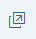

<!-- loioeadd60ae907646bbb838866566b23182 -->

# Step 1: Browser Developer Tools

In this step, you will learn how to use your browser's developers tools to troubleshoot your SAPUI5 app.

Most modern web browsers contain some form of Developer Tools. They allow you to examine the details of the current web page. You can also use them to debug JavaScript code, analyze network performance, live-edit DOM elements, and much more. As an example, we will show you how to use the *Developer Tools* in Google Chrome. Other browsers have similar capabilities, and you can easily adapt the examples shown here to these browsers.


<a name="loioeadd60ae907646bbb838866566b23182__section_hkm_s4f_vz"/>

## Opening the Example App and the Developer Tools

1.  Download the example app with errors from the Demo Kitat [Troubleshooting](https://ui5.sap.com/#/entity/sap.ui.core.tutorial.troubleshooting/sample/sap.ui.core.tutorial.troubleshooting.01) and run the app.

    > ### Note:  
    > If you run the app within the Demo Kit frame, this step will not work as described. Open the app in a new tab first with .

2.  Open the *Developer Tools* by pressing [F12\].


<a name="loioeadd60ae907646bbb838866566b23182__section_xmw_w4f_vz"/>

## Inspecting DOM Elements and CSS Styles in the *Elements* Tab

1.  Activate the *Inspect Element* mode by pressing  [Ctrl\] + [Shift\] + [C\] .

2.  Click the *Do Something* button in the app.

    The DOM tree in the *Elements* tab highlights the button's DOM element. Depending on which part of the button \(icon or text\) you clicked, different HTML tags are highlighted.

3.  Search for the following line:

    ```
    <button id="container-HeapOfShards---app--myButton" data-sap-ui="container-HeapOfShards---app--myButton" aria-describedby="__text1"
    	class="sapMBtn sapMBtnBase sapMBtnInverted">
    </button>
    ```

    The *Styles* section in the panel on the right shows the active and overruled \(striked-through\) CSS styles for the DOM element that is currently selected.

4.  In the *Styles* section, switch to the *Computed* tab.

    You can see that the `margin` of the button is set to `0px`.

5.  In the context menu of the element, choose *Edit as HTML* and add `sapUiLargeMargin` to the `class` section of the `button` tag.

    You can immediately see the effect on the web page.

    The edited element should now look like this:

    ```
    <button id="container-HeapOfShards---app--myButton" data-sap-ui="container-HeapOfShards---app--myButton" aria-describedby="__text1"
    	class="sapMBtn sapMBtnBase sapMBtnInverted sapUiLargeMargin">
    </button>
    ```

6.  In the *Styles* section, switch again to the *Computed* tab.

    You can see that the `margin` of the button is now set to `48px`.


<a name="loioeadd60ae907646bbb838866566b23182__section_bjt_qqf_vz"/>

## Analyzing Messages in the *Console* Tab


### Interacting with the document

1.  Switch to the *Console* tab and enter `$("#container-HeapOfShards---app--myButton")`

    The console displays the DOM element structure of the button:

    ```
    Q.fn.init [button#container-HeapOfShards---app--myButton.sapMBtn.sapMBtnBase.sapMBtnInverted, 
    context: document, selector: "#container-HeapOfShards---app--myButton"]
    ```

2.  Examine the `button` element by expanding the structure.

3.  On the *Console* tab, enter `myView=sap.ui.getCore().byId("container-HeapOfShards---app")`.

4.  On the *Console* tab, enter `myView.byId("myButton")`.

    The console displays the SAPUI5 structure of the button control:

    ```
    f {bAllowTextSelection: true, mEventRegistry: {…}, 
    sId: "container-HeapOfShards---app--myButton", mProperties: PropertyBag, mAggregations: {…}, …}
    ```

    Examine the SAPUI5 structure by expanding it.


> ### Note:  
> The method of retrieval is different for SAPUI5 controls and DOM elements:
> 
> 
> <table>
> <tr>
> <th valign="top">
> 
>  SAPUI5 Control
> 
> 
> 
> </th>
> <th valign="top">
> 
> DOM Element
> 
> 
> 
> </th>
> </tr>
> <tr>
> <td valign="top">
> 
>  `sap.ui.getCore().byId("container-HeapOfShards---app--myButton")` 
> 
> 
> 
> </td>
> <td valign="top">
> 
>  `jQuery("#container-HeapOfShards---app--myButton")` 
> 
> 
> 
> </td>
> </tr>
> </table>


### Watching messages

1.  Switch to the *Console* tab.

2.  Click the *Do Something* button in the app.

    A `MessageToast` appears with the text *Sorry, an error occurred!*.

3.  In the console, you see the following error message:

    ```
    TypeError: oEvent.getSourceXYZ is not a function
    at f.onPress (http://.../App.controller.js?eval:20:69)
    ...
    ```

    This means that an error occurred in the `onPress` function in the `App.controller.js` file at line `20`.

4.  Click the first link in the stack trace after `f.onPress` to look at the source code where you can see that it wasn't the generic `getSource` function that was called, but an undefined `getSourceXYZ`.

    ```
    sMessage = this.getResourceBundle().getText("buttonOk", [oEvent.getSourceXYZ().getId()])
    ```


<a name="loioeadd60ae907646bbb838866566b23182__section_rdm_rqf_vz"/>

## Debugging in the *Sources* Tab

1.  Switch to the *Source* tab.

2.  To view the source of the `App.controller` file, press  [Ctrl\] + [P\] , enter `App.controller`, and select `App.controller.js?eval`.

3.  Set a breakpoint in line 20 by clicking on the line number of the following line:

    ```
    sMessage = this.getResourceBundle().getText("buttonOk", [oEvent.getSourceXYZ().getId()]);
    ```

4.  Click the *Do Something* button in the app.

    The debugger stops at line 20.

5.  In line 20, replace `getSourceXYZ()` with `getSource()` and press  [Ctrl\] + [S\] :

    ```
    sMessage = this.getResourceBundle().getText("buttonOk", [oEvent.getSourceXYZ().getId()]);
    ```

6.  Resume the execution of the code by pressing [F8\].

    The message toast is now displayed on the web page with the following message: *"HeapOfShards---app--myButton" pressed* 


> ### Note:  
> You can also use the *Pause on exception* button and select *Pause on caught exceptions* on the top right of the *Sources* tab to pause the execution before an exception occurs without setting breakpoints.


<a name="loioeadd60ae907646bbb838866566b23182__section_ej5_sqf_vz"/>

## Checking the *Network* Tab

The *Network* tab shows the sequence and duration of files being loaded. It can be used to optimize loading performance and debug request issues.

1.  Switch to the *Network* tab.

2.  Press [F5\] to reload the page.

    You see a list of the files that are currently loaded.

    You can see that the `NavigationBar.js` file is loaded, but the view does not contain any `NavigationBar` elements so it is not used.

3.  You can't edit the code directly in this tab. You have to fix the source files in your development environment and then reload the app.

    Remove the unnecessary reference to the `NavigationBar` in the `App.controller` file:

    ```
    sap.ui.define([
    	"sap/ui/core/mvc/Controller",
    	'sap/m/MessageToast',
    	'sap/ui/ux3/NavigationBar'
    ], function(Controller, MessageToast, NavigationBar) {
    ...
    ```


<a name="loioeadd60ae907646bbb838866566b23182__section_tk3_5qf_vz"/>

## Testing Responsiveness with *Device Mode*

Switch to *Device* mode by clicking the respective button or by pressing  [Ctrl\] + [Shift\] + [M\] .

Emulate different mobile devices by selecting different devices, or switch orientation from landscape to portrait.


<a name="loioeadd60ae907646bbb838866566b23182__section_f1h_vqf_vz"/>

## Analyzing Performance Problems and Memory Leaks

There are additional tabs that can help you to analyze performance problems or memory leaks. For more information, refer to the documentation of the developer tools of your browser.

-   *Memory* or *Profiles*

-   *Performance* or *Timeline*

-   *Application* or *Resources*


**Related Information**  


[Documentation of the Chrome DevTools on `https://developers.google.com`](https://developers.google.com/web/tools/chrome-devtools/)

