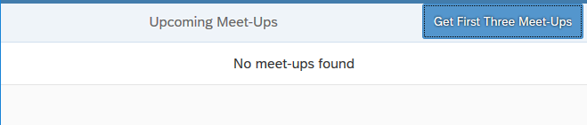
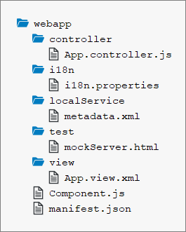

<!-- loio7a78f1b707c248fd9ec53dcb5f10814c -->

# Step 1: Initial App Without Data

We start with a simple app scenario with a list of items bound to an OData V2 service. Since the OData V2 service is not available yet on a real server, we will use the mock server to simulate both data and data calls.

For this very simple tutorial app we will use an OData V2 service called `NerdMeetups` that lists meet-up groups according to location, date, topic, etc. The app will display a simple list populated by a function import call to display only upcoming meet-ups \(meet-ups with an event date greater to the current date\).

Additionally, a button will fetch the first three meet-ups \(using a custom URL parameter called `first`\). This exercise simply shows an app with no data retrieved from the back end. This can happen when the back end is down, or when the service is not implemented yet.

Usually you start the development of an app with local mock data first. This way you can continue implementing the application logic without depending on the back end readiness and connectivity.

## Preview

   
  
**The initial app**

  

## Coding

To set up your project for this tutorial, download the files for *Step 1* in the Demo Kit at [Mock Server - Step 1](https://ui5.sap.com/#/entity/sap.ui.core.tutorial.mockserver/sample/sap.ui.core.tutorial.mockserver.01). Copy the code to your workspace and make sure that the application runs by calling the `webapp/test/mockServer.html` file.

Depending on your development environment you might have to adjust resource paths and configuration entries. The project structure and the files coming with this tutorial are explained in detail in the [Walkthrough](walkthrough-tutorial-3da5f4b.md) tutorial.

You should have the same files as displayed in the following figure:

   
  
**Folder structure with downloaded files**

  

