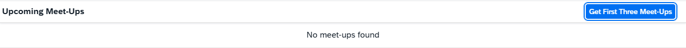

<!-- loio7a78f1b707c248fd9ec53dcb5f10814c -->

# Step 1: Initial App Without Mock Data

We start with a simple app scenario with a list of items bound to an OData V2 service.

For this simple tutorial app we will use an OData V2 service called `Meetups` that lists meetup groups according to location, date, topic, etc. The app will display a simple list populated by a function import call to display only upcoming meetups \(meetups with an event date greater than the current date\). The app will also include a button that, when clicked, fetches and displays the first three meetups using a custom URL parameter called `first`.

> ### Note:  
> This initial step demonstrates an app with no data retrieved from the back end. At this stage, the app will display neither data nor functionality. This scenario can occur when the back-end service is unavailable, not yet implemented, or when you are in the early stages of front-end development. The purpose of this step is to set up a basic app structure before integrating the mock server in subsequent steps.

## Preview

  
  
**The initial app**

## Coding

1.  To set up your project for this tutorial, download the files at [Mock Server - Step 1](https://ui5.sap.com/#/entity/sap.ui.core.tutorial.mockserver/sample/sap.ui.core.tutorial.mockserver.01).

2.  Extract the downloaded `.zip` file at the desired location on your local machine.
3.  Open a shell in the extracted folder and execute `npm install`.
4.  Execute `npm start` to start the web server and to open a new browser window hosting your newly created `test/mockServer.html`.

You should have the same files as displayed in the following figure:

  
  
**Folder structure with downloaded files**

