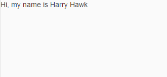

<!-- loio4cde849dc18949b69bbe152a0aaa19c6 -->

# Step 1: No Data Binding

In this step, we create a basic application and simply place some text on the screen using a standard `sap.m.Text` control. The text in this control is a hard-coded part of the control's definition; therefore, this is not an example of data binding!


## Preview




## Coding

You can view and download all files in the Demo Kit at [Data Binding - Step 1](https://ui5.sap.com/#/entity/sap.ui.core.tutorial.databinding/sample/sap.ui.core.tutorial.databinding.01).

1.  Create a folder on your local machine which will contain all the sources of the app we're going to build. We'll refer to this folder as the “app root folder”.
2.  Create a new file called `package.json` which will enable you to execute commands and consume packages from the[npm registry](https://www.npmjs.com/) via the npm command line interface. Enter the following content:

    **package.json \(New\)**

    ```
    {
      "name": "data-binding-tutorial",
      "private": true,
      "version": "1.0.0",
      "author": "SAP SE",
      "description": "UI5 Demo App - Data Binding Tutorial",
      "devDependencies": {
        "@ui5/cli": "^3"
      },
      "scripts": {
        "start": "ui5 serve -o index.html"
      }
    }
    ```

3.  Create a new folder named `webapp` in the app root folder. It will contain all the sources that become available in the browser later. We'll refer to this folder as the "webapp folder".

4.  Create a new HTML file named `index.html` in your webapp folder and enter the following content:

    **webapp/index.html \(New\)**

    ```html
    <!DOCTYPE HTML>
    <html>
    <head>
    	<meta charset="utf-8">
    	<title>Data Binding Tutorial</title>
    	<script id="sap-ui-bootstrap"
    		src="resources/sap-ui-core.js"
    		data-sap-ui-theme="sap_horizon"
    		data-sap-ui-compat-version="edge"
    		data-sap-ui-async="true"
    		data-sap-ui-on-init="module:sap/ui/core/ComponentSupport"
    		data-sap-ui-resource-roots='{"ui5.databinding": "./"}'>
    	</script>
    </head>
    <body class="sapUiBody" id="content">
    	<div data-sap-ui-component data-name="ui5.databinding" data-id="container" data-settings='{"id" : "databinding"}'></div>
    </body>
    </html>
    ```

5.  Create a new file named `manifest.json` in the webapp folder; it's also known as the "app descriptor". All application-specific configuration options which we'll introduce in this tutorial will be added to this file. Enter the following content:

    **webapp/manifest.json \(New\)**

    ```
    {
    	"_version": "1.60.0",
    	"sap.app": {
    		"id": "ui5.databinding",
    		"type": "application",
    		"applicationVersion": {
    			"version": "1.0.0"
    		}
    	},
    	"sap.ui": {
    		"technology": "UI5",
    		"deviceTypes": {
    			"desktop": true,
    			"tablet": true,
    			"phone": true
    		}
    	},
    	"sap.ui5": {
    		"dependencies": {
    			"minUI5Version": "1.120.0",
    			"libs": {
    				"sap.m": {},
    				"sap.ui.core": {}
    			}
    		},
    		"rootView": {
    			"viewName": "ui5.databinding.view.App",
    			"type": "XML",
    			"id": "app"
    		}
    	}
    }
    ```

6.  Create a new file named `Component.js` in the webapp folder. Enter the following content:

    **webapp/Component.js \(New\)**

    ```
    sap.ui.define([
    	"sap/ui/core/UIComponent"
    ], (UIComponent) => {
    	"use strict";
    	return UIComponent.extend("ui5.databinding.Component", {
    		metadata: {
    			interfaces: ["sap.ui.core.IAsyncContentCreation"],
    			manifest: "json"
    		}
    	});
    });
    ```

7.  Create a new folder named `view` in the webapp folder. Now create a new file `App.view.xml` within the `view` folder. We start by placing the `sap.m.Text` control into the XML view. Since the value of the control's text property has been hard-coded, it is unrelated to any data that might exist within a model object. Therefore, data binding is **not** used here.

    **webapp/view/App.view.xml \(New\)**

    ```
    <mvc:View
    	xmlns="sap.m"
    	xmlns:mvc="sap.ui.core.mvc">
    	<Text text="Hi, my name is Harry Hawk"/>
    </mvc:View>
    ```

8.  Open a terminal in the app root folder and execute `npm i -D @ui5/cli` to install UI5 Tooling in the app root folder..

9.  Execute `npx ui5 init` in the app root folder.

10. Execute `npx ui5 use OpenUI5`

11. Execute `npx ui5 add sap.m sap.ui.core sap.ui.layout themelib_sap_horizon`

12. Execute `npm start` to start the web server and to open a new browser window hosting your newly created `index.html`.


