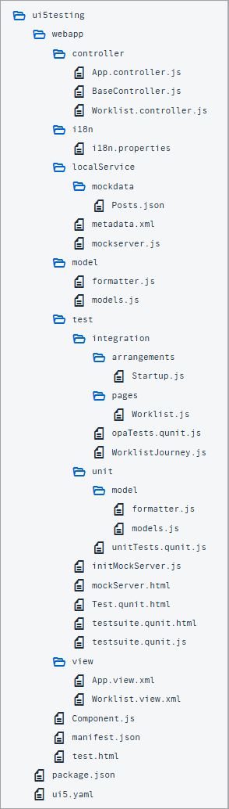

<!-- loioab134ef3932c4b42898c79c10341e8b5 -->

# Step 1: Overview and Testing Strategy

In this step, we will take a look at the prototype and define the test strategy for our app. The prototype already contains the infrastructure for unit and integration testing and a minimum set of tests and features.

> ### Note:  
> In this tutorial we will focus on writing clean unit and integration tests for apps. They build the foundation and are crucial for good application quality. We will also outline how to write testable code. Not all implementation patterns can be tested easily, but when writing the test code together with the implementation code as we have in this tutorial, testable code is a natural result.

## Preview

  
  
**The prototype app**

## Coding

To set up your project for this tutorial, download the files for *Step 1* from the *Samples* in the Demo Kit at [Testing - Step 1](https://ui5.sap.com/#/entity/sap.m.tutorial.testing/sample/sap.m.tutorial.testing.01). Copy the code to your workspace and make sure that the application runs by calling the `webapp/test/mockServer.html` file.

Depending on your development environment, you might have to adjust resource paths and configuration entries. The project structure and the files provided with this tutorial are explained in detail in the [Walkthrough](walkthrough-tutorial-3da5f4b.md) tutorial.

After downloading *Step 1*, you should have the following files:

  
  
**Folder structure with downloaded files**

## The Initial App

With the downloaded code, you now have the bulletin board prototype, set up according to the SAPUI5 best practices. The prototype provides the common features of an SAPUI5 app. If you have completed the Walkthrough tutorial, you should be familiar with most of the source code in this step. Additional features of the app are:

-   **Entry Page**

    In this tutorial, we will often switch between testing application features manually, and running automated tests. The `webapp/test/test.html` file provides a list of entry points for the app so that you do not have to enter the URLs manually. From this page you can open the app with mock data, run the unit tests, run the integration tests, or run the app’s test suite \(this will be added later in the tutorial\). Note that in a productive scenario we would have an additional entry point that calls the app with a real service. At this stage we are working with mock data and don't have a real service for our prototype yet, so we have left this step out.

-   **Home Page**

    The home page of our bulletin board app is the `webapp/test/mockServer.html` file. On this page, we initialize SAPUI5, start the mock server, and instantiate our app component. It consists of a single view that displays a list of posts from a bulletin board with several attributes in a table.

    > ### Note:  
    > We do not yet have a real service for the bulletin board prototype so run the app with mock data and this test page throughout the tutorial. The mock server helps by mimicking a real service and it processes requests with a small delay, just as a real service would. This is perfect for realistic application testing and is also helpful for local development tests. It is a good practice to put all test pages in the test folder of the app, so that they are clearly separated from the productive coding.

-   **Data**

    In the `webapp/localService/` folder, you can find the metadata and the mock data for the app. The `metadata.xml` file is used by the mock server to simulate real back-end service calls in the app. It describes our OData service and you can replace it later with a real service. The service we use has a single OData entity:

    -   **Post**

        A post consists of typical properties like *Title*, *Description*, and *Price*. Each post is assigned to a *Category* and a *Contact*. The entity can be identified with its ID property: `PostID`. The corresponding `EntitySet` is `Posts`.

    -   **Category**

        In our example, the category only has a `Name` property. Posts are sorted into a category by the category name. The corresponding `EntitySet` is `Categories`.

    -   **Comment**

        A comment has an `Author`, a `Date`, and a `CommentText` property. The entity can be identified by the `CommentID` property and is linked to a `post` by the `ParentID`. The corresponding `EntitySet` is `Comments`.

    The actual test data containing several mock posts is located in the `webapp/test/service/posts.json` file.

-   **Testing Functionality**

    The team that created the first prototype already took care of the basic test setup. Everything required for application testing is shipped with SAPUI5 and can simply be used within the app. The testing infrastructure is set up in the `test` folder that is located in the `webapp` folder of the app:

    -   **Mock Server**

        The mock server is set up in the `webapp/localService/mockserver.js` file. It loads the metadata and the mock data in the same folder. Using the mock server allows us to run the app easily and show realistic data for testing, even without a network connection and without the need of having a remote server for our application data.

        There is a configurable delay for each request that is processed by the mock server that allows you to mimick a slow back-end server.

    -   **Unit Tests**

        All unit tests are located in the `webapp/test/unit` folder and can be started by calling the `unitTests.qunit.html` file in the same folder. Initially, there are only a few tests for model instantiation and formatters that cover basic functionality in the prototype. We will give you more details about the unit test setup later in the tutorial.

    -   **Integration Tests**

        Integration tests are written in OPA5 – a tool for integration testing that is included in SAPUI5 – and can be found in the `webapp/test/integration` folder. You can start all OPA5 tests by calling the `opaTests.qunit.html` file in the same folder. OPA5 tests are organized in test journeys, and we have included a worklist journey that checks if the table of posts is displayed properly. We will give you more details about the integration test setup later in the tutorial.

-   **Other quality-related features of the app**

    The app is set up according to best practices and already contains many helpful features.

    -   **Separation of concerns \(MVC\)**

        All artifacts are located in either the `model`, `view`, or `controller` folder of the app. The app’s component and its descriptor configure which of those MVC artifacts to load. This configuration controls the navigation flow of the app.

    -   **Separation of productive and nonproductive code**

        All nonproductive code is located in the `test` subfolder. This includes the unit and integration tests, and the test page to call the app with mock data. All productive code is located in the `webapp` folder. This clearly separates the test artifacts from the application coding and makes it easy to remove all test-related artifacts before deploying the app for productive use.

    -   **Busy handling**

        As a best practice, you should always give users instant feedback when triggering actions and navigating in the app. The app already includes functionality to display a busy indication when data is loaded or actions are triggered. To simulate a slow backend and show the behavior of the app, the mock server is configured with a delay of one second for each request.

Now that we have a running prototype, we can further extend it with additional tests and features. Make sure that the app is running by calling the test page, the unit tests, and the integration tests from the entry page `webapp/test/test.html`. The app should display a list of bulletin board posts as seen in the screenshot above and the tests should run without errors.

## Test Strategy

Let’s first take a look at best practices for testing apps written in SAPUI5. JavaScript is a dynamic programming language and only some issues can be detected by static code check tools and manual testing. Automated tests that execute the code regularly are beneficial for good quality and development productivity – especially when you're developing in short development cycles.

We expect our prototype to be released and shipped as a product soon, so we need a solid testing strategy. Fortunately the prototype team has already thought ahead and prepared an infrastructure for unit and integration testing that is included in the app. This is a really good starting point for further enhancements of the app.

The mock server is also set up and allows us to test the app with local test data instead of a real back-end service. We can use the mock data for writing reliable integration tests that do not depend on another system which might be unavailable when the tests are run.

> ### Note:  
> If you start developing an app from scratch, you should always consider testing from the very beginning of the software life cycle. Nobody wants to write tests for undocumented code and make assumptions about the logic. It is worth the effort to think about code checks, unit and integration testing, and a solid testing strategy from the very start.

Before you start implementing your first test, you should think about how to test the different aspects of your application. The image below shows the testing tools along the agile testing pyramid.

  
  
**Testing pyramid**

When you set up application testing, you should automate as many testing steps as possible. If you immediately write a test for all the features that we implement, then you can greatly reduce manual testing efforts that are time consuming and cumbersome. If you change something later, you can simply run the existing tests and see if the functionality is still working as expected.

SAPUI5 comes with two testing tools: QUnit for unit testing and OPA5 for integration testing. The unit tests are the foundation of our testing pyramid and they should validate the most important logic of our app. In addition, you can write integration tests for more interaction-related functionality, such as interacting with UI elements of the app.

There might still be features that are hard to test with these client-side testing frameworks. Certain features might require a more sophisticated system test, such as a screenshot comparison that can be implemented with additional testing frameworks. And of course, you should also schedule manual tests \(for example, browser, performance, or security tests\) to make sure that the app is behaving as expected.

## Conventions

-   Write unit tests in QUnit for more logic-related functionality

-   Write integration tests in OPA5 for user interaction

-   Separate productive and nonproductive code in the app \(`webapp`, `test` folder\)

-   Provide a local test page that triggers the app in test mode with mock data \(`test/mockServer.html`\)

**Related Information**  

[Testing](../04_Essentials/testing-7cdee40.md "SAPUI5 provides several testing options, like to unit and integration tests and the OData V2 mock server.")

[Unit Testing with QUnit](../04_Essentials/unit-testing-with-qunit-09d145c.md "QUnit is a powerful, easy-to-use JavaScript unit testing framework. It is used by the jQuery, jQuery UI and jQuery Mobile projects and is capable of testing any generic JavaScript code. It supports asynchronous tests out-of-the-box.")

[Integration Testing with One Page Acceptance Tests \(OPA5\)](../04_Essentials/integration-testing-with-one-page-acceptance-tests-opa5-2696ab5.md "OPA5 is an API for SAPUI5 controls. It hides asynchronicity and eases access to SAPUI5 elements. This makes OPA especially helpful for testing user interactions, integration with SAPUI5, navigation, and data binding.")

[Mock Server](../04_Essentials/mock-server-69d3cbd.md "A mock server mimics one or more back-end services. It is used to simplify integration testing and to decouple UI development from service development. By using a mock server you can develop and test the UI even if the service in the back end is incomplete or unstable.")

[Walkthrough Tutorial](walkthrough-tutorial-3da5f4b.md "In this tutorial we will introduce you to all major development paradigms of SAPUI5.")

