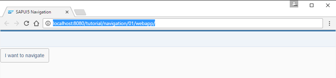
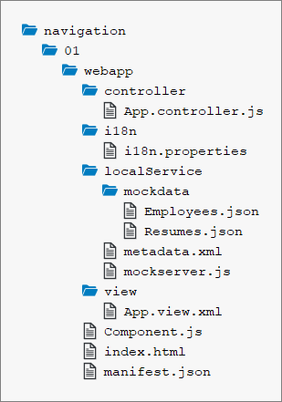

<!-- loiodf245bd449a7470c8c2a0926ca8d78de -->

# Step 1: Set Up the Initial App

We start by setting up a simple app for this tutorial. The app displays mock data only and mimics real OData back-end calls with the mock server as you have seen in the *Walkthrough* tutorial.

The structure and data model created in this step will be used throughout the rest of this tutorial. The initial app created in this step will be extended in the subsequent steps to illustrate the navigation and routing features of SAPUI5.

## Preview

  
  
**Initial app with a simple button**

## Setup

1.  To set up your project for this tutorial, download the files at [Navigation and Routing - Step 1](https://ui5.sap.com/#/entity/sap.ui.core.tutorial.navigation/sample/sap.ui.core.tutorial.navigation.01).

2.  Extract the downloaded `.zip` file at the desired location on your local machine.
3.  Open a shell in the extracted folder and execute `npm install`.
4.  Execute `npm start` to start the web server and to open a new browser window hosting your newly created `index.html`.

You should have the same files as displayed in the following figure:

  
  
**Folder structure with downloaded files**

> ### Note:  
> The content of the `localService` folders will not be changed in this tutorial. The `i18n` folder will always contain the `i18n.properties` file only. Therefore, we will show both subfolders collapsed in the following steps.

## The Initial App

With the downloaded coding, you have an initial app with recommended settings that provides the basic features of an SAPUI5 app:

-   **Home Page**

    The home page of our app is defined in the `webapp/index.html` file. In this file we bootstrap SAPUI5 and tell the runtime where to find our custom resources. Furthermore, we initialize the `MockServer` to simulate back-end requests as we do not have a real back-end service throughout this tutorial. Finally, we instantiate the application component, assign it to a `sap.m.Shell` control, and place the shell into the body. The corresponding `Component.js` file in the `webapp` folder will be extended throughout this tutorial.

-   **Data**

    In the `webapp/localService/mockserver.js` file, we configure the mock server. Using the mock server in this tutorial allows us to easily run the code even without network connection and without the need of having a remote server for our application data.

    The `metadata.xml` file used by the mock server describes our OData service. The service only has two OData entities:

    -   Employee

        An `employee` has typical properties like `FirstName` and `LastName` as well as a navigation property to a resume entity referenced by a `ResumeID`. Of course, the entity also has an ID property: `EmployeeID`. The corresponding `EntitySet` is `Employees`. The actual test data containing several employees is located in the `webapp/localService/mockdata/Employees.json` file.

    -   Resume

        In our case, we want to keep the resume of employees very simple. Therefore, we just have simple properties of type `Edm.String`. The properties are `Information`, `Projects`, `Hobbies` and `Notes`; all of them contain textual information. The entity has an ID property `ResumeID` and the corresponding `EntitySet` is `Resumes`. The resume data for an employee is located in file `webapp/localService/mockdata/Resumes.json`.

-   **Configuration of the App**

    In the `webapp/manifest.json` descriptor file, we configure our app. The descriptor file contains the following most interesting sections:

    -   `sap.app`

        In this section we reference an `i18n.properties` file and use a special syntax to bind the texts for the `title` and `description` properties.

        In the `dataSources` part, we tell our app where to find our OData service `employeeRemote`. As you might guess, the `uri` correlates to the `rootUri` of our mock server instance which can be found in `webapp/localService/mockserver.js`. It is important that these two paths match to allow our mock server to provide the test data we defined above. The `localUri` is used to determine the location of the `metadata.xml` file.

    -   `sap.ui5`

        Under `sap.ui5` we declare with the `rootView` parameter that our `sap.ui.demo.nav.view.App` view shall be loaded and used as the `rootView` for our app. Furthermore, we define two `models` to be automatically instantiated and bound to the `i18n` component and a default model `""`. The latter references our `employeeRemote` `dataSource` which is declared in our `sap.app` section as an OData 2.0 data source. The `i18n` file can be found at `webapp/i18n/i18n.properties`. This data source will be mocked by our mock server.

So far we have a basic app that does not really have any navigation or routing implemented. This will change in the next steps when we implement our first navigation features.

