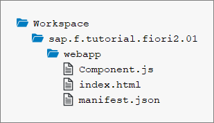

<!-- loio59b772bfac5241b89c16b12395c1116c -->

# Step 1: Setting Up the Initial App

We start by setting up a basic SAPUI5 app for this tutorial.

The structure in this step will be used throughout the rest of this tutorial. The basic SAPUI5 app created in this step will be extended in the subsequent steps to illustrate the main `FlexibleColumnLayout` features.

<a name="loio59b772bfac5241b89c16b12395c1116c__section_ed2_4dd_lbb"/>

## Preview

  
  
**The basic SAPUI5 app**

<a name="loio59b772bfac5241b89c16b12395c1116c__section_cnf_d4b_l4b"/>

## Setup

1.  To set up your project for this tutorial, download the files at [Flexible Column Layout App - Step 1](https://ui5.sap.com/#/entity/sap.f.tutorial.fiori2/sample/sap.f.tutorial.fiori2.01).

2.  Extract the downloaded `.zip` file at the desired location on your local machine.
3.  Open a shell in the extracted folder and execute `npm install`.
4.  Execute `npm start` to start the web server and to open a new browser window hosting `index.html`.

You should have the same files as displayed in the following figure:

  
  
**Folder structure with downloaded files**

