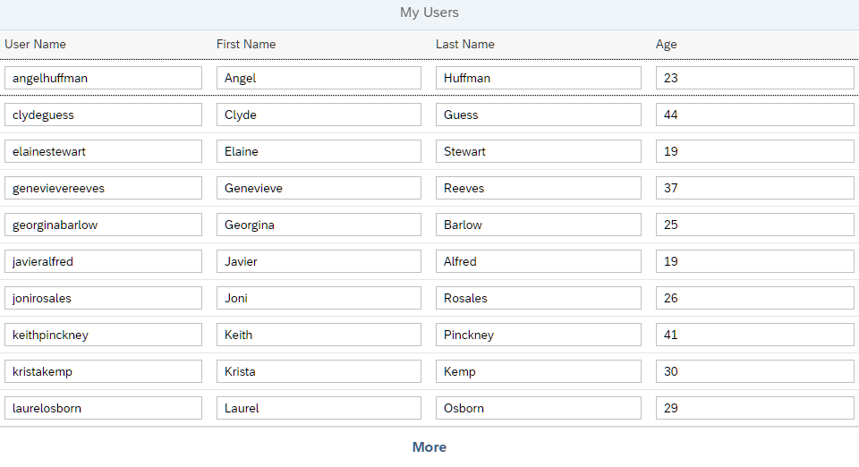
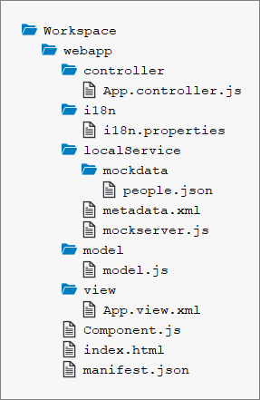

<!-- loio15d84f36c0594cb2b3295aa1f55cb961 -->

# Step 1: The Initial App

We start by setting up a simple app that loads data from an OData service and displays it in a table. We use a mock server to simulate requests to and responses from the service.

The structure and data model created in this step will be used throughout this tutorial to illustrate the OData V4 features in SAPUI5.


<a name="loio15d84f36c0594cb2b3295aa1f55cb961__section_bt4_fxc_z1b"/>

## Preview

   
  
<a name="loio15d84f36c0594cb2b3295aa1f55cb961__fig_tvr_vzd_gcb"/>Initial app with a simple table

  


<a name="loio15d84f36c0594cb2b3295aa1f55cb961__section_tsr_gxc_z1b"/>

## Setup

To set up your project for this tutorial, download the files at [OData V4 - Step 1](https://ui5.sap.com/#/entity/sap.ui.core.tutorial.odatav4/sample/sap.ui.core.tutorial.odatav4.01). Copy or import the code to your workspace and make sure that the application runs by calling the `webapp/index.html` file.

Depending on your development environment, you might have to adjust resource paths and configuration entries. The project structure and the files provided with this tutorial are explained in detail in the [Walkthrough](walkthrough-3da5f4b.md) tutorial.

You should now have the following files:

  
  
<a name="loio15d84f36c0594cb2b3295aa1f55cb961__fig_mdg_c12_gcb"/>Folder structure with downloaded files

  


<a name="loio15d84f36c0594cb2b3295aa1f55cb961__section_vng_l12_gcb"/>

## The Initial App

The downloaded code includes an app that displays a table containing a table of users. For performance reasons, the table only loads 10 users at a time. More data can be retrieved by using the *More* button at the bottom of the page.

During the implementation of the app, we use local mock data so that we can concentrate on the application logic without dealing with back-end readiness or connectivity issues. We use the *TripPin* sample service as a "real" OData service.

The most important files are the following:


### `webapp/index.html`

This file defines the home page of the app. It contains the bootstrap script and tells the runtime where to find our custom resources. It also initializes the mock server that intercepts all requests to the real *TripPin* service and sends back mock responses.


### `webapp/manifest.json`

The `manifest.json` descriptor file contains the app configuration. In the `sap.app` section, the OData V4 service is configured as the default service:

```json
"dataSources": {
	"default": {
		"uri": "https://services.odata.org/TripPinRESTierService/(S(id))/",
		"type": "OData",
		"settings": {
			"odataVersion": "4.0"
		}
	}
}

```


### Mock server \(`webapp/localService/*`\)

> ### Note:  
> The mock server included in this tutorial is only meant to support the features needed in this tutorial. Currently, there is no "general-purpose mock server" for application development available with OData V4 \(like there is for OData V2\).

The `mockserver.js` file contains the implementation of the mock server. It is quite simple since the mock server is only used to simulate certain types of requests to the *TripPin* service.

The `metadata.xml` file contains the service metadata that includes, for example, entity types and entity sets. Those define the possible requests as well as the structure of responses.

To be able to add data to the emulated OData responses, we have to store the entities for each entity type we use in a JSON file: The `people.json` file contains some data that is used for the mock service responses.

In this tutorial, we only use the entity type `Person` of the *TripPin* service. The entities of type `Person` are collected in the entity set `People`. Each `Person` has a key property `UserName` and the properties `Age`, `FirstName`, and `LastName`.

**Related Information**  


[*OData* Reference Services including *TripPin*](http://www.odata.org/odata-services/)

[Bootstrapping: Loading and Initializing](../04_Essentials/bootstrapping-loading-and-initializing-a04b0d1.md "To use SAPUI5 features in your HTML page, you have to load and initialize the SAPUI5 library.")

[Descriptor for Applications, Components, and Libraries \(manifest.json\)](../04_Essentials/descriptor-for-applications-components-and-libraries-manifest-json-be0cf40.md "The descriptor for applications, components, and libraries (in short: app descriptor) is inspired by the WebApplication Manifest concept introduced by the W3C. The descriptor provides a central, machine-readable, and easy-to-access location for storing metadata associated with an application, an application component, or a library.")

