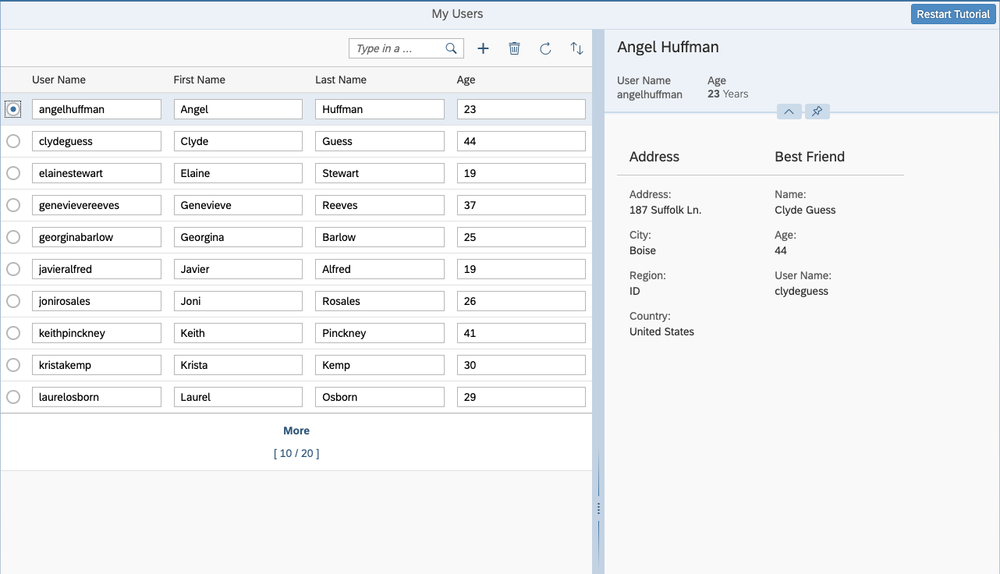

<!-- loioe687dbdc4c064ba3a3ce3942288e8f74 -->

# Step 10: Enable Data Reuse

In this step we avoid unnecessary back-end requests by preventing the destruction of data shown in the detail area when sorting or filtering the list.


<a name="loioe687dbdc4c064ba3a3ce3942288e8f74__section_bt4_fxc_z1b"/>

## Preview

   
  
**No visual change compared to the last step**

  


<a name="loioe687dbdc4c064ba3a3ce3942288e8f74__section_tsr_gxc_z1b"/>

## Coding

You can view and download all files at [OData V4 - Step 10](https://ui5.sap.com/#/entity/sap.ui.core.tutorial.odatav4/sample/sap.ui.core.tutorial.odatav4.10/code).


<a name="loioe687dbdc4c064ba3a3ce3942288e8f74__section_pvc_fyc_z1b"/>

## webapp/controller/App.controller.js

```js
...
		onMessageBindingChange : function (oEvent) {
			...
		},

		onSelectionChange : function (oEvent) {
            this._setDetailArea(oEvent.getParameter("listItem").getBindingContext());
        },
...
        /**
         * Toggles the visibility of the detail area
         *
         * @param {object} [oUserContext] - the current user context
         */
        _setDetailArea : function (oUserContext) {         
            var oDetailArea = this.byId("detailArea"),
                oLayout = this.byId("defaultLayout"),
                oOldContext,
                oSearchField = this.byId("searchField");
 
            if (!oDetailArea) {
                return; // do nothing when running within view destruction
            }
 
            oOldContext = oDetailArea.getBindingContext();
            if (oOldContext) {
                oOldContext.setKeepAlive(false);
            }
            if (oUserContext) {
                oUserContext.setKeepAlive(true,
                    // hide details if kept entity was refreshed but does not exists any more
                    this._setDetailArea.bind(this));

            }
            oDetailArea.setBindingContext(oUserContext || null);
            // resize view
            oDetailArea.setVisible(!!oUserContext);
            oLayout.setSize(oUserContext ? "60%" : "100%");
            oLayout.setResizable(!!oUserContext);
            oSearchField.setWidth(oUserContext ? "40%" : "20%");
        }
 ...
```

We extend the logic of the `_setDetailArea` function. First, we check if there's an "old" binding context in the detail area. If so, the `keepAlive` for the old context is set to `false`.

For the new context we set `keepAlive` to `true` and add `_setDetailArea` as an `onBeforeDestroy` function to it, which hides the detail area when the user linked to it is deleted in the back end and the list is refreshed.

You can use the `Context#setKeepAlive` method to prevent the destruction of information shown in the detail area when the selected user is no longer part of the list from which the information was selected. This could otherwise happen if you filter or sort the list.

**Related Information**  


[Extending the Lifetime of a Context that is not Used Exclusively by a Table Collection](../04_Essentials/data-reuse-648e360.md#loio648e360fa22d46248ca783dc6eb44531__section_ELC)

