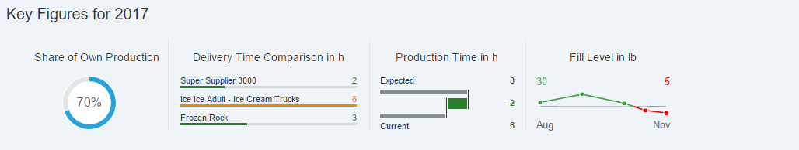

<!-- loio819beea79ed34d4bb66d8a421820cbc3 -->

# Step 10: Line Micro Chart

In this step, we will create the `LineMicroChart` on the **Production Process** page.


<a name="loio819beea79ed34d4bb66d8a421820cbc3__section_z2r_dyl_l1b"/>

## Preview

  


<a name="loio819beea79ed34d4bb66d8a421820cbc3__section_pyt_3yl_l1b"/>

## LineMicroChart

With the `LineMicroChart`, we want to visualize how the fill level is going to change during the course of the production process and we want to determine the threshold values that fall below a specified level.


### ProcessFlow.view.xml

You can view and download this step in the Demo Kit at [Ice Cream Machine - Step 10 - Line Micro Chart](https://ui5.sap.com/#/entity/sap.suite.ui.commons.tutorial.icecream/sample/sap.suite.ui.commons.tutorial.icecream.10).

```xml
mvc:View
    ...
        <m:headerContainer>
            <m:HeaderContainer
                scrollStep="200"
                scrollTime="500"
                showDividers="true"
                class="sapUiSmallMargin">
                ...
                <m:FlexBox
                    width="12rem"
                    height="10rem"
                    alignItems="Center"
                    justifyContent="Center"
                    direction="Column">
                    <m:Title
                        text="{
                            parts: [
                                'i18n>processFlowChartsFillLevel',
                                'business>/fillLevel/measure'
                            ],
                            formatter: '.formatMessage'
                        }"
                        class="sapUiSmallMargin" />
                    <m:FlexBox width="12rem" height="6rem" renderType="Bare">
                        <mc:LineMicroChart
                            size="Responsive"
                            threshold="{business>/fillLevel/threshold}"
                            leftTopLabel="{business>/fillLevel/valueBegin}"
                            leftBottomLabel="{business>/fillLevel/timeBegin}"
                            rightTopLabel="{business>/fillLevel/valueEnd}"
                            rightBottomLabel="{business>/fillLevel/timeEnd}"
                            color="{business>/fillLevel/color}"
                            showPoints="true"
                            points="{
                                path: 'business>/fillLevel/timeSeries',
                                templateShareable: true
                            }">
                            <mc:LineMicroChartPoint
                                x="{business>time}"
                                y="{business>level}" />
                        </mc:LineMicroChart>
                    </m:FlexBox>
                </m:FlexBox>
            </m:HeaderContainer>
        </m:headerContainer>
    ...
</mvc:View>
```

You can find the information about the fill levels in the *points* aggregation of the `LineMicroChart` control. Property **x** of the `LineMicroChartPoint` contains the dimension of the chart and the time. Property **y** contains the fill level during the production process. The **threshold** property separates the records by their fill level into an upper and a lower layer. With the *color* property, we can apply a different color to each layer, depending on the specified threshold.

**Parent topic:** [Ice Cream Machine](ice-cream-machine-e5b7f8a.md "In this tutorial, we will show you how to use SAPUI5 controls like Generic Tiles, Micro Charts, and Process Flow.")

**Next:** [Step 9: Delta Micro Chart](step-9-delta-micro-chart-3973372.md "In this step, we will create the DeltaMicroChart on the Production Process page.")

**Previous:** [Step 11: Process Flow](step-11-process-flow-452ff8c.md "In this step, we will create the ProcessFlow on the Production Process page.")

