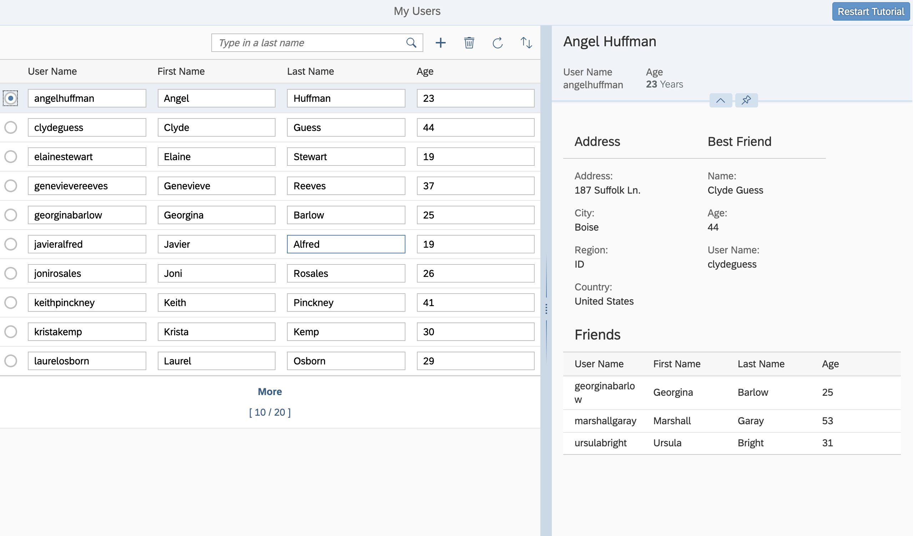

<!-- loio19cc773a60d944c8bb588056f665de04 -->

# Step 11: Add Table with :n Navigation to Detail Area

In this step we add a table with additional information to the detail area.


<a name="loio19cc773a60d944c8bb588056f665de04__section_bt4_fxc_z1b"/>

## Preview

   
  
**A table containing information about friends of the selected user is added**

  


<a name="loio19cc773a60d944c8bb588056f665de04__section_tsr_gxc_z1b"/>

## Coding

You can view and download all files at [OData V4 - Step 11](https://ui5.sap.com/#/entity/sap.ui.core.tutorial.odatav4/sample/sap.ui.core.tutorial.odatav4.11/code).


<a name="loio19cc773a60d944c8bb588056f665de04__section_pp2_mxc_z1b"/>

## webapp/view/App.view.xml

```xml
<mvc:View
...
											<VBox>
												<FlexBox wrap="Wrap">
														...
													<f:Form	editable="false">
														<f:title>
															<core:Title text="{i18n>bestFriendTitleText}" />
														</f:title>
														...
														<f:formContainers>
															<f:FormContainer>
																<f:formElements>
																	...
																</f:formElements>
															</f:FormContainer>
														</f:formContainers>
													</f:Form>
												</FlexBox>
												<Table
													id="friendsTable"
													width="auto"
													items="{path: 'Friends',
															parameters: {
																$$ownRequest: true
															}}"
													noDataText="No Data"
													class="sapUiSmallMarginBottom">
													<headerToolbar>
														<Toolbar>
															<Title
																text="Friends"
																titleStyle="H3"
																level="H3"/>
														</Toolbar>
													</headerToolbar>
													<columns>
														<Column>
															<Text text="User Name"/>
														</Column>
														<Column>
															<Text text="First Name"/>
														</Column>
														<Column>
															<Text text="Last Name"/>
														</Column>
														<Column>
															<Text text="Age"/>
														</Column>
													</columns>
													<items>
														<ColumnListItem>
															<cells>
																<Text text="{UserName}"/>
															</cells>
															<cells>
																<Text text="{FirstName}"/>
															</cells>
															<cells>
																<Text text="{LastName}"/>
															</cells>
															<cells>
																<Text text="{Age}"/>
															</cells>
														</ColumnListItem>
													</items>
												</Table>
											</VBox>
...
</mvc:View>
```

We extend the detail area of the `appView` by adding a table after the `FlexBox`. To this table we add a data binding for friends. It is important that we set the `$$ownRequest` binding parameter to `true`, so that the table containing all friends of the selected user makes its own OData requests separate from the request for best friend and best friend's address.

