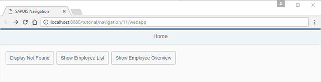
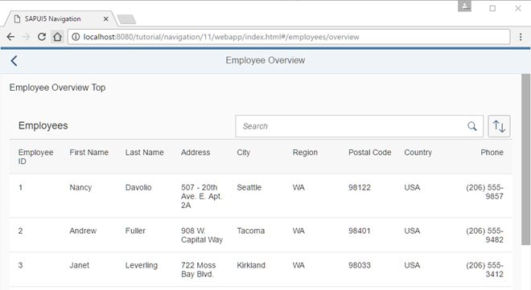
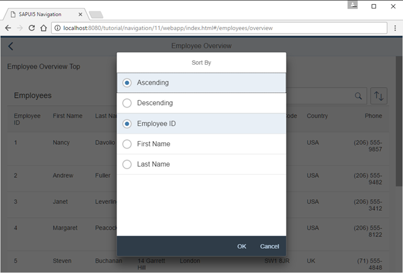

<!-- loiob01840ec42ef48e6bfd2bc12612f501f -->

# Step 11: Assign Multiple Targets

In this step, we will add a new button to the home page to illustrate the usage of multiple targets for a route. When the button is pressed, a new page opens that contains two parts: a header part at the top and a content part. The content part displays a table of employees that can be sorted and searched. We will use the array notation in the routing configuration to assign multiple targets to a route - a feature that we have not yet introduced.


## Preview

   
  
**New button Show Employee Overview**

  

   
  
**Employee Overview with search field**

  

   
  
**Sort options for the Employee Overview**

  


## Coding

You can view and download all files in the Demo Kit at [Routing and Navigation - Step 11](https://ui5.sap.com/#/entity/sap.ui.core.tutorial.navigation/sample/sap.ui.core.tutorial.navigation.11) .

   
  
**Folder Structure for this Step**

 


## webapp/view/Home.view.xml

```xml
<mvc:View
	controllerName="sap.ui.demo.nav.controller.Home"
	xmlns="sap.m"
	xmlns:mvc="sap.ui.core.mvc">
	<Page title="{i18n>homePageTitle}" class="sapUiResponsiveContentPadding">
		<content>
			<Button id="displayNotFoundBtn" text="{i18n>DisplayNotFound}" press=".onDisplayNotFound" class="sapUiTinyMarginEnd"/>
			<Button id="employeeListBtn" text="{i18n>ShowEmployeeList}" press=".onNavToEmployees" class="sapUiTinyMarginEnd"/>
			<Button id="employeeOverviewBtn" text="{i18n>ShowEmployeeOverview}" press=".onNavToEmployeeOverview" class="sapUiTinyMarginEnd"/>

		</content>
	</Page>
</mvc:View>

```

First we add a new button to the `Home` view and add an event handler for the `press` event.


## webapp/controller/Home.controller.js

```js
sap.ui.define([
	"sap/ui/demo/nav/controller/BaseController"
], function (BaseController) {
	"use strict";
	return BaseController.extend("sap.ui.demo.nav.controller.Home", {
		...
		onNavToEmployees : function () {
			this.getRouter().navTo("employeeList");
		},
		onNavToEmployeeOverview : function ()  {
			this.getRouter().navTo("employeeOverview");
		}

	});
});
```

As you know already from the previous steps, we add the `press` event handler `onNavToEmployeeOverview`. It navigates to the route `employeeOverview` which does not exist yet, so let’s create it.


## webapp/manifest.json

```js
{
	"_version": "1.12.0",
	"sap.app": {
		...
	},
	"sap.ui": {
		...
	},
	"sap.ui5": {
		...
		"routing": {
			"config": {
				"routerClass": "sap.m.routing.Router",
				"type": "View",
				"viewType": "XML",
				"path": "sap.ui.demo.nav.view",
				"controlId": "app",
				"controlAggregation": "pages",
				"transition": "slide",
				"bypassed": {
					"target": "notFound"
				}
			},
			"routes": [{
				"pattern": "",
				"name": "appHome",
				"target": "home"
			}, {
				"pattern": "employees",
				"name": "employeeList",
				"target": "employees"
			}, {
				"pattern": "employees/overview",
				"name": "employeeOverview",
				"target": ["employeeOverviewTop", "employeeOverviewContent"]
			}, {
				"pattern": "employees/{employeeId}",
				"name": "employee",
				"target": "employee"
			}, {
				"pattern": "employees/{employeeId}/resume:?query:",
				"name": "employeeResume",
				"target": "employeeResume"
			}],
			"targets": {
				...
				"resumeTabNotes": {
					"id": "resumeNotes",
					"parent": "employeeResume",
					"path": "sap.ui.demo.nav.view.employee",
					"name": "ResumeNotes",
					"controlId": "notesTab",
					"controlAggregation": "content"
				},
				"employeeOverview": {
					"id": "employeeOverview",
					"path": "sap.ui.demo.nav.view.employee.overview",
					"name": "EmployeeOverview",
					"level" : 2
				},
				"employeeOverviewTop": {
					"id": "employeeOverviewTop",
					"parent": "employeeOverview",
					"path": "sap.ui.demo.nav.view.employee.overview",
					"name": "EmployeeOverviewTop",
					"controlId": "EmployeeOverviewParent",
					"controlAggregation": "content"
				},
				"employeeOverviewContent": {
					"id": "employeeOverviewContent",
					"parent": "employeeOverview",
					"path": "sap.ui.demo.nav.view.employee.overview",
					"name": "EmployeeOverviewContent",
					"controlId": "EmployeeOverviewParent",
					"controlAggregation": "content"
				}

			}
		}
	}
}
```

We extend our current routing configuration with a new route `employeeOverview`. Note that this route has to be configured before the `employee` route, else the `employee` route would be matched with a hash like `/#/employees/overview`. The new route `employeeOverview` references two targets at the same time with an array notation: `employeeOverviewTop` and `employeeOverviewContent`. As you can see here, a route can reference an arbitrary number of targets that will be displayed when the route is matched.

Both targets `employeeOverviewTop` and `employeeOverviewContent` reference the target `employeeOverview` as their parent target because we want to place them both inside the parent. Please also note that we also introduce a new layer `overview` in the `path` property.

> ### Note:  
> The order of the routing configuration matters here, because the router stops matching additional routes when the first match is found. You can override this behavior if you set parameter `greedy` to `true` on the route. Then the route will always be matched when the pattern matches the current URL, even if another route has been matched before. The `greedy` option comes from the underlying `Crossroads.js` library, a popular routing library. A common use case for using `greedy` is configuring targets without views and then listening for route-matched events.

Now we create both targets `employeeOverviewTop` and `employeeOverviewContent` as well as their parent target `employeeOverview`. On the parent target we set `level` to `2` to ensure a correct transition animation. In the targets, we also configure where the corresponding views of the children shall be displayed by setting the parameters `controlId` and `controlAggregation` to a control ID of a `sap.ui.layout.HorizontalLayout` that we are about to create in a new view. You should be familiar with this configuration from the last step.

The router makes sure that the parent view is loaded in addition to the target view when a corresponding route has been matched and the targets are displayed. The referenced views are displayed automatically at the configured place in the parent’s view, in our case in the content aggregation of the page control. We have mentioned three different views that we still need to add to the app to make the configuration work:

-   `EmployeeOverview`

-   `EmployeeOverviewTop`

-   `EmployeeOverviewContent`


## webapp/view/employee/overview/EmployeeOverview.view.xml \(New\)

```xml
<mvc:View
	controllerName="sap.ui.demo.nav.controller.employee.overview.EmployeeOverview"
	xmlns="sap.m"
	xmlns:mvc="sap.ui.core.mvc">
	<Page id="EmployeeOverviewParent" title="{i18n>EmployeeOverview}"
		showNavButton="true"
		navButtonPress=".onNavBack"
		class="sapUiResponsiveContentPadding">
		<content>
			<!-- inserted by routing -->
		</content>
	</Page>
</mvc:View>

```

First we create the parent view by creating the folder `overview` under `webapp/view/employee` and placing the file `EmployeeOverview.view.xml` into that folder. This view contains a `Page` control that is referenced from the targets in our `manifest.json` descriptor file. The content aggregation of the page will be filled by the router with the top and content part when the corresponding route has been hit.


## webapp/controller/employee/overview/EmployeeOverview.controller.js \(New\)

```js
sap.ui.define([
	"sap/ui/demo/nav/controller/BaseController"
], function (BaseController) {
	"use strict";
	return BaseController.extend("sap.ui.demo.nav.controller.employee.overview.EmployeeOverview", {
	});
});
```

The controller does not contain any logic yet, but we will add back navigation features here in the next steps.


## webapp/view/employee/overview/EmployeeOverviewTop.view.xml \(New\)

```xml
<mvc:View xmlns="sap.m" xmlns:mvc="sap.ui.core.mvc" class="sapUiMediumMarginBottom">
	<Title text="{i18n>EmployeeOverviewTop}"/>
</mvc:View>

```

Create the file `EmployeeOverviewTop.view.xml` and place it in the `webapp/view/employee/overview` folder. This view displays a static text for illustration purposes. Change it according to your own requirements. We don’t need a controller for this view


## webapp/view/employee/overview/EmployeeOverviewContent.view.xml \(New\)

```xml
<mvc:View
	controllerName="sap.ui.demo.nav.controller.employee.overview.EmployeeOverviewContent"
	xmlns="sap.m"
	xmlns:mvc="sap.ui.core.mvc">
	<Table id="employeesTable"
		items="{/Employees}">
		<headerToolbar>
			<Toolbar>
				<Title text="{i18n>Employees}" level="H2"/>
				<ToolbarSpacer />
				<SearchField id="searchField" search=".onSearchEmployeesTable" width="50%"/>
				<Button icon="sap-icon://sort" press=".onSortButtonPressed"/>
			</Toolbar>
		</headerToolbar>
		<columns>
			<Column id="employeeIDCol"><Text text="{i18n>EmployeeID}"/></Column>
			<Column id="firstNameCol" demandPopin="true"><Text text="{i18n>FirstName}"/></Column>
			<Column id="lastNameCol" demandPopin="true"><Text text="{i18n>LastName}"/></Column>
			<Column id="addressCol" minScreenWidth="Tablet" demandPopin="true"><Text text="{i18n>Address}"/></Column>
			<Column id="cityCol" minScreenWidth="Tablet" demandPopin="true"><Text text="{i18n>City}"/></Column>
			<Column id="regionCol" minScreenWidth="Tablet" demandPopin="true"><Text text="{i18n>Region}"/></Column>
			<Column id="postalCodeCol" minScreenWidth="Tablet" demandPopin="true"><Text text="{i18n>PostalCode}"/></Column>
			<Column id="countryCol" minScreenWidth="Tablet" demandPopin="true"><Text text="{i18n>Country}"/></Column>
			<Column id="homePhoneCol" minScreenWidth="Tablet" demandPopin="true" hAlign="Right"><Text text="{i18n>Phone}"/></Column>
		</columns>
		<items>
			<ColumnListItem>
				<cells>
					<Text text="{EmployeeID}"/>
					<Text text="{FirstName}"/>
					<Text text="{LastName}"/>
					<Text text="{Address}"/>
					<Text text="{City}"/>
					<Text text="{Region}"/>
					<Text text="{PostalCode}"/>
					<Text text="{Country}"/>
					<Text text="{HomePhone}"/>
				</cells>
			</ColumnListItem>
		</items>
	</Table>
</mvc:View>

```

Create the file EmployeeOverviewContent.view.xml in the `webapp/view/employee/overview` folder. This view displays a responsive table with several columns containing employee data like *Employee ID*, *First Name*, *Last Name* and so on. In the `headerToolbar`, we add the `SearchField` and a `Button`. The `SearchField` in the header area allows to search in the table. The `Button` next to it opens a dialog to adjust the sorting of the table.


## webapp/controller/employee/overview/EmployeeOverviewContent.controller.js \(New\)

```js
sap.ui.define([
	"sap/ui/demo/nav/controller/BaseController",
	"sap/ui/model/Filter",
	"sap/ui/model/FilterOperator",
	"sap/ui/model/Sorter",
	"sap/m/ViewSettingsDialog",
	"sap/m/ViewSettingsItem"
], function(
	BaseController,
	Filter,
	FilterOperator,
	Sorter,
	ViewSettingsDialog,
	ViewSettingsItem
) {
	"use strict";

	return BaseController.extend("sap.ui.demo.nav.controller.employee.overview.EmployeeOverviewContent", {

		onInit: function () {
			this._oTable = this.byId("employeesTable");
			this._oVSD = null;
			this._sSortField = null;
			this._bSortDescending = false;
			this._aValidSortFields = ["EmployeeID", "FirstName", "LastName"];
			this._sSearchQuery = null;

			this._initViewSettingsDialog();
		},

		onSortButtonPressed : function () {
			this._oVSD.open();
		},

		onSearchEmployeesTable : function (oEvent) {
			this._applySearchFilter( oEvent.getSource().getValue() );
		},

		_initViewSettingsDialog : function () {
			this._oVSD = new ViewSettingsDialog("vsd", {
				confirm: function (oEvent) {
					var oSortItem = oEvent.getParameter("sortItem");
					this._applySorter(oSortItem.getKey(), oEvent.getParameter("sortDescending"));
				}.bind(this)
			});

			// init sorting (with simple sorters as custom data for all fields)
			this._oVSD.addSortItem(new ViewSettingsItem({
				key: "EmployeeID",
				text: "Employee ID",
				selected: true			// by default the MockData is sorted by EmployeeID
			}));

			this._oVSD.addSortItem(new ViewSettingsItem({
				key: "FirstName",
				text: "First Name",
				selected: false
			}));

			this._oVSD.addSortItem(new ViewSettingsItem({
				key: "LastName",
				text: "Last Name",
				selected: false
			}));
		},

		_applySearchFilter : function (sSearchQuery) {
			var aFilters, oFilter, oBinding;

			// first check if we already have this search value
			if (this._sSearchQuery === sSearchQuery) {
				return;
			}
			this._sSearchQuery = sSearchQuery;
			this.byId("searchField").setValue(sSearchQuery);

			// add filters for search
			aFilters = [];
			if (sSearchQuery && sSearchQuery.length > 0) {
				aFilters.push(new Filter("FirstName", FilterOperator.Contains, sSearchQuery));
				aFilters.push(new Filter("LastName", FilterOperator.Contains, sSearchQuery));
				oFilter = new Filter({ filters: aFilters, and: false });  // OR filter
			} else {
				oFilter = null;
			}

			// update list binding
			oBinding = this._oTable.getBinding("items");
			oBinding.filter(oFilter, "Application");
		},

		/**
		 * Applies sorting on our table control.
		 * @param {string} sSortField		the name of the field used for sorting
		 * @param {string} sortDescending	true or false as a string or boolean value to specify a descending sorting
		 * @private
		 */
		_applySorter : function (sSortField, sortDescending){
			var bSortDescending, oBinding, oSorter;

			// only continue if we have a valid sort field
			if (sSortField && this._aValidSortFields.indexOf(sSortField) > -1) {

				// convert  the sort order to a boolean value
				if (typeof sortDescending === "string") {
					bSortDescending = sortDescending === "true";
				} else if (typeof sortDescending === "boolean") {
					bSortDescending =  sortDescending;
				} else {
					bSortDescending = false;
				}

				// sort only if the sorter has changed
				if (this._sSortField && this._sSortField === sSortField && this._bSortDescending === bSortDescending) {
					return;
				}

				this._sSortField = sSortField;
				this._bSortDescending = bSortDescending;
				oSorter = new Sorter(sSortField, bSortDescending);

				// sync with View Settings Dialog
				this._syncViewSettingsDialogSorter(sSortField, bSortDescending);

				oBinding = this._oTable.getBinding("items");
				oBinding.sort(oSorter);
			}
		},

		_syncViewSettingsDialogSorter : function (sSortField, bSortDescending) {
			// the possible keys are: "EmployeeID" | "FirstName" | "LastName"
			// Note: no input validation is implemented here
			this._oVSD.setSelectedSortItem(sSortField);
			this._oVSD.setSortDescending(bSortDescending);
		}

	});

});

```

Finally create the controller for the *Employee Overview* page in the `webapp/controller/employee/overview` folder. It basically sets up a `ViewSettingsDialog` to sort and filter the table of employees and implements event handlers for the search field and for the sorting of the table.

There is nothing special about this implementation. If you are interested in how to set up a table with sorting and filtering you can check the corresponding steps of the *Walkthrough* tutorial or the examples in the Demo Kit. We will mainly make use of the UI and the functionality for showing additional navigation and routing features. Therefore, we suggest copying the code and trying it out.

Open `webapp/index.html#/employees/overview` and check the new views. As you can see, the three views are wired together automatically by the router based on our configuration in the descriptor. In the top area of the page, you see a static text and below you see the table filled with data from our test service. The whole routing functionality that we see in this example is implemented by referencing two targets from one route.

Of course, you can also search the table and change the sorting. When the sorting dialog opens, it creates a block layer so that the back button and other controls cannot be accessed. However, you can still use the back button of the browser. As you can see, the dialog is closed automatically by the router before navigating.

> ### Note:  
> The default behavior of the `sap.m` router is that all dialogs are closed when the hash changes \(i.e. when calling `navTo`, `display` or pressing the back button of the browser\). You can change this default behavior by calling `getTargetHandler().setCloseDialogs(false)` on the router or on the `Targets` object.

However, we have one problem yet to solve: the search and table ordering are not bookmarkable. Fortunately, we have additional navigation features at hand and you will see how this works in the next steps


## webapp/i18n/i18n.properties

```ini
...
EmployeeOverview=Employee Overview
ShowEmployeeOverview=Show Employee Overview

EmployeeOverviewTop=Employee Overview Top

Region=Region
EmployeeID=Employee ID
Phone=Phone
Employees=Employees
```

Add the new texts to the `properties` file.

**Related Information**  


[API Reference: `sap.m.routing.TargetHandler`](https://ui5.sap.com/#/api/sap.m.routing.TargetHandler)

