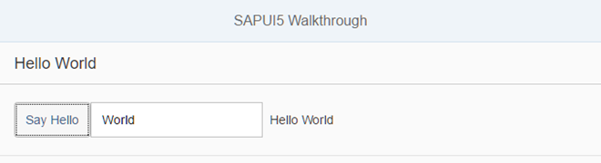

<!-- loio3b9d9f84930d43df90ad0789d99bd4a3 -->

# Step 11: Pages and Panels

After all the work on the app structure it’s time to improve the look of our app. We will use two controls from the `sap.m` library to add a bit more "bling" to our UI. You will also learn about control aggregations in this step.


## Preview

   
  
**A panel is now displaying the controls from the previous steps**

  


## Coding

You can view and download all files at [Walkthrough - Step 11](https://ui5.sap.com/#/entity/sap.m.tutorial.walkthrough/sample/sap.m.tutorial.walkthrough.11).

```xml
<mvc:View
   controllerName="sap.ui.demo.walkthrough.controller.App"
   xmlns="sap.m"
   xmlns:mvc="sap.ui.core.mvc"
  displayBlock="true">
   <App>
      <pages>
         <Page title="{i18n>homePageTitle}">
            <content>
               <Panel
                  headerText="{i18n>helloPanelTitle}">
                  <content>

                     <Button
                        text="{i18n>showHelloButtonText}"
                        press=".onShowHello"/>
                     <Input
                        value="{/recipient/name}"
                        description="Hello {/recipient/name}"
                        valueLiveUpdate="true"
                        width="60%"/>
                  </content>
               </Panel>
            </content>
         </Page>
      </pages>
   </App>
</mvc:View>

```

We put both the input field and the button inside a containing control called `sap.m.Page`. The page provides an aggregation to `0..N` other controls called `content`. It also displays the title attribute in a header section on top of the content. The page itself is placed into the `pages` aggregation of another control called `sap.m.App` which does the following important things for us:

-   It writes a bunch of properties into the header of the `index.html` that are necessary for proper display on mobile devices.

-   It offers functionality to navigate between pages with animations. We will use this soon.


In order to make the fullscreen height of the view work properly, we add the `displayBlock` attribute with the value `true` to the view. The actual content is wrapped inside a `Panel` control, in order to group related content.


## webapp/i18n/i18n.properties

```ini
# App Descriptor
appTitle=Hello World
appDescription=A simple walkthrough app that explains the most important concepts of [/pandoc/div/div/horizontalrule/codeblock/span/span
     {""}) SAPUI5 (span]

# Hello Panel
showHelloButtonText=Say Hello
helloMsg=Hello {0}
homePageTitle=Walkthrough
helloPanelTitle=Hello World
```

We add new key/value pairs to our text bundle for the start page title and the panel title.

**Related Information**  


[API Reference: `sap.m.NavContainer`](https://ui5.sap.com/#/api/sap.m.NavContainer)

[Samples: `sap.m.NavContainer` ](https://ui5.sap.com/#/entity/sap.m.NavContainer)

[API Reference: `sap.m.Page`](https://ui5.sap.com/#/api/sap.m.Page)

[Samples: `sap.m.Page` ](https://ui5.sap.com/#/entity/sap.m.Page)

