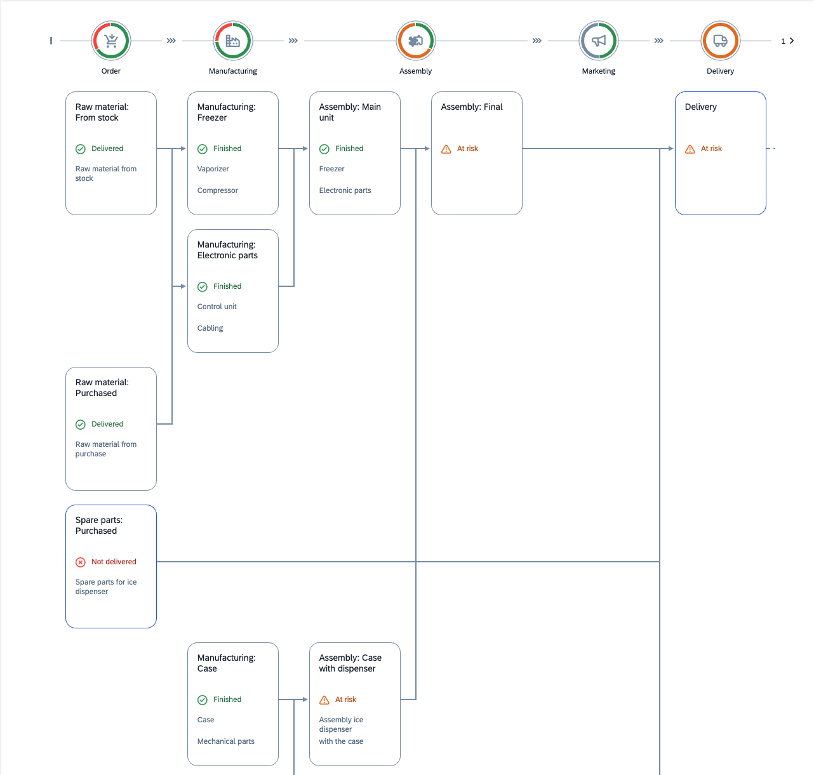
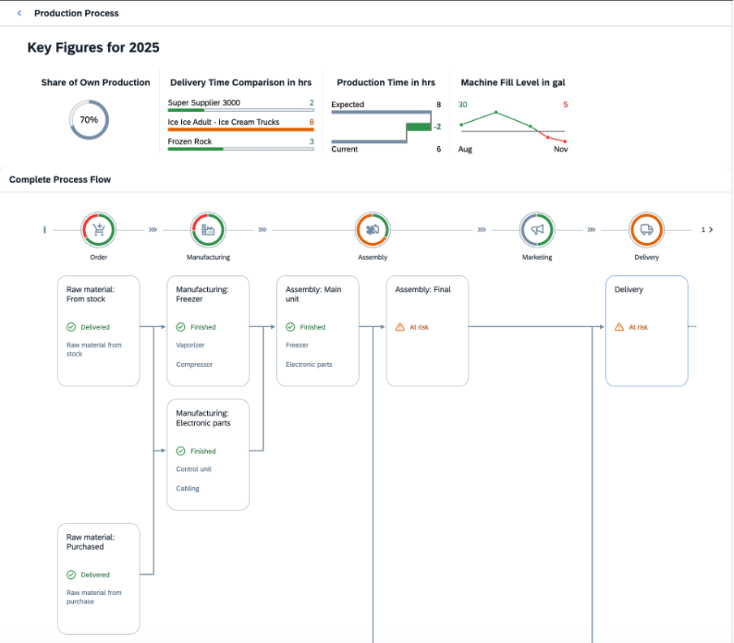

<!-- loio452ff8c4f12f4f04b3855186c7fa1adc -->

# Step 11: Process Flow

In this step, you will create the `ProcessFlow` on the *Production Process* page.

In the last steps, you have implemented the user interaction handling to allow navigation from the *Production Process* tile to the `ProcessFlow` view. With the *Production Process* tile, you have an aggregated view of the progress of the production process. Therefore, a detailed overview of the current production status is generated in this step. You will add the production flow, the states of the manufacturing steps, their dependencies, and critical steps, if necessary.

First, add the `ProcessFlow` control to this view, so that you can see the current status of the production process. The production process consists of six steps represented by the following `ProcessFlowLaneHeaders`:

-   Order

-   Manufacturing

-   Assembly

-   Marketing

-   Delivery

-   Payment


The `ProcessFlowLaneHeaders` use icons that stand for the meaning of the lanes. The lane headers aggregate the status of the nodes that are assigned to a particular lane. Each lane consists of `ProcessFlowNodes` that describe an activity in this production step. The structure of the nodes and their relationships for `ProcessFlow` are defined in the `ProcessFlowData.json` file.

The header area of the `ProcessFlow` must contain a `HeaderContainer` with four micro charts that provide the following information:

-   Share of Own Production \(your own production rate\)

-   Delivery Time Comparison in h \(comparison of suppliers' delivery time\)

-   Production Time in h \(comparison of expected and current production times\)

-   Fill Level in lb \(displays the fill level changes over time\)


<a name="loio452ff8c4f12f4f04b3855186c7fa1adc__section_vtd_2wr_l1b"/>

## Preview




<a name="loio452ff8c4f12f4f04b3855186c7fa1adc__section_n3b_ywr_l1b"/>

## `ProcessFlow`

The `ProcessFlow` in the center of the page is used to visualize the current state of the production process. Each production step is represented by a lane. The colors of the state segments of `ProcessFlowHeader` are calculated internally according to a `ProcessFlowNode` of a lane. The following semantic colors are used:

-   Grey for **Neutral**

-   Green for **Good**

-   Orange for **Critical**

-   Red for **Error**.


The *Assembly* lane in the middle is a **merged** lane that consists of nodes that are bound together by a parent-child relation. As a result, the usual width is doubled.

The `ProcessFlowNode` elements *Spare parts: Purchased* and *Delivery* are highlighted \(refer to the *focused* property on the API\). They are of high interest as their states are critical.


### `ProcessFlow.view.xml`

You can view and download this step in the Demo Kit from the [Ice Cream Machine - Step 11 - Process Flow](https://ui5.sap.com/#/entity/sap.suite.ui.commons.tutorial.icecream/sample/sap.suite.ui.commons.tutorial.icecream.11).

```xml
<mvc:View
    ...
            <m:ObjectHeader
                ...
                <m:headerContainer>
                    <m:HeaderContainer
                        ...
                    </m:HeaderContainer>
                </m:headerContainer>
            </m:ObjectHeader>
            <m:Panel headerText="{i18n>processFlowProcessTitle}">
                <ProcessFlow
                    id="processflow1"
                    scrollable="false"
                    nodes="{process>/Nodes}"
                    lanes="{process>/Lanes}"
                    nodePress=".onNodePressed">
                    <nodes>
                        <ProcessFlowNode
                            laneId="{process>lane}"
                            nodeId="{process>id}"
                            title="{process>title}"
                            titleAbbreviation="{process>titleAbbreviation}"
                            children="{process>children}"
                            state="{process>state}"
                            stateText="{process>stateText}"
                            texts="{process>texts}"
                            highlighted="{process>highlighted}"
                            focused="{process>focused}"/>
                    </nodes>
                    <lanes>
                        <ProcessFlowLaneHeader
                            laneId="{process>id}"
                            iconSrc="{process>icon}"
                            text="{process>label}"
                            position="{process>position}"/>
                    </lanes>
                </ProcessFlow>
            </m:Panel>
        ...
</mvc:View>

```

First, you must add a `ProcessFlow` control to your view. By setting the `scrollable` property to `false`, the `ProcessFlow` uses the default browser scrolling.

Next, bind the `nodes` and `lanes` aggregations. Templates are added to the corresponding aggregations \(nodes and lanes\).

The template for `ProcessFlowNodes` is created using the following properties:

-   The `laneId` that is a unique identifier for the lane the node belongs to.

-   The `nodeId` that is the current node identifier.

-   The `child` property that defines the parent-child relation to other nodes using their `nodeIds`.

-   The `state` property that determines the property of the node and influences the aggregated state of the lane directly.


The next template for the lanes is created using a `ProcessFlowLaneHeader` with a `laneId` that you have from the `ProcessFlowNode`. The `iconSrc` property of the `ProcessFlowLaneHeader` accepts any icon. The text after the state of the `ProcessFlowLaneHeader` is set with the `text` property of the lane header. The order of the lanes is defined by the `position` property of the lane header.


### `ProcessFlow.controller.js`

```js
sap.ui.define([
    "sap/ui/core/mvc/Controller",
    "sap/m/MessageToast",
    "sap/base/strings/formatMessage"
], function (Controller, MessageToast, formatMessage) {
    "use strict";

    return Controller.extend("sap.suite.ui.commons.demokit.tutorial.icecream.11.controller.ProcessFlow", {
        ...
        onNodePressed: function (oEvent) {
            var sItemTitle = oEvent.getParameters().getTitle();
            MessageToast.show(this.getResourceBundle().getText("processFlowNodeClickedMessage", [sItemTitle]));
        },

        getResourceBundle: function () {
            return this.getOwnerComponent().getModel("i18n").getResourceBundle();
        }
    });
});

```

The `onNodePressed` event listener is set on the onNode event of the `ProcessFlow`. It is called when you click on the `node`. The title text of the `node` is displayed in the message toast.


<a name="loio452ff8c4f12f4f04b3855186c7fa1adc__section_jxs_14k_l1b"/>

## Preview of the final `ProcessFlow`

This is the final view of this page:



