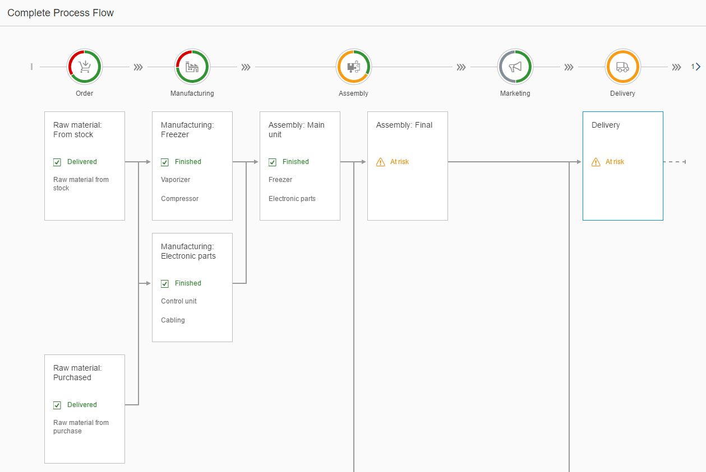

<!-- loio452ff8c4f12f4f04b3855186c7fa1adc -->

# Step 11: Process Flow

In this step, we will create the `ProcessFlow` on the **Production Process** page.


<a name="loio452ff8c4f12f4f04b3855186c7fa1adc__section_vtd_2wr_l1b"/>

## Preview

  


<a name="loio452ff8c4f12f4f04b3855186c7fa1adc__section_n3b_ywr_l1b"/>

## ProcessFlow

The `ProcessFlow` in the center of the page will be used to visualize the current state of the production process. Each production step is represented by a lane. The colors of the state segments of `ProcessFlowHeader` are calculated internally according to a `ProcessFlowNode` of a lane. The following semantic colors are used:

-   Grey for **Neutral**

-   Green for **Good**

-   Orange for **Critical**

-   Red for **Error**.


The **Assembly** lane in the middle is a *merged* lane that consists of nodes that are bound together by a parent-child relation. As a result, the usual width will be doubled.

The `ProcessFlowNode` elements **Spare parts: Purchased** and **Delivery** are highlighted \(refer to the *focused* property on the API\). They are of high interest because their states are critical.


### ProcessFlow.view.xml

You can view and download this step in the Demo Kit at [Ice Cream Machine - Step 11 - Process Flow](https://ui5.sap.com/#/entity/sap.suite.ui.commons.tutorial.icecream/sample/sap.suite.ui.commons.tutorial.icecream.11).

```xml
<mvc:View
    ...
        <m:ObjectHeader
            ...
            <m:headerContainer>
                <m:HeaderContainer
                    ...
                </m:HeaderContainer>
            </m:headerContainer>
        </m:ObjectHeader>
        <m:Panel headerText="{i18n>processFlowProcessTitle}">
            <ProcessFlow
                id="processflow1"
                scrollable="false"
                nodes="{process>/Nodes}"
                lanes="{process>/Lanes}"
                nodePress=".onNodePressed">
                <nodes>
                    <ProcessFlowNode
                        laneId="{process>lane}"
                        nodeId="{process>id}"
                        title="{process>title}"
                        titleAbbreviation="{process>titleAbbreviation}"
                        isTitleClickable="{process>isTitleClickable}"
                        children="{process>children}"
                        state="{process>state}"
                        stateText="{process>stateText}"
                        texts="{process>texts}"
                        highlighted="{process>highlighted}"
                        focused="{process>focused}" />
                </nodes>
                <lanes>
                    <ProcessFlowLaneHeader
                        laneId="{process>id}"
                        iconSrc="{process>icon}"
                        text="{process>label}"
                        position="{process>position}" />
                </lanes>
            </ProcessFlow>
        </m:Panel>
    ...
</mvc:View>
```

First, we are going to add a `ProcessFlow` control to our view. By setting the *scrollable* property to **false**, the `ProcessFlow` will use the default browser scrolling.

Next, we will bind the *nodes* and *lanes* aggregations. Templates will be added to the corresponding aggregations \(nodes and lanes\).

The template for `ProcessFlowNodes` is created using the following properties:

-   The *laneId* that is a unique identifier for the lane the node belongs to.

-   The *nodeId* that is the current node identifier.

-   The **child** property that defines the parent-child relation to other nodes using their *nodeIds*.

-   The **state** property that determines the property of the node and influences the aggregated state of the lane directly.


The next template for the lanes will be created using a `ProcessFlowLaneHeader` with a *laneId* that we already know from the `ProcessFlowNode`. The *iconSrc* property of the `ProcessFlowLaneHeader` accepts any icon. The text below the state of the `ProcessFlowLaneHeader` is set with the *text* property of the lane header. The order of the lanes is defined by the *position* property of the lane header.


### ProcessFlow.controller.js

```js
sap.ui.define([
    "sap/ui/core/mvc/Controller",
    "sap/m/MessageToast",
    "sap/base/strings/formatMessage"

], function(Controller, MessageToast) {
    "use strict";

    return Controller.extend("sap.suite.ui.commons.demokit.tutorial.icecream.11.controller.ProcessFlow", {
       ...
       onNodePressed: function(oEvent) {
            var sItemTitle = oEvent.getParameters().getTitle();
            MessageToast.show(this.getResourceBundle().getText("processFlowNodeClickedMessage", [sItemTitle]));
       },

       getResourceBundle: function() {
           return this.getOwnerComponent().getModel("i18n").getResourceBundle();
       }
   });
});
```

The *onNodePressed* event listener is set on the *onNode* event of the `ProcessFlow`. It is called when the user clicks on the *node*. The title text of the *node* will be displayed in the message toast.

**Parent topic:** [Ice Cream Machine](ice-cream-machine-e5b7f8a.md "In this tutorial, we will show you how to use SAPUI5 controls like Generic Tiles, Micro Charts, and Process Flow.")

**Next:** [Step 10: Line Micro Chart](step-10-line-micro-chart-819beea.md "In this step, we will create the LineMicroChart on the Production Process page.")

**Previous:** [Step 12: Timeline](step-12-timeline-4f36786.md "Use this step to learn how to set up a page where your customers can post their reviews of the ice cream machine.")

