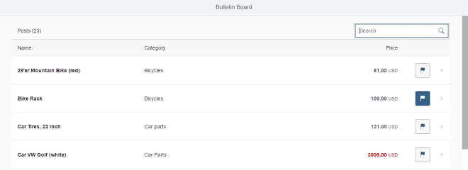

<!-- loio0c270b45dd904429ba634656e3a37a73 -->

# Step 12: Adding a Search

We now add a search field to our bulletin board and define a filter that represents the search term. This is done similarly as in step 24 of the Walkthrough tutorial.


## Preview

  
  
**Search field**




## Coding

You can view and download all files in the *Samples* in the Demo Kit at [Testing - Step 12](https://ui5.sap.com/#/entity/sap.m.tutorial.testing/sample/sap.m.tutorial.testing.12).


## webapp/view/Worklist.view.xml

```xml
...
         <Table
               id="table"
               width="auto"
               class="sapUiResponsiveMargin"
               growing="true"
               items="{
               path: '/Posts',
               sorter: {
                  path: 'Title',
                  descending: false
                  }
               }"
               busyIndicatorDelay="{worklistView>/tableBusyDelay}"
               updateFinished=".onUpdateFinished">
            <headerToolbar>
               <Toolbar>
                  <Label id="tableHeader" text="{worklistView>/worklistTableTitle}"/>
                  <ToolbarSpacer />
                  <SearchField id="searchField" width="auto" search=".onFilterPosts" />
               </Toolbar>
            </headerToolbar>
...
```

We add a `ToolbarSpacer` and a `SearchField` to the `headerToolbar` of our table.


## webapp/controller/Worklist.controller.js

```js
sap.ui.define([
	'./BaseController',
	'sap/ui/model/json/JSONModel',
	'../model/formatter',
	'../model/FlaggedType',
	'sap/m/library',
	"sap/ui/model/Filter",
	"sap/ui/model/FilterOperator"

], function (BaseController, JSONModel, formatter, FlaggedType, mobileLibrary, Filter, FilterOperator) {
	"use strict";
...
		onUpdateFinished: function (oEvent) {
			// update the worklist's object counter after the table update
			var sTitle,
				oTable = oEvent.getSource(),
				iTotalItems = oEvent.getParameter("total");
			// only update the counter if the length is final and
			// the table is not empty
			if (iTotalItems && oTable.getBinding("items").isLengthFinal()) {
				sTitle = this.getResourceBundle().getText("worklistTableTitleCount", [iTotalItems]);
			} else {
				sTitle = this.getResourceBundle().getText("worklistTableTitle");
			}
			this.getModel("worklistView").setProperty("/worklistTableTitle", sTitle);
		},

		onFilterPosts: function (oEvent) {

			// build filter array
			var aFilter = [];
			var sQuery = oEvent.getParameter("query");
			if (sQuery) {
				aFilter.push(new Filter("Title", FilterOperator.Contains, sQuery));
			}

			// filter binding
			var oTable = this.byId("table");
			var oBinding = oTable.getBinding("items");
			oBinding.filter(aFilter);
		},

...
```

To enable filtering, we extend the controller with a method that applies the search term entered in the search field to the list binding, similarly as we did for `InvoiceList.controller.js` in step 24 of the Walkthrough tutorial.

**Related Information**  


[Step 42 of Walkthrough: Filtering](step-23-filtering-5295470.md "In this step, we add a search field for our product list and define a filter that represents the search term. When searching, the list is automatically updated to show only the items that match the search term.")

