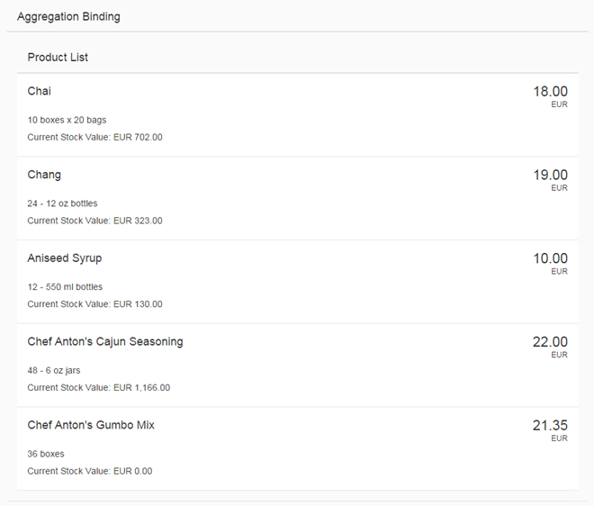

<!-- loio97830de2d7314e93b5c1ee3878a17be9 -->

# Step 12: Aggregation Binding Using Templates

Aggregation binding \(or "list binding"\) allows a control to be bound to a list within the model data and allows relative binding to the list entries by its child controls.

It will automatically create as many child controls as are needed to display the data in the model using one of the following two approaches:

-   Use template control that is cloned as many times as needed to display the data.

-   Use a factory function to generate the correct control per bound list entry based on the data received at runtime.


## Preview

   
  
<a name="loio97830de2d7314e93b5c1ee3878a17be9__fig_r1j_pst_mr"/>List with aggregation binding

  


## Coding

You can view and download all files in the Demo Kit at [Data Binding - Step 12](https://ui5.sap.com/#/entity/sap.ui.core.tutorial.databinding/sample/sap.ui.core.tutorial.databinding.12).


## webapp/index.js

```js
sap.ui.require([
	"sap/ui/model/json/JSONModel",
	"sap/ui/core/mvc/XMLView",
	"sap/ui/model/resource/ResourceModel"
], function (JSONModel, XMLView, ResourceModel) {
	"use strict";

	// Attach an anonymous function to the SAPUI5 'init' event
	sap.ui.getCore().attachInit(function () {
		var oProductModel = new JSONModel();
		oProductModel.loadData("./model/Products.json");
		sap.ui.getCore().setModel(oProductModel, "products");


		var oModel = new JSONModel({
			firstName: "Harry",
			lastName: "Hawk",
			enabled: true,
			address: {
				street: "Dietmar-Hopp-Allee 16",
				city: "Walldorf",
				zip: "69190",
				country: "Germany"
			},
			salesAmount: 12345.6789,
			currencyCode: "EUR"
		});

		// Assign the model object to the SAPUI5 core
		sap.ui.getCore().setModel(oModel);

		var oResourceBundle = new ResourceModel({
			bundleName: "sap.ui.demo.db.i18n.i18n",
			supportedLocales: ["", "de"],
			fallbackLocale: ""
		});

		sap.ui.getCore().setModel(oResourceModel, "i18n");

		// Create the XML view called "App"
		var oView = new XMLView({
			viewName: "sap.ui.demo.db.view.App"
		});

		// Register the view with the message manager
		sap.ui.getCore().getMessageManager().registerObject(oView, true);

		// Display the view
		oView.placeAt("content");
	});
});

```


## webapp/view/App.view.xml

```xml
...
					<Input description="{/currencyCode}" enabled="{/enabled}" id="salesAmount"
						value="{
							parts: [
								{path: '/salesAmount'},
								{path: '/currencyCode'}
							],
							type: 'sap.ui.model.type.Currency',
							formatOptions: {showMeasure: false}
						}" width="200px"/>
				</l:VerticalLayout>
			</l:HorizontalLayout>
		</content>
	</Panel>
	<Panel headerText="{i18n>panel3HeaderText}" class="sapUiResponsiveMargin" width="auto">
		<List headerText="{i18n>productListTitle}" items="{products>/Products}">
			<items>
				<ObjectListItem title="{products>ProductName}"
					number="{
						parts: [
							{path: 'products>UnitPrice'},
							{path: '/currencyCode'}
						],
						type: 'sap.ui.model.type.Currency',
						formatOptions: { showMeasure: false }
					}"
					numberUnit="{/currencyCode}">
					<attributes>
						<ObjectAttribute text="{products>QuantityPerUnit}"/>
						<ObjectAttribute title="{i18n>stockValue}"
							text="{
								parts: [
									{path: 'products>UnitPrice'},
									{path: 'products>UnitsInStock'},
									{path: '/currencyCode'}
								],
								formatter: '.formatStockValue'
							}"/>
					</attributes>
				</ObjectListItem>
			</items>
		</List>
	</Panel>
...
```

We add a new panel to the view.


## webapp/controller/App.controller.js

```js
sap.ui.define([
	"sap/ui/core/mvc/Controller",
	"sap/m/library",
	"sap/ui/core/Locale",
	"sap/ui/core/LocaleData",
	"sap/ui/model/type/Currency"

], function (Controller, mobileLibrary, Locale, LocaleData, Currency) {
	"use strict";
	return Controller.extend("sap.ui.demo.db.controller.App", {
		formatMail: function(sFirstName, sLastName) {
			var oBundle = this.getView().getModel("i18n").getResourceBundle();
			return mobileLibrary.URLHelper.normalizeEmail(
				sFirstName + "." + sLastName + "@example.com",
				oBundle.getText("mailSubject", [sFirstName]),
				oBundle.getText("mailBody"));
		},
		formatStockValue: function(fUnitPrice, iStockLevel, sCurrCode) {
			var sBrowserLocale = sap.ui.getCore().getConfiguration().getLanguage();
			var oLocale = new Locale(sBrowserLocale);
			var oLocaleData = new LocaleData(oLocale);
			var oCurrency = new Currency(oLocaleData.mData.currencyFormat);
			return oCurrency.formatValue([fUnitPrice * iStockLevel, sCurrCode], "string");

		}
	});
});

```


## webapp/model/Products.json \(New\)

```js
{ "Products": [ {
     "ProductID": 1,
     "ProductName": "Chai",
     "SupplierID": 1,
     "CategoryID": 1,
     "QuantityPerUnit": "10 boxes x 20 bags",
     "UnitPrice": "18.0000",
     "UnitsInStock": 39,
     "UnitsOnOrder": 0,
     "ReorderLevel": 10,
     "Discontinued": false
    }, {
     "ProductID": 2,
     "ProductName": "Chang",
     "SupplierID": 1,
     "CategoryID": 1,
     "QuantityPerUnit": "24 - 12 oz bottles",
     "UnitPrice": "19.0000",
     "UnitsInStock": 17,
     "UnitsOnOrder": 40,
     "ReorderLevel": 25,
     "Discontinued": true
    }, {
     "ProductID": 3,
     "ProductName": "Aniseed Syrup",
     "SupplierID": 1,
     "CategoryID": 2,
     "QuantityPerUnit": "12 - 550 ml bottles",
     "UnitPrice": "10.0000",
     "UnitsInStock": 0,
     "UnitsOnOrder": 70,
     "ReorderLevel": 25,
     "Discontinued": false
    }, {
     "ProductID": 4,
     "ProductName": "Chef Anton's Cajun Seasoning",
     "SupplierID": 2,
     "CategoryID": 2,
     "QuantityPerUnit": "48 - 6 oz jars",
     "UnitPrice": "22.0000",
     "UnitsInStock": 53,
     "UnitsOnOrder": 0,
     "ReorderLevel": 0,
     "Discontinued": false
    }, {
     "ProductID": 5,
     "ProductName": "Chef Anton's Gumbo Mix",
     "SupplierID": 2,
     "CategoryID": 2,
     "QuantityPerUnit": "36 boxes",
     "UnitPrice": "21.3500",
     "UnitsInStock": 0,
     "UnitsOnOrder": 0,
     "ReorderLevel": 0,
     "Discontinued": true
    }]
  }
```

We now use a new JSON model file for product data.


## webapp/i18n/i18n.properties

```ini
... 
# Screen titles
panel1HeaderText=Data Binding Basics
panel2HeaderText=Address Details
panel3HeaderText=Aggregation Binding

# Invoice List
invoiceListTitle=Invoices
statusA=New
statusB=In Progress
statusC=Done

# Product list
productListTitle=Product List
stockValue=Current Stock Value
```


## webapp/i18n/i18n\_de.properties

```ini
...
# Screen titles
panel1HeaderText=Data Binding Basics
panel2HeaderText=Adressdetails
panel3HeaderText=Aggregation Binding

# Invoice List
invoiceListTitle=Rechnungen
statusA=Neu
statusB=Laufend
statusC=Abgeschlossen

# Product list
productListTitle=Artikelliste
stockValue=Lagerbestand Wert
```

We add the missing texts.

**Parent topic:** [Data Binding](data-binding-e531093.md "In this tutorial, we will explain the concepts of data binding in SAPUI5.")

**Next:** [Step 11: Validation Using the Message Manager](step-11-validation-using-the-message-manager-b8c4e53.md "So far, we have created a currency field that can format itself correctly. The currency data type also has the ability to validate that user input adheres to to the requirements of a currency; however, data type validation functions are managed by SAPUI5, which of itself has no mechanism for reporting error messages back to the UI; therefore, we need a mechanism for reporting error messages raised by validation functions back to the user. In this step, we will connect the entire view to a feature known as the &quot;Message Manager&quot;. Once this connection is established, any validation error messages generated based on the user input will be passed to the message manager which in turn will connect them to the appropriate view and control that caused the error.")

**Previous:** [Step 13: Element Binding](step-13-element-binding-6c7c5c2.md "Now we want to do something with that newly generated list. In most cases you will use a list to allow the selection of an item and then show the details of that item elsewhere. In order to achieve this, we use a form with relatively bound controls and bind it to the selected entity via element binding.")

**Related Information**  


[List Binding \(Aggregation Binding\)](../04_Essentials/list-binding-aggregation-binding-91f0577.md "List binding (or aggregation binding) is used to automatically create child controls according to model data.")

