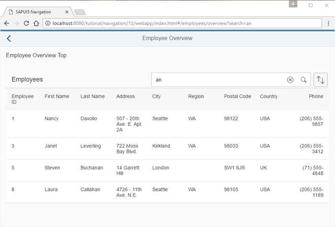

<!-- loioe85da535ea19430a90c381f3c2bd748e -->

# Step 12: Make a Search Bookmarkable

In this step we will make the search bookmarkable. This allows users to search for employees in the *Employees* table and they can bookmark their search query or share the URL.


## Preview

  
  
**Search and sorting bookmarkable**




## Coding

You can view and download all files in the *Samples* in the Demo Kit at [Routing and Navigation - Step 12](https://ui5.sap.com/#/entity/sap.ui.core.tutorial.navigation/sample/sap.ui.core.tutorial.navigation.12) .


## webapp/manifest.json

```js
{
	"_version": "1.12.0",
	"sap.app": {
		...
	},
	"sap.ui": {
		...
	},
	"sap.ui5": {
		...
		"routing": {
			"config": {
				"routerClass": "sap.m.routing.Router",
				"type": "View",
				"viewType": "XML",
				"path": "sap.ui.demo.nav.view",
				"controlId": "app",
				"controlAggregation": "pages",
				"transition": "slide",
				"bypassed": {
					"target": "notFound"
				}
			},
			"routes": [{
				"pattern": "",
				"name": "appHome",
				"target": "home"
			}, {
				"pattern": "employees",
				"name": "employeeList",
				"target": "employees"
			}, {
				"pattern": "employees/overview:?query:",
				"name": "employeeOverview",
				"target": ["employeeOverviewTop", "employeeOverviewContent"]

			}, {
				"pattern": "employees/{employeeId}",
				"name": "employee",
				"target": "employee"
			}, {
				"pattern": "employees/{employeeId}/resume:?query:",
				"name": "employeeResume",
				"target": "employeeResume"
			}],
			"targets": {
				...
			}
		}
	}
}
```

In order to make the search bookmarkable we have to think about how the pattern of the corresponding route should match the bookmark. We decide to allow `/#/employees/overview?search=mySearchQueryString` in order to bookmark a search. Therefore, we simply extend our routing configuration a little. We add the optional `:?query:` parameter to the route `employeeOverview`. We keep in mind that we want to use `search` as the URL parameter for the search term that was entered in the search field.


## webapp/controller/employee/overview/EmployeeOverviewContent.controller.js

```js
sap.ui.define([
	"sap/ui/demo/nav/controller/BaseController",
	"sap/ui/model/Filter",
	"sap/ui/model/FilterOperator",
	"sap/ui/model/Sorter",
	"sap/m/ViewSettingsDialog",
	"sap/m/ViewSettingsItem"
], function(
	BaseController,
	Filter,
	FilterOperator,
	Sorter,
	ViewSettingsDialog,
	ViewSettingsItem
) {
	"use strict";

	return BaseController.extend("sap.ui.demo.nav.controller.employee.overview.EmployeeOverviewContent", {

		onInit: function () {
			var oRouter = this.getRouter();

			this._oTable = this.byId("employeesTable");
			this._oVSD = null;
			this._sSortField = null;
			this._bSortDescending = false;
			this._aValidSortFields = ["EmployeeID", "FirstName", "LastName"];
			this._sSearchQuery = null;
			this._oRouterArgs = null;


			this._initViewSettingsDialog();

			// make the search bookmarkable
			oRouter.getRoute("employeeOverview").attachMatched(this._onRouteMatched, this);

		},

		_onRouteMatched: function (oEvent) {
			// save the current query state
			this._oRouterArgs = oEvent.getParameter("arguments");
			this._oRouterArgs["?query"] = this._oRouterArgs["?query"] || {};

			// search/filter via URL hash
			this._applySearchFilter(this._oRouterArgs["?query"].search);
		},


		onSortButtonPressed : function (oEvent) {
			this._oVSD.open();
		},

		onSearchEmployeesTable : function (oEvent) {
			var oRouter = this.getRouter();
			// update the hash with the current search term
			this._oRouterArgs["?query"].search = oEvent.getSource().getValue();
			oRouter.navTo("employeeOverview", this._oRouterArgs, true /*no history*/);
		},
		...
	});
});
```

Now we handle the optional query parameter from the `employeeOverview` route in our `EmployeeOverviewContent` controller. First we change the `onInit` function by adding an event listener for the matched event of the `employeeOverview` route. Then we buffer the current router arguments as received from the event. If a query is available, the result from `oEvent.getParameter("arguments")` will contain a `?query` property with an object of all URL parameters specified, otherwise it is undefined. If no query parameter is defined, we always initialize the query and save it to `this._oRouterArgs["?query"]`. If we have a search term query at the `search` key we continue and call `this._applySearchFilter(this._oRouterArgs["?query"].search)` to trigger a search based on the search query parameter from the URL.

Storing the `arguments` objects internally in the controller is important, because we will use the current arguments when calling `navTo()` in the search event handler `onSearchEmployeesTable` and pass on the arguments with the updated search term. We keep the URL and the UI in sync by navigating to the current target again with the current value of the search field from the event’s source. The search value is stored in `this._oRouterArgs["?query"].search` together with the other query parameters and it is passed directly to the router again

That’s it, now our search is bookmarkable and reflected in the URL. Try to access the following pages in your browser:

-   `webapp/index.html#/employees/overview`

-   `webapp/index.html#/employees/overview?search=`

-   `webapp/index.html#/employees/overview?search=an`


When you change the value in the search field, you see that the hash updates accordingly.

