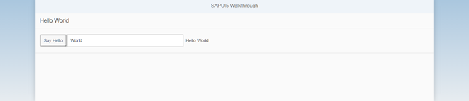

<!-- loio4df1d914e52d4b1aa0805eb01522537e -->

# Step 12: Shell Control as Container

Now we use a shell control as container for our app and use it as our new root element. The shell takes care of visual adaptation of the application to the device’s screen size by introducing a so-called letterbox on desktop screens.


## Preview

   
  
**The app is now run in a shell that limits the app width**

  


## Coding

You can view and download all files at [Walkthrough - Step 12](https://ui5.sap.com/#/entity/sap.m.tutorial.walkthrough/sample/sap.m.tutorial.walkthrough.12).

```xml
<mvc:View
	controllerName="sap.ui.demo.walkthrough.controller.App"
	xmlns="sap.m"
	xmlns:mvc="sap.ui.core.mvc"
	displayBlock="true">
	<Shell>

		<App>
			<pages>
				<Page title="{i18n>homePageTitle}">
					<content>
						<Panel
							headerText="{i18n>helloPanelTitle}">
							<content>
								<Button
									text="{i18n>showHelloButtonText}"
									press=".onShowHello"/>
								<Input
									value="{/recipient/name}"
									description="Hello {/recipient/name}"
									valueLiveUpdate="true"
									width="60%"/>
							</content>
						</Panel>
					</content>
				</Page>
			</pages>
		</App>
	</Shell>

</mvc:View>

```

The shell control is now the outermost control of our app and automatically displays a so-called letterbox, if the screen size is larger than a certain width.

> ### Note:  
> We don't add the `Shell` control to the declarative UI definition in the XML view if apps run in an external shell, like the SAP Fiori launchpad that already has a shell around the component UI.

There are further options to customize the shell, like setting a custom background image or color and setting a custom logo. Check the related API reference for more details.

**Related Information**  


[API Reference: `sap.m.Shell`](https://ui5.sap.com/#/api/sap.m.Shell)

