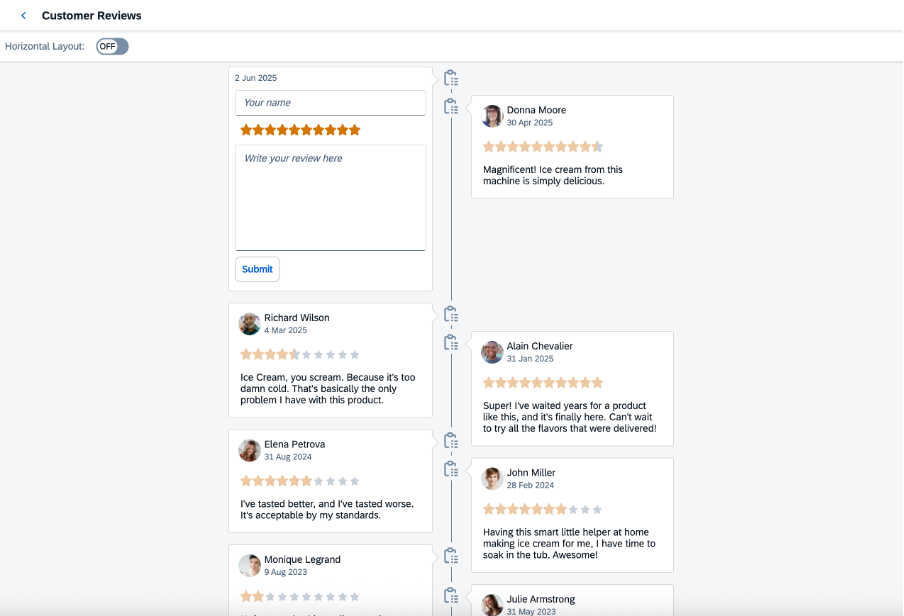

<!-- loio4f36786913774ad98fe471e61ae723c2 -->

# Step 12: Timeline

Use this step to learn how to set up a page where your customers can post their reviews of the ice cream machine.

In this step, you will use the `Timeline` control that allows the users to write and submit reviews. The reviews are arranged in chronological order along the timeline axis.

You can view and download this step in the Demo Kit from the [Ice Cream Machine - Step 12 - Timeline](https://ui5.sap.com/#/entity/sap.suite.ui.commons.tutorial.icecream/sample/sap.suite.ui.commons.tutorial.icecream.12).


<a name="loio4f36786913774ad98fe471e61ae723c2__section_ssy_4fs_n1b"/>

## Preview




<a name="loio4f36786913774ad98fe471e61ae723c2__section_idf_qfs_n1b"/>

## Setting Up a Reviews Page with a Timeline

To perform this step, you need one of the views you created in step 5, `Reviews.view.xml`, as well as the controller you defined for this view, `Reviews.controller.js`.


### `Reviews.view.xml`

In the `Reviews.view.xml` view, add a `Timeline` element that displays a timeline with customer reviews.

You may also need to add a `page` and a `toolbar` if the view does not include them yet.

```xml
<mvc:View
    xmlns="sap.m"
    xmlns:mvc="sap.ui.core.mvc"
    xmlns:suite="sap.suite.ui.commons"
    controllerName="sap.suite.ui.commons.demokit.tutorial.icecream.12.controller.Reviews">
    <Page
        title="{i18n>timelineTitle}"
        showNavButton="true"
        navButtonPress=".onNavButtonPressed"
        backgroundDesign="Solid">
        <Toolbar>
            <Label text="{i18n>layoutSwitchLabel}"/>
            <Switch change=".onHorizontalSwitchChange"/>
        </Toolbar>
        <suite:Timeline
            id="timeline"
            enableDoubleSided="true"
            growingThreshold="0"
            groupBy="dateTime"
            lazyLoading="true"
            content="{reviews>/UserReviews}"
            textHeight="automatic"
            showHeaderBar="false">
            <suite:TimelineItem
                dateTime="{
                    path: 'reviews>date',
                    formatter: '.formatDateTime'
                }"
                userPicture="{=!${reviews>template} ? ${reviews>userPic} : null}"
                title="{=!${reviews>template} ? ${reviews>user} : null}"
                text="{=!${reviews>template} ? ${reviews>quote} : null}"
                filterValue="{=!${reviews>template} ? ${reviews>rating} : null}">
                <suite:embeddedControl>
                    <VBox>
                        <Input
                            value="{reviews>user}"
                            visible="{reviews>template}"
                            placeholder="{i18n>newReviewUserNameHint}"/>
                        <RatingIndicator
                            enabled="{reviews>template}"
                            value="{reviews>rating}"
                            maxValue="10"
                            iconSize="1rem"
                            class="sapUiTinyMargin"/>
                        <Text
                            text="{reviews>quote}"
                            visible="{=!${reviews>template}}"
                            class="sapUiTinyMargin"/>
                        <TextArea
                            value="{reviews>quote}"
                            growing="false"
                            height="150px"
                            width="100%"
                            visible="{reviews>template}"
                            placeholder="{i18n>newReviewUserCommentHint}"
                            valueLiveUpdate="true"/>
                        <Button
                            visible="{reviews>template}"
                            text="{i18n>newReviewButtonText}"
                            press=".addReview"/>
                    </VBox>
                </suite:embeddedControl>
            </suite:TimelineItem>
        </suite:Timeline>
    </Page>

</mvc:View>

```


### `Reviews.controller.js`

In the reviews controller, define the `addReview` function for adding a review, along with the `formatDateTime` function for adjusting date and time format, dynamically updating the `onRatingChange` rating, `onHorizontalSwitchChange` layout switching, and navigating back to the start page, `onNavButtonPressed`.

```js
sap.ui.define([
    "sap/ui/core/mvc/Controller",
    "sap/ui/core/format/DateFormat"
], function (Controller, DateFormat) {
    "use strict";

    return Controller.extend("sap.suite.ui.commons.demokit.tutorial.icecream.12.controller.Reviews", {
        onInit: function () {
            this.oTimeline = this.byId("timeline");
        },

        addReview: function () {
            var oModel = this.getView().getModel("reviews"),
                oData = oModel.getData(),
                oTemplateEntry = oData.UserReviews[0];

            oTemplateEntry.template = false;
            oTemplateEntry.dateTime = new Date().toJSON().slice(0, 10).toString();

            // Add new template entry to the beginning
            oData.UserReviews.unshift({
                "user": "",
                "userPic": "",
                "rating": 10,
                "quote": "",
                "dateTime": "now",
                "template": true
            });

            oModel.setData(oData);
        },

        formatDateTime: function (dateTime) {
            var oDateInstance = DateFormat.getDateInstance();
            return oDateInstance.format(oDateInstance.parse(dateTime));
        },

        onNavButtonPressed: function () {
            var oRouter = this.getOwnerComponent().getRouter();
            oRouter.navTo("home");
        },

        onHorizontalSwitchChange: function (event) {
            if (event.getParameter("state")) {
                this.oTimeline.setAxisOrientation("Horizontal");
            } else {
                this.oTimeline.setAxisOrientation("Vertical");
            }
        }

    });
});

```

The initial review data is pulled from the model data in the `/model/data/Reviews.json` file that is included in the download materials for this tutorial.

