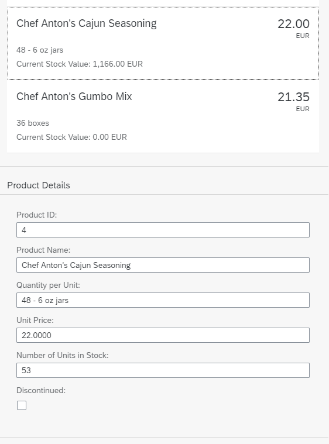

<!-- loio6c7c5c266b534e7ea9a28f861dc515f5 -->

# Step 13: Element Binding

Now we want to do something with that newly generated list. In most cases you will use a list to allow the selection of an item and then show the details of that item elsewhere. In order to achieve this, we use a form with relatively bound controls and bind it to the selected entity via element binding.


## Preview

  
  
**Element binding implemented, product details displayed per item**




## Coding

You can view and download all files in the Demo Kit at [Data Binding - Step 13](https://ui5.sap.com/#/entity/sap.ui.core.tutorial.databinding/sample/sap.ui.core.tutorial.databinding.13).


## webapp/view/App.view.xml

```xml
...
			</items>
		</List>
	</Panel>
	<Panel id="productDetailsPanel" headerText="{i18n>panel4HeaderText}" class="sapUiResponsiveMargin" width="auto">
		<form:SimpleForm editable="true" layout="ColumnLayout">
			<Label text="{i18n>ProductID}"/>
			<Input value="{products>ProductID}"/>

			<Label text="{i18n>ProductName}"/>
			<Input value="{products>ProductName}"/>

			<Label text="{i18n>QuantityPerUnit}"/>
			<Input value="{products>QuantityPerUnit}"/>

			<Label text="{i18n>UnitPrice}"/>
			<Input value="{products>UnitPrice}"/>

			<Label text="{i18n>UnitsInStock}"/>
			<Input value="{products>UnitsInStock}"/>

			<Label text="{i18n>Discontinued}"/>
			<CheckBox selected="{products>Discontinued}"/>
		</form:SimpleForm>
	</Panel>
</mvc:View>
```

Now we have an empty form. In order to fill this form with data, we will bind the whole panel to the path of the element which we clicked in the list. We need to add a `press`-event handler to the items in the list:


## webapp/view/App.view.xml

```xml
...
  	<Panel headerText="{i18n>panel3HeaderText}" class="sapUiResponsiveMargin" width="auto">
		<List headerText="{i18n>productListTitle}" items="{products>/Products}">
			<items>
				<ObjectListItem
					press=".onItemSelected"
					type="Active"
					title="{products>ProductName}"
					number="{
						parts: [
							{path: 'products>UnitPrice'},
							{path: '/currencyCode'}
						],
						type: 'sap.ui.model.type.Currency',
						formatOptions: { showMeasure: false }
					}"
					numberUnit="{/currencyCode}">
					<attributes>
... 
```


## webapp/controller/App.controller.js

```js
sap.ui.define([
	"sap/ui/core/mvc/Controller",
	"sap/m/library",
	"sap/ui/core/Locale",
	"sap/ui/core/LocaleData",
	"sap/ui/model/type/Currency"
], function (Controller, mobileLibrary, Locale, LocaleData, Currency) {
	"use strict";
	return Controller.extend("sap.ui.demo.db.controller.App", {
		formatMail: function(sFirstName, sLastName) {
			var oBundle = this.getView().getModel("i18n").getResourceBundle();
			return mobileLibrary.URLHelper.normalizeEmail(
				sFirstName + "." + sLastName + "@example.com",
				oBundle.getText("mailSubject", [sFirstName]),
				oBundle.getText("mailBody"));
		},
		formatStockValue: function(fUnitPrice, iStockLevel, sCurrCode) {
			var sBrowserLocale = sap.ui.getCore().getConfiguration().getLanguage();
			var oLocale = new Locale(sBrowserLocale);
			var oLocaleData = new LocaleData(oLocale);
			var oCurrency = new Currency(oLocaleData.mData.currencyFormat);
			return oCurrency.formatValue([fUnitPrice * iStockLevel, sCurrCode], "string");
		},
		onItemSelected: function(oEvent) {
			var oSelectedItem = oEvent.getSource();
			var oContext = oSelectedItem.getBindingContext("products");
			var sPath = oContext.getPath();
			var oProductDetailPanel = this.byId("productDetailsPanel");
			oProductDetailPanel.bindElement({ path: sPath, model: "products" });

		}
	});
});

```

In the controller, we bind the newly created panel to the correct item whenever it is pressed.

We can now click on an element in the list and see its details in the panel below. We can even edit these details and these changes are directly shown in the list because we use two-way binding.

> ### Note:  
> Element bindings can also be relative to its parent context.


## webapp/i18n/i18n.properties

```ini
...
# Screen titles
panel1HeaderText=Data Binding Basics
panel2HeaderText=Address Details
panel3HeaderText=Aggregation Binding
panel4HeaderText=Product Details

# Product list
productListTitle=Product List
stockValue=Current Stock Value

# Product Details
ProductID=Product ID
ProductName=Product Name
QuantityPerUnit=Quantity per Unit
UnitPrice=Unit Price
UnitsInStock=Number of Units in Stock
Discontinued=Discontinued

```


## webapp/i18n/i18n\_de.properties

```ini
# Screen titles
panel1HeaderText=Data Binding Grundlagen
panel2HeaderText=Adressdetails
panel3HeaderText=Aggregation Binding
panel4HeaderText=Produktdetails
 
# Product list
productListTitle=Artikelliste
stockValue=Lagerbestand Wert

# Product Details
ProductID=Produkt-ID
ProductName=Produktname
QuantityPerUnit=Menge pro Einheit
UnitPrice=Preis der Einheit
UnitsInStock=Lagerbestand
Discontinued=Eingestellt
```

Add the missing texts to the `properties` files.

**Related Information**  


[Context Binding \(Element Binding\)](../04_Essentials/context-binding-element-binding-91f05e8.md "Context binding (or element binding) allows you to bind elements to a specific object in the model data, which will create a binding context and allow relative binding within the control and all of its children. This is especially helpful in list-detail scenarios.")

