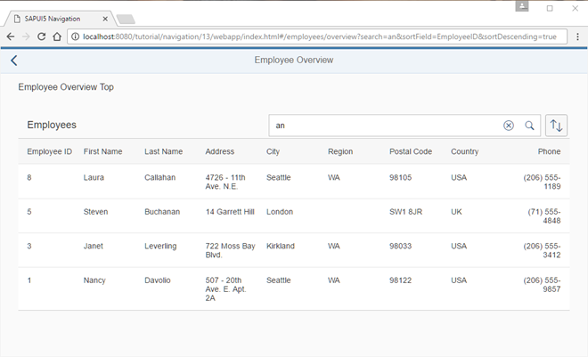

<!-- loio39759878ae4f48dcad0cf34da1d299f0 -->

# Step 13: Make Table Sorting Bookmarkable

In this step, we will create a button at the top of the table which will change the sorting of the table. When the current sorting state of the table is changed, the sorting state will be reflected in the URL. This illustrates how to make the table sorting bookmarkable.


## Preview

   
  
<a name="loio39759878ae4f48dcad0cf34da1d299f0__fig_r1j_pst_mr"/>Bookmarkable search and sorting

  


## Coding

You can view and download all files in the *Samples* in the Demo Kit at [Routing and Navigation - Step 13](https://ui5.sap.com/#/entity/sap.ui.core.tutorial.navigation/sample/sap.ui.core.tutorial.navigation.13).


## webapp/controller/employee/overview/EmployeeOverviewContent.controller.js

```js
sap.ui.define([
	"sap/ui/demo/nav/controller/BaseController",
	"sap/ui/model/Filter",
	"sap/ui/model/FilterOperator",
	"sap/ui/model/Sorter",
	"sap/m/ViewSettingsDialog",
	"sap/m/ViewSettingsItem"
], function(
	BaseController,
	Filter,
	FilterOperator,
	Sorter,
	ViewSettingsDialog,
	ViewSettingsItem
) {
	"use strict";
	return BaseController.extend("sap.ui.demo.nav.controller.employee.overview.EmployeeOverviewContent", {
		onInit: function () {
			...
		},
		_onRouteMatched: function (oEvent) {
			// save the current query state
			this._oRouterArgs = oEvent.getParameter("arguments");
			this._oRouterArgs["?query"] = this._oRouterArgs["?query"] || {};
			var oQueryParameter = this._oRouterArgs["?query"];

			// search/filter via URL hash
			this._applySearchFilter(oQueryParameter.search);

			// sorting via URL hash
			this._applySorter(oQueryParameter.sortField, oQueryParameter.sortDescending);
			
		},
		...
		_initViewSettingsDialog: function () {
			var oRouter = this.getRouter();
			this._oVSD = new ViewSettingsDialog("vsd", {
				confirm: function (oEvent) {
					var oSortItem = oEvent.getParameter("sortItem");
					this._oRouterArgs["?query"].sortField = oSortItem.getKey();
					this._oRouterArgs["?query"].sortDescending = oEvent.getParameter("sortDescending");
					oRouter.navTo("employeeOverview", this._oRouterArgs, true /*without history*/);
				}.bind(this) 
			});
			...
		},
		...
	});
});
```

We enhance the `EmployeeOverviewContent` controller further to add support for bookmarking the table’s sorting options. We expect two query parameters `sortField` and `sortDescending` from the URL for configuring the sorting of the table. In the matched handler of the route `employeeOverview`, we store the query parameter in the `oQueryParameter` variable and add an additional call to `this._applySorter(oQueryParameter.sortField, oQueryParameter.sortDescending)` . This triggers the sorting action based on the two query parameters `sortField` and `sortDescending` from the URL.

Next we change the `confirm` event handlers of our `ViewSettingsDialog`. The `confirm` handler updates the current router arguments with the parameters from the event accordingly. Then we call `oRouter.navTo("employeeOverview", this._oRouterArgs, true)` with the updated router arguments to persist the new sorting parameters in the URL. Both the previous arguments \(i.e. `search`\) and the new arguments for the sorting will then be handled by the matched event handler for the `employeeOverview` route.

Congratulations! Even the sorting options of the table can now be bookmarked. Try to access the following pages:

-   `webapp/index.html#/employees/overview?sortField=EmployeeID&sortDescending=true`

-   `webapp/index.html#/employees/overview?search=an&sortField=EmployeeID&sortDescending=true`


When changing the table’s sorting options, you will see that the hash updates accordingly.

**Parent topic:** [Navigation and Routing](navigation-and-routing-1b6dcd3.md "SAPUI5 comes with a powerful routing API that helps you control the state of your application efficiently. This tutorial will illustrate all major features and APIs related to navigation and routing in SAPUI5 apps by creating a simple and easy to understand mobile app. It represents a set of best practices for applying the navigation and routing features of SAPUI5 to your applications.")

**Next:** [Step 12: Make a Search Bookmarkable](step-12-make-a-search-bookmarkable-e85da53.md "In this step we will make the search bookmarkable. This allows users to search for employees in the Employees table and they can bookmark their search query or share the URL.")

**Previous:** [Step 14: Make Dialogs Bookmarkable](step-14-make-dialogs-bookmarkable-5cc3147.md "In this step, we want to allow bookmarking of the dialog box that is opened when the user clicks the Sort button. The dialog should automatically open when the URL contains the query parameter showDialog.")

