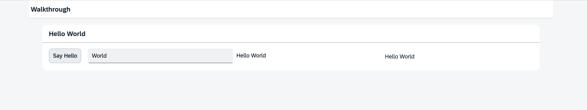

<!-- loio17b87fbafb5a4474982760d2a3a73e69 -->

# Step 13: Margins and Paddings

Our app content is still glued to the corners of the letterbox. To fine-tune our layout, we can add margins and paddings to the controls that we added in the previous step.

Instead of manually adding CSS to the controls, we will use the standard classes provided by SAPUI5. These classes take care of consistent sizing steps, left-to-right support, and responsiveness.


## Preview

  
  
**The layout of the panel and its content now has margins and padding**




<a name="loio17b87fbafb5a4474982760d2a3a73e69__section_wl1_jq2_syb"/>

## Coding

You can view and download all files at [Walkthrough - Step 13](https://ui5.sap.com/#/entity/sap.m.tutorial.walkthrough/sample/sap.m.tutorial.walkthrough.13).


<a name="loio17b87fbafb5a4474982760d2a3a73e69__section_xl1_jq2_syb"/>

## webapp/view/App.view.xml

```xml
<mvc:View
	controllerName="ui5.walkthrough.controller.App"
	xmlns="sap.m"
	xmlns:mvc="sap.ui.core.mvc"
	displayBlock="true">
	<Shell>
		<App>
			<pages>
				<Page title="{i18n>homePageTitle}">
					<content>
						<Panel
							headerText="{i18n>helloPanelTitle}"
							class="sapUiResponsiveMargin"
							width="auto">
							<content>
								<Button
									text="{i18n>showHelloButtonText}"
									press=".onShowHello"
									class="sapUiSmallMarginEnd"/>
								<Input
									value="{/recipient/name}"
									valueLiveUpdate="true"
									width="60%"/>
								<Text
									text="Hello {/recipient/name}"
									class="sapUiSmallMargin"/>
							</content>
						</Panel>
					</content>
				</Page>
			</pages>
		</App>
	</Shell>
</mvc:View>
```

To layout the panel, we add the CSS class `sapUiResponsiveMargin` that will add some space around the panel. We have to set the width of the panel to `auto` since the margin would otherwise be added to the default width of 100% and exceed the page size.

If you decrease the screen size, then you can actually see that the margin also decreases. As the name suggests, the margin is responsive and adapts to the screen size of the device. Tablets will get a smaller margin and phones in portrait mode will not get a margin to save space on these small screens.

Margins can be added to all kinds of controls and are available in many different options. We can even add space between the button and the input field by adding class `sapUiSmallMarginEnd` to the button.

To format the output text individually, we remove the description from the input field and add a new `Text` control with the same value. Here we also use a small margin to align it with the other content. Similarly, we could add the standard padding classes to layout the inner parts of container controls such as our panel, but as it already brings a padding by default, this is not needed here.


## Conventions

-   Use the standard SAPUI5 CSS classes for the layout if possible.


**Related Information**  


[Using Predefined CSS Margin Classes](../04_Essentials/using-predefined-css-margin-classes-777168f.md "SAPUI5 gives you the option of adding spacing in between controls by adding a margin. A margin clears an area around its respective control, outside of its border.")

[Using Container Content Padding CSS Classes](../04_Essentials/using-container-content-padding-css-classes-c71f6df.md "For many container controls in SAPUI5, such as a Dialog or a Page, you can define whether the container should have a padding within the content area. A padding clears the area between the container layout and the controls that are displayed in the content area.")

