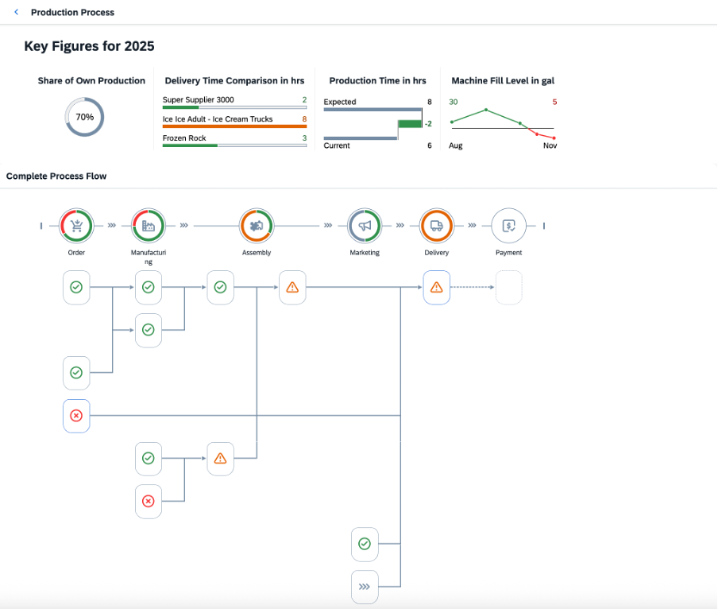
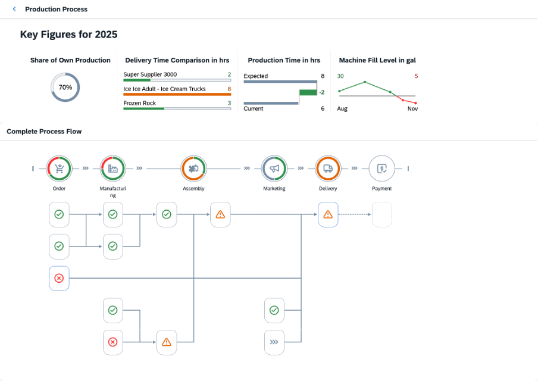

<!-- loiob6ed1f85d6fe483989e8c6d9cea70040 -->

# Step 13: Optimizing the Process Flow Layout

In the last step, you will optimize the `ProcessFlow` layout.

When you have completed the previous steps, your *Production Process* page will look like this:

You may have seen that some `ProcessFlow` nodes are not placed in a perfect way. For example, there is additional space for the `Marketing` node and available space is not used. To optimize the position of the nodes, the `ProcessFlow` control provides the `optimizeLayout` API method. With this method, you can rearrange the nodes.

Note that this optimization has an influence on the app performance as rendering times increase.

For more information, see the [API Reference](https://ui5.sap.com/#/api/sap.suite.ui.commons.ProcessFlow) in the Demo Kit.

