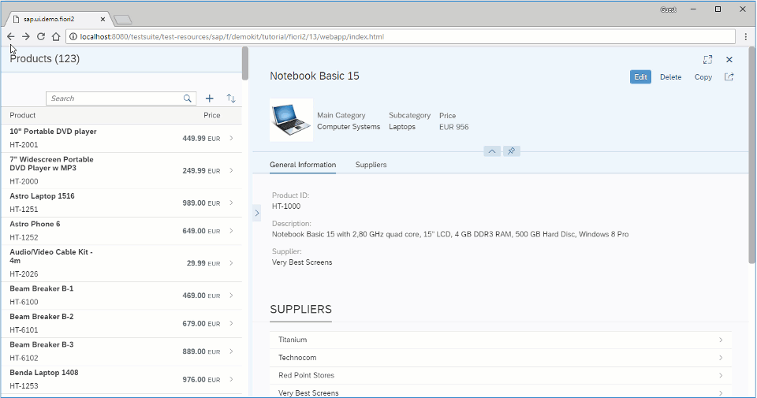

<!-- loiocb3863746ea14d3698a8b6cc2c62832d -->

# Step 13: Setting the List-Detail Pattern

In this step, we set up the app to follow the list-detail pattern.

Apps using the list-detail pattern operate with a layout divided into two separate areas - a list area and a details area. The list area displays the items available to the user and the details area displays the details for an item that is selected in the list. If your use case requires it, you can set the `FlexibleColumnLayout` to use a maximum of two columns. For more information, see the [SAP Fiori Design Guidelines](https://experience.sap.com/fiori-design-web/flexible-column-layout/#two-columns-masterdetail-mode).


<a name="loiocb3863746ea14d3698a8b6cc2c62832d__section_yfh_d31_12b"/>

## Preview

  
  
**list-detail pattern with FlexibleColumnLayout**




<a name="loiocb3863746ea14d3698a8b6cc2c62832d__section_fd2_4dd_lbb"/>

## Coding

You can view and download all files at [Flexible Column Layout App - Step 13](https://ui5.sap.com/#/sample/sap.f.tutorial.fiori2.13/preview).


<a name="loiocb3863746ea14d3698a8b6cc2c62832d__section_b2w_gqj_l4b"/>

## webapp/Component.js \[MODIFY\]

```js
		...
		getHelper: function () {
			return this._getFcl().then(function(oFCL) {
				var oSettings = {
					defaultTwoColumnLayoutType: fioriLibrary.LayoutType.TwoColumnsMidExpanded,
					defaultThreeColumnLayoutType: fioriLibrary.LayoutType.ThreeColumnsMidExpanded,
					initialColumnsCount: 2,
					maxColumnsCount: 2
				};
				return (FlexibleColumnLayoutSemanticHelper.getInstanceFor(oFCL, oSettings));
			 });
		},
		...
```

We set `maxColumnsCount` parameter of the `getHelper` method to `2`.

