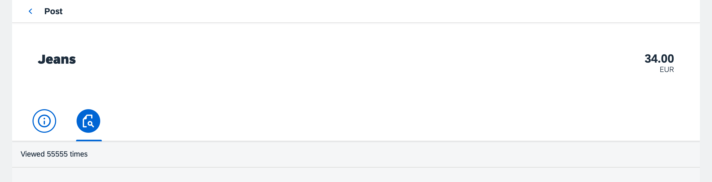

<!-- loio6e9c6bd2054c4425b7f15cac31aa675c -->

# Step 14: Adding Tabs

We want to display statistics for posts, for example, how many times it was viewed. To achieve this, we implement an icon tab bar with an *Info* tab and a *Statistics* tab. The existing content should be placed on the *Info* tab and the view count on the *Statistics* tab.


## Preview

  
  
**An icon tab bar with statistics**




## Coding

You can view and download all files in the *Samples* in the Demo Kit at [Testing - Step 14](https://ui5.sap.com/#/entity/sap.m.tutorial.testing/sample/sap.m.tutorial.testing.14).


## webapp/view/Post.view.xml

```xml
<mvc:View
      controllerName="sap.ui.demo.bulletinboard.controller.Post"
      xmlns="sap.m"
      xmlns:form="sap.ui.layout.form"
      xmlns:mvc="sap.ui.core.mvc"
      xmlns:semantic="sap.m.semantic">
   <semantic:FullscreenPage
         id="page"
         busy="{postView>/busy}"
         busyIndicatorDelay="0"
         navButtonPress=".onNavBack"
         showNavButton="true"
         title="{i18n>objectTitle}">
      <semantic:content>
         <ObjectHeader
               id="objectHeader"
               title="{Title}"
               number="{
                  path: 'Price',
                  formatter: '.formatter.numberUnit'
               }"
               numberUnit="{Currency}"
               backgroundDesign="Translucent">
         </ObjectHeader>
         <IconTabBar id="iconTabBar"
                  expanded="{device>/isNoPhone}"
                  class="sapUiNoContentPadding">
            <items>
               <IconTabFilter icon="sap-icon://hint" key="info" >
                  <form:SimpleForm>
                     <form:content>
                        <Label text="{i18n>postDateLabel}"/>
                        <Text text="{Timestamp}"/>
                        <Label text="{i18n>postDescriptionLabel}"/>
                        <Text text="{Description}"/>
                     </form:content>
                  </form:SimpleForm>
               </IconTabFilter>
               <IconTabFilter icon="sap-icon://inspection" key="statistics">
                  <Text text="Viewed 55555 times" id="viewCounter"/>
               </IconTabFilter>
            </items>
         </IconTabBar>

      </semantic:content>
   </semantic:FullscreenPage>
</mvc:View>
```

We add a `sap.m.IconTabBar` with the two tabs `info` and `statistics`. The `statistics` tab we have already referred to in our test case.

Inside the first tab there is a `sap.ui.layout.form.SimpleForm` with a date and a description field that are mapped to the model data. In the second tab we place a new `Text` control.

In this very simple example, we just put a static text in the tab. In a real application, we would bind the value to the model.


## webapp/i18n/i18n.properties

```ini
#~~~ Object View ~~~~~~~~~~~~~~~~~~~~~~~~~~

#XTIT: Object view title
objectTitle=Post


#XTIT: Post view date label
postDateLabel=Posted At

#XTIT: Post view description label
postDescriptionLabel=Description


#~~~ Footer Options ~~~~~~~~~~~~~~~~~~~~~~~
```

We add the missing texts to the `i18n.properties` file.

