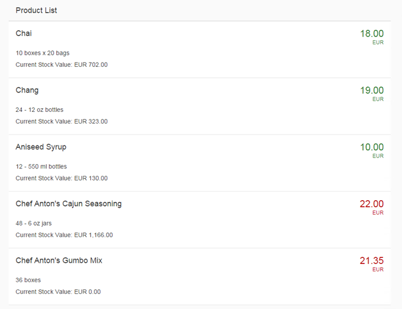

<!-- loio5cff8d1c3fb84c5db7a00f2daca125af -->

# Step 14: Expression Binding

Expression binding allows you to display a value on the screen that has been calculated from values found in some model object. This way simple formatting or calculations can be inserted directly into the data binding string. In this example, we will change the color of the price depending on whether it is above or below some arbitrary threshold. The threshold value is also stored in the JSON model.


## Preview

  
  
**Values formatted**




## Coding

You can view and download all files in the Demo Kit at [Data Binding - Step 14](https://ui5.sap.com/#/entity/sap.ui.core.tutorial.databinding/sample/sap.ui.core.tutorial.databinding.14).


## webapp/view/App.view.xml

```xml
...
		</content>
	</Panel>
	<Panel headerText="{i18n>panel3HeaderText}" class="sapUiResponsiveMargin" width="auto">
		<List headerText="{i18n>productListTitle}" items="{products>/Products}">
			<items>
				<ObjectListItem
					press=".onItemSelected"
					type="Active"
					title="{products>ProductName}"
					number="{
						parts: [
							{path: 'products>UnitPrice'},
							{path: '/currencyCode'}
						],
						type: 'sap.ui.model.type.Currency',
						formatOptions: { showMeasure: false }
					}"
					numberUnit="{/currencyCode}"
					numberState="{= ${products>UnitPrice} > ${/priceThreshold} ? 'Error' : 'Success' }">
					<attributes>
						<ObjectAttribute text="{products>QuantityPerUnit}"/>
						<ObjectAttribute title="{i18n>stockValue}"
							text="{
								parts: [
									{path: 'products>UnitPrice'},
									{path: 'products>UnitsInStock'},
									{path: '/currencyCode'}
								],
								formatter: '.formatStockValue'
							}"/>
					</attributes>
				</ObjectListItem>
			</items>
		</List>
	</Panel>
...
```

In the XML view, we add a new `numberState` property to the `ObjectListItem` element within the `List`. The value of this property is an expression that will be evaluated for each item.


## webapp/index.js

```js
sap.ui.require([
	"sap/ui/model/json/JSONModel",
	"sap/ui/core/mvc/XMLView",
	"sap/ui/model/resource/ResourceModel"
], function (JSONModel, XMLView, ResourceModel) {
	"use strict";

	// Attach an anonymous function to the SAPUI5 'init' event
	sap.ui.getCore().attachInit(function () {

		var oProductModel = new JSONModel();
		oProductModel.loadData("./model/Products.json");
		sap.ui.getCore().setModel(oProductModel, "products");

		var oModel = new JSONModel({
			firstName: "Harry",
			lastName: "Hawk",
			enabled: true,
			address: {
				street: "Dietmar-Hopp-Allee 16",
				city: "Walldorf",
				zip: "69190",
				country: "Germany"
			},
			salesAmount: 12345.6789,
			priceThreshold: 20,
			currencyCode: "EUR"
		});

		// Assign the model object to the SAPUI5 core
		sap.ui.getCore().setModel(oModel);

		var oResourceBundle = new ResourceModel({
			bundleName: "sap.ui.demo.db.i18n.i18n",
			supportedLocales: ["", "de"],
			fallbackLocale: ""
		});

		sap.ui.getCore().setModel(oResourceModel, "i18n");

		// Display the XML view called "App"
		var oView = new XMLView({
			viewName: "sap.ui.demo.db.view.App"
		});

		// Register the view with the message manager
		sap.ui.getCore().getMessageManager().registerObject(oView, true);

		// Insert the view into the DOM
		oView.placeAt("content");
	});
});

```

We add a new property called `priceThreshold` against which each invoice value will be checked.

As a result of binding an expression to the `numberState` property, the error status \(color\) of the price field will change depending on the invoice value.

Look at the following two expressions:

-   `numberState="{= ${products>UnitPrice} > ${/priceThreshold} ? 'Error' : 'Success' }"`

-   `numberState="{= ${products>UnitPrice} <= ${/priceThreshold} ? 'Success' : 'Error' }"`


Can you see why one of these expressions will work, and the other will not?

Logically, both expressions are identical; yet the first one works, and the second does not: it produces only an empty screen and an "Invalid XML" message in the browser's console… Hmmm, what's going on here?

In order to understand why this situation occurs, you must understand how XML files are parsed.

When an XML file is parsed, certain characters have a special \(that is, high priority\) meaning to the XML parser. When such characters are encountered, they are **always** interpreted to be part of the XML definition itself and not part of any other content that might exist within the XML document.

As soon as the XML parser encounters one of these high-priority characters \(in this case, a less-than \(`<`\) character\), it will always be interpreted as the start of a new XML tag – irrespective of any other meaning that character might have within the context of the expression. This is known as a **syntax collision**.

In this case, the collision occurs between the syntax of XML and the syntax of the JavaScript-like expression language used by SAPUI5.

Therefore, this statement fails because the less-than character is interpreted as the start of an XML tag: `numberState="{= ${products>UnitPrice} <= ${/priceThreshold} ? 'Success' : 'Error' }"`

This particular problem can be avoided in one of two ways:

-   Reverse the logic of the condition \(use "greater than or equal to" instead of "less than"\)

-   Use the escaped value for the less-than character: `numberState="{= ${products>UnitPrice} &lt;= ${/priceThreshold} ? 'Success' : 'Error' }"` 


Since the use of an escaped character is not so easy to read, the preferred approach is to reverse the logic of the condition and use a greater-than character instead.

The ampersand \(`&`\) character also has a high priority meaning to the XML parser. This character will always be interpreted to mean "The start of an escaped character". So if you wish to use the Boolean `AND` operator \(`&&`\) in a condition, you must escape both ampersand characters \(`&amp;&amp;`\).

**Related Information**  


[Expression Binding](../04_Essentials/expression-binding-daf6852.md "Expression binding is an enhancement of the SAPUI5 binding syntax, which allows for providing expressions instead of custom formatter functions.")

