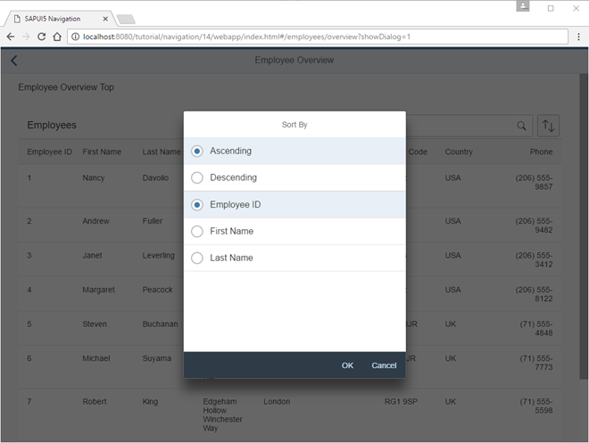

<!-- loio5cc3147afc8d4854b5d3c5fc20923f77 -->

# Step 14: Make Dialogs Bookmarkable

In this step, we want to allow bookmarking of the dialog box that is opened when the user clicks the *Sort* button. The dialog should automatically open when the URL contains the query parameter `showDialog`.


## Preview

   
  
<a name="loio5cc3147afc8d4854b5d3c5fc20923f77__fig_r1j_pst_mr"/>Bookmark for a dialog

  


## Coding

You can view and download all files in the *Samples* in the Demo Kit at [Routing and Navigation - Step 14](https://ui5.sap.com/#/entity/sap.ui.core.tutorial.navigation/sample/sap.ui.core.tutorial.navigation.14).


## /controller/employee/overview/EmployeeOverviewContent.controller.js

```js
sap.ui.define([
	"sap/ui/demo/nav/controller/BaseController",
	"sap/ui/model/Filter",
	"sap/ui/model/FilterOperator",
	"sap/ui/model/Sorter",
	"sap/m/ViewSettingsDialog",
	"sap/m/ViewSettingsItem"
], function(
	BaseController,
	Filter,
	FilterOperator,
	Sorter,
	ViewSettingsDialog,
	ViewSettingsItem
) {
	"use strict";
	return BaseController.extend("sap.ui.demo.nav.controller.employee.overview.EmployeeOverviewContent", {
		onInit: function () {
			...
		},
		_onRouteMatched: function (oEvent) {
			// save the current query state
			this._oRouterArgs = oEvent.getParameter("arguments");
			this._oRouterArgs["?query"] = this._oRouterArgs["?query"] || {};
			var oQueryParameter = this._oRouterArgs["?query"];

			// search/filter via URL hash
			this._applySearchFilter(oQueryParameter.search);

			// sorting via URL hash
			this._applySorter(oQueryParameter.sortField, oQueryParameter.sortDescending);

			// show dialog via URL hash
			if (oQueryParameter.showDialog) {
				this._oVSD.open();
			}
			
		},
		onSortButtonPressed: function (oEvent) {
			var oRouter = this.getRouter();
			this._oRouterArgs["?query"].showDialog = 1;
			oRouter.navTo("employeeOverview", this._oRouterArgs);

		},
		...
		_initViewSettingsDialog: function () {
			var oRouter = this.getRouter();
			this._oVSD = new ViewSettingsDialog("vsd", {
				confirm: function (oEvent) {
					var oSortItem = oEvent.getParameter("sortItem");
					this._oRouterArgs["?query"].sortField = oSortItem.getKey();
					this._oRouterArgs["?query"].sortDescending = oEvent.getParameter("sortDescending");
					delete this._oRouterArgs["?query"].showDialog;
					oRouter.navTo("employeeOverview", this._oRouterArgs, true /*without history*/);
				}.bind(this),
				cancel: function (oEvent){
					delete this._oRouterArgs["?query"].showDialog;
					oRouter.navTo("employeeOverview", this._oRouterArgs, true /*without history*/);
				}.bind(this)
			});
			...
		},
		...
	});
});
```

Once again we will update the `EmployeeOverviewContent` controller to add support for the bookmarking of our sorting dialog. We decide to choose a query parameter `showDialog` that controls if the dialog is opened directly when we navigate to the page with a deep link. Therefore, we extend the matched event handler for the `employeeOverview` route. If the query parameter `showDialog` is set to `1`, we open the dialog.

Next we change the `press` handler of the sort button. In the `onSortButtonPressed` function we set `this._oRouterArgs["?query"].showDialog = 1` and call `navTo()` to let the router do the job instead of directly opening the dialog. Finally, we delete `this._oRouterArgs["?query"].showDialog` before calling `navTo()` in the `confirm` and `cancel` event handlers of the `ViewSettingsDialog`. This is important to make sure that the dialog does not open again by the matched handler.

We are now done with this step. Try to access the following pages:

-   `webapp/index.html#/employees/overview?showDialog=1`

-   `webapp/index.html#/employees/overview?search=an&sortField=EmployeeID&sortDescending=true&showDialog=1`


As you can see, the dialog opens automatically if the parameter `showDialog=1` is added to the URL. That’s exactly what we wanted.

**Parent topic:** [Navigation and Routing](navigation-and-routing-1b6dcd3.md "SAPUI5 comes with a powerful routing API that helps you control the state of your application efficiently. This tutorial will illustrate all major features and APIs related to navigation and routing in SAPUI5 apps by creating a simple and easy to understand mobile app. It represents a set of best practices for applying the navigation and routing features of SAPUI5 to your applications.")

**Next:** [Step 13: Make Table Sorting Bookmarkable](step-13-make-table-sorting-bookmarkable-3975987.md "In this step, we will create a button at the top of the table which will change the sorting of the table. When the current sorting state of the table is changed, the sorting state will be reflected in the URL. This illustrates how to make the table sorting bookmarkable.")

**Previous:** [Step 15: Reuse an Existing Route](step-15-reuse-an-existing-route-877d57e.md "The Employees table displays employee data. However, the resumes of the employees are not accessible from this view yet. We could create a new route and a new view to visualize the resume again, but we could also simply reuse an existing route to cross-link the resume of a certain employee. In this step, we will add a feature that allows users to directly navigate to the resume of a certain employee. We will reuse the Resume page that we have created in an earlier step. This example illustrates that there can be multiple navigation paths that direct to the same page.")

