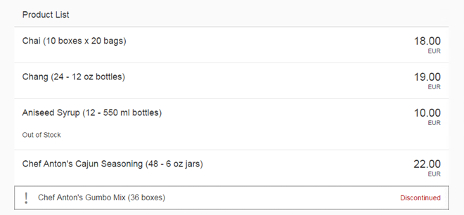

<!-- loio284a036c8ff943238fb65bf5a2676fb7 -->

# Step 15: Aggregation Binding Using a Factory Function

Instead of hard-coding a single template control, we use a factory function to generate different controls based on the data received at runtime. This approach is much more flexible and allows complex or heterogeneous data to be displayed.


## Preview

  
  
**Controls generated based on data**




## Coding

You can view and download all files in the Demo Kit at [Data Binding - Step 15](https://ui5.sap.com/#/entity/sap.ui.core.tutorial.databinding/sample/sap.ui.core.tutorial.databinding.15).


## webapp/view/App.view.xml

```xml

<mvc:View
	controllerName="sap.ui.demo.db.controller.App"
	xmlns="sap.m"
	xmlns:core="sap.ui.core"
	xmlns:form="sap.ui.layout.form"
	xmlns:l="sap.ui.layout"
	xmlns:mvc="sap.ui.core.mvc">
...
	<Panel headerText="{i18n>panel3HeaderText}" class="sapUiResponsiveMargin" width="auto">
		<List
			id="ProductList"
			headerText="{i18n>productListTitle}"
			items="{
				path: 'products>/Products',
				factory: '.productListFactory'
			}">
			<dependents>
				<core:Fragment fragmentName="sap.ui.demo.db.view.ProductSimple" type="XML"/>
				<core:Fragment fragmentName="sap.ui.demo.db.view.ProductExtended" type="XML"/>
			</dependents>
		</List>
	</Panel>
...
</mvc:View>
```

The `List` XML element that previously held the product list is now reduced simply to a named, but otherwise empty placeholder. Without a factory function to populate it, this `List` would always remain empty.


## webapp/controller/App.controller.js

```js
sap.ui.define([
	"sap/ui/core/mvc/Controller",
	"sap/m/library",
	"sap/ui/core/Locale",
	"sap/ui/core/LocaleData",
	"sap/ui/model/type/Currency",
	"sap/m/ObjectAttribute"
], function (Controller, mobileLibrary, Locale, LocaleData, Currency, ObjectAttribute) {
	"use strict";

	return Controller.extend("sap.ui.demo.db.controller.App", {
		formatMail: function(sFirstName, sLastName) {
			var oBundle = this.getView().getModel("i18n").getResourceBundle();
			return mobileLibrary.URLHelper.normalizeEmail(
				sFirstName + "." + sLastName + "@example.com",
				oBundle.getText("mailSubject", [sFirstName]),
				oBundle.getText("mailBody"));
		},

		formatStockValue : function(fUnitPrice, iStockLevel, sCurrCode) {
			var sBrowserLocale = sap.ui.getCore().getConfiguration().getLanguage();
			var oLocale = new Locale(sBrowserLocale);
			var oLocaleData = new LocaleData(oLocale);
			var oCurrency = new Currency(oLocaleData.mData.currencyFormat);
			return oCurrency.formatValue([fUnitPrice * iStockLevel, sCurrCode], "string");
		},

		onItemSelected : function(oEvent) {
			var oSelectedItem = oEvent.getSource();
			var oContext = oSelectedItem.getBindingContext("products");
			var sPath = oContext.getPath();
			var oProductDetailPanel = this.byId("productDetailsPanel");
			oProductDetailPanel.bindElement({ path: sPath, model: "products" });
		},

		productListFactory : function(sId, oContext) {
			var oUIControl;

			// Decide based on the data which dependent to clone
			if (oContext.getProperty("UnitsInStock") === 0 && oContext.getProperty("Discontinued")) {
				// The item is discontinued, so use a StandardListItem
				oUIControl = this.byId("productSimple").clone(sId);
			} else {
				// The item is available, so we will create an ObjectListItem
				oUIControl = this.byId("productExtended").clone(sId);

				// The item is temporarily out of stock, so we will add a status
				if (oContext.getProperty("UnitsInStock") < 1) {
					oUIControl.addAttribute(new ObjectAttribute({
						text : {
							path: "i18n>outOfStock"
						}
					}));
				}
			}

			return oUIControl;
		}

	});
});

```

In the `App` controller, we create a new function called `productListFactory`. A factory function returns a control for the associated binding context, similar to the XML templates we have defined in the previous steps. The types of controls returned by this factory function must suit the items aggregation of the `sap.m.List` object. In this case, we return either a `StandardListItem` or an `ObjectListItem` based on the data stored in the context of the item to be created.

We decide which type of control to return by checking the current stock level and whether or not the product has been discontinued. For both options, we prepare and load an XML fragment so that we can define the view logic declaratively and assign the current controller. If the stock level is zero and the product has also been discontinued, then we use the `ProductSimple` XML fragment, otherwise the `ProductExtended` XML fragment.

The XML fragments need to be loaded only once for each case, so we create a Singleton by storing a helper variable on the controller and only loading it once. For each item of the list, we clone the corresponding control stored on the controller. This method creates a fresh copy of a control that we can bind to the context of the list item. Please note: In a factory function, you are responsible for the life cycle of the control you create.

If the product is not discontinued but the stock level is zero, we are temporarily out of stock. In this case, we add a single `ObjectAttribute` that adds the *Out of Stock* message to the control using JavaScript. Similar to declarative definitions in the XML view or fragments, we can bind properties using data binding syntax. In this case, we bind the text to a property in the resource bundle. Since the `Attribute` is a child of the list item, it has access to all assigned models and the current binding context.

Finally, we return the control that is displayed inside the list.


<a name="loio284a036c8ff943238fb65bf5a2676fb7__section_wws_xj1_fcb"/>

## webapp/view/ProductSimple.fragment.xml \(new\)

```xml
<core:FragmentDefinition
	xmlns="sap.m"
	xmlns:core="sap.ui.core">
	<StandardListItem
		id="productSimple"

		icon="sap-icon://warning"
		title="{products>ProductName} ({products>QuantityPerUnit})"
		info="{i18n>Discontinued}"
		type="Active"
		infoState="Error"
		press=".onItemSelected">
	</StandardListItem>
</core:FragmentDefinition>

```

The XML fragment defines a `StandardListItem` that is used if the stock level is zero and the product has also been discontinued. This is our simple use case where we just define a warning icon and a *Product Discontinued* message in the `info` property.


<a name="loio284a036c8ff943238fb65bf5a2676fb7__section_ghp_ck1_fcb"/>

## webapp/view/ProductExtended.fragment.xml \(new\)

```xml
<core:FragmentDefinition
	xmlns="sap.m"
	xmlns:core="sap.ui.core">
	<ObjectListItem
		id="productExtended"

		title="{products>ProductName} ({products>QuantityPerUnit})"
		number="{
			parts: [
				{path: 'products>UnitPrice'},
				{path: '/currencyCode'}
			],
			type: 'sap.ui.model.type.Currency',
			formatOptions : {
				showMeasure : false
			}
		}"
		type="Active"
		numberUnit="{/currencyCode}"
		press=".onItemSelected">
	</ObjectListItem>
</core:FragmentDefinition>

```

In our extended use case, we create an `ObjectListItem` to display more details of the product. The properties are bound to the fields of the current data binding context and therefore can use types, formatters, and all handlers that are defined in the assigned controller.

However, more complex logic can’t be defined declaratively in XML. Therefore, when the stock level is zero, we add a single `ObjectAttribute` that displays the *Out of Stock* message in the controller using JavaScript.


## webapp/i18n/i18n.properties

```ini
...
# Product Details
...
outOfStock=Out of Stock
```


## webapp/i18n/i18n\_de.properties

```ini
...
# Product Details
...
outOfStock=Nicht vorr\u00e4tig
```

We add the missing texts to the `properties` files.

That's all - you completed the Data Binding tutorial!

**Related Information**  


[List Binding \(Aggregation Binding\)](../04_Essentials/list-binding-aggregation-binding-91f0577.md "List binding (or aggregation binding) is used to automatically create child controls according to model data.")

[XML Fragments](../04_Essentials/xml-fragments-2c677b5.md "XML fragments are similar to XML view, but have no <View> tag as root element. Instead, there is an SAPUI5 control.")

[Using Factory Functions](../04_Essentials/using-factory-functions-335848a.md "")

