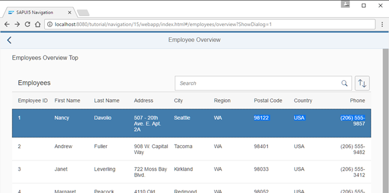

<!-- loio877d57e3b5654b19a2d2e5190dc43b0d -->

# Step 15: Reuse an Existing Route

The *Employees* table displays employee data. However, the resumes of the employees are not accessible from this view yet. We could create a new route and a new view to visualize the resume again, but we could also simply reuse an existing route to cross-link the resume of a certain employee. In this step, we will add a feature that allows users to directly navigate to the resume of a certain employee. We will reuse the *Resume* page that we have created in an earlier step. This example illustrates that there can be multiple navigation paths that direct to the same page.


## Preview

   
  
<a name="loio877d57e3b5654b19a2d2e5190dc43b0d__fig_r1j_pst_mr"/>Navigation to an existing route from a table item

  


## Coding

You can view and download all files in the *Samples* in the Demo Kit at [Routing and Navigation - Step 15](https://ui5.sap.com/#/entity/sap.ui.core.tutorial.navigation/sample/sap.ui.core.tutorial.navigation.15).


## webapp/view/employee/overview/EmployeeOverviewContent.view.xml

```xml
<mvc:View
	controllerName="sap.ui.demo.nav.controller.employee.overview.EmployeeOverviewContent"
	xmlns="sap.m"
	xmlns:mvc="sap.ui.core.mvc">
	<Table id="employeesTable"
		items="{/Employees}"
			itemPress=".onItemPressed">
		<headerToolbar>
			...
		</headerToolbar>
		<columns>
			...
		</columns>
		<items>
			<ColumnListItem type="Active">
				<cells>
					...
				</cells>
			</ColumnListItem>
		</items>
	</Table>
</mvc:View>
```

In the `EmployeeOverviewContent` view we register an event handler for the `itemPress` event and set the type attribute of the `ColumnListItem` to `Active` so that we can choose an item and trigger the navigation.


## webapp/controller/employee/overview/EmployeeOverviewContent.controller.js

```js
sap.ui.define([
	"sap/ui/demo/nav/controller/BaseController",
	"sap/ui/model/Filter",
	"sap/ui/model/FilterOperator",
	"sap/ui/model/Sorter",
	"sap/m/ViewSettingsDialog",
	"sap/m/ViewSettingsItem"
], function(
	BaseController,
	Filter,
	FilterOperator,
	Sorter,
	ViewSettingsDialog,
	ViewSettingsItem
) {
	"use strict";
	return BaseController.extend("sap.ui.demo.nav.controller.employee.overview.EmployeeOverviewContent", {
		...
		_syncViewSettingsDialogSorter: function (sSortField, bSortDescending) {
			// the possible keys are: "EmployeeID" | "FirstName" | "LastName"
			// Note: no input validation is implemented here
			this._oVSD.setSelectedSortItem(sSortField);
			this._oVSD.setSortDescending(bSortDescending);
		},
		onItemPressed: function (oEvent) {
			var oItem, oCtx, oRouter;
			oItem = oEvent.getParameter("listItem");
			oCtx = oItem.getBindingContext();
			this.getRouter().navTo("employeeResume",{
				employeeId : oCtx.getProperty("EmployeeID"),
				"?query": {
					tab: "Info"
				}
			});
		}
	});
});
```

Next we add the `itemPress` handler `.onItemPressed` to the `EmployeeOverviewContent` controller. It reads from the binding context which item has been chosen and navigates to the `employeeResume` route. We have already added this route and the corresponding target in a previous step and can now reuse it. From now on it is possible to navigate to the `employeeResume` route from our employee table as well as from the employee detail page created in an earlier step \(the route name is `employee`\).

**Parent topic:** [Navigation and Routing](navigation-and-routing-1b6dcd3.md "SAPUI5 comes with a powerful routing API that helps you control the state of your application efficiently. This tutorial will illustrate all major features and APIs related to navigation and routing in SAPUI5 apps by creating a simple and easy to understand mobile app. It represents a set of best practices for applying the navigation and routing features of SAPUI5 to your applications.")

**Next:** [Step 14: Make Dialogs Bookmarkable](step-14-make-dialogs-bookmarkable-5cc3147.md "In this step, we want to allow bookmarking of the dialog box that is opened when the user clicks the Sort button. The dialog should automatically open when the URL contains the query parameter showDialog.")

**Previous:** [Step 16: Handle Invalid Hashes by Listening to Bypassed Events](step-16-handle-invalid-hashes-by-listening-to-bypassed-events-a7932a7.md "So far we have created many useful routes in our app. In the very early steps we have also made sure that a Not Found page is displayed in case the app was called with an invalid hash. Now, we proceed further and track invalid hashes to be able to detect and correct any invalid links or add new URL patterns that are often requested but not found. Therefore, we simply listen to the bypassed events")

