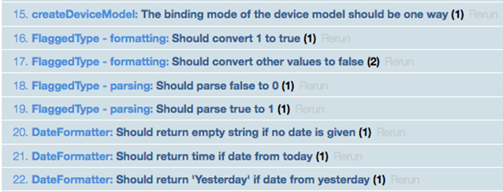

<!-- loiobc4114a88e4d4ac1a0f53b2a7a92b226 -->

# Step 15: Writing a Short Date Formatter Using TDD

It's now time to improve the content of the *Info* tab. We want to see the *Posted At* date in a formatted way. Based on the age of the post, we either display the time, a textural representation of the day, or the date only.


## Preview

   
  
**Unit tests of the formatter**

  

Depending on the current date, we distinguish four different formatting categories, as shown in the table below:

**Formatting Categories**


<table>
<tr>
<th valign="top">

Category


</th>
<th valign="top">

Sample Input


</th>
<th valign="top">

Expected Output \(for `en-US`\)


</th>
</tr>
<tr>
<td valign="top">

Today


</td>
<td valign="top">

 ***2013/02/13 12:05:20*** 


</td>
<td valign="top">

 ***12:05 PM*** 


</td>
</tr>
<tr>
<td valign="top">

Yesterday


</td>
<td valign="top">

 ***2013/02/12 12:05:20*** 


</td>
<td valign="top">

 ***Yesterday*** 


</td>
</tr>
<tr>
<td valign="top">

Last 7 days


</td>
<td valign="top">

 ***2013/02/08 12:05:20*** 


</td>
<td valign="top">

 ***Friday*** 


</td>
</tr>
<tr>
<td valign="top">

Others


</td>
<td valign="top">

 ***2011/02/05 12:05:20*** 


</td>
<td valign="top">

 ***Dec 5, 2011*** 


</td>
</tr>
</table>

As you can see, we have many different cases, and our formatter contains real logic.

We test this in a unit test. In this step we will follow an iterative approach. We first write a failing test and immediately fix it by adding the production code to make the test pass. Then the next iteration starts. We do not write more than one failing unit test at once.

> ### Note:  
> There are many benefits of consequently applying the test-driven development \(TDD\) methodology, for example, very fast feedback, you can execute your tests after each change and get immediate feedback if the tests run green. You also spend less time debugging and for analysis. We recommend that you get familiar with TDD and clean code practices. In this step you get a first impression how TDD results in better separation of concerns, APIs, handling of dependencies, code reuse, and a test suite growing together with the code.


## Coding

You can view and download all files in the *Samples* in the Demo Kit at [Testing - Step 15](https://ui5.sap.com/#/entity/sap.m.tutorial.testing/sample/sap.m.tutorial.testing.15).


## webapp/test/unit/AllTests.js

```js
sap.ui.define([
	"./model/models",
	"./model/formatter",
	"./model/FlaggedType",
	"./model/DateFormatter"
], function() {
	"use strict";
});
```

First, we add the new test file we are about to create to the `AllTests.js` file.


## webapp/model/DateFormatter.js \(New\)

```js
sap.ui.define([
	"sap/ui/base/Object"
], function(Object) {
		return Object.extend("sap.ui.demo.bulletinboard.model.DateFormatter", {
	});
});
```

We create an empty hull for our formatter implementation first so that we can include it in our test. It does not contain any logic yet but simply extends an SAPUI5 base object.


## webapp/test/unit/model/DateFormatter.js \(New\)

```js
sap.ui.define([
	"sap/ui/demo/bulletinboard/model/DateFormatter"
], function(DateFormatter) {
	QUnit.module("DateFormatter");
	QUnit.test("initial", function(assert) {
		assert.ok(new DateFormatter());
	});
});
```

And we create our test that checks if there is a `DateFormatter` object. Now we can execute our unit tests. We see that this test is failing as the object does not exist in our code yet.


## webapp/test/unit/model/DateFormatter.js

```js
sap.ui.define([
	"sap/ui/demo/bulletinboard/model/DateFormatter"
], function(DateFormatter) {
	QUnit.module("DateFormatter");
	QUnit.test("Should return empty string if no date is given", function(assert) {
		var oFormatter = new DateFormatter();
		var sFormattedDate = oFormatter.format(null);
		assert.strictEqual(sFormattedDate, "");
	});
});
```

Now we implement a test for the API of the format function. We assume it will have a `Date` object as input parameter. In the first step, the test verifies that the format function returns an empty string if we pass `null`.


## webapp/model/DateFormatter.js

```js
sap.ui.define([
	"sap/ui/base/Object"
], function(Object) {
		return Object.extend("sap.ui.demo.bulletinboard.model.DateFormatter", {
			format: function() {
				return "";
			}
		});
	}
);
```

Now we fix our test again by returning the expected string.


## Dependency Injection:

```js
sap.ui.define([
	"sap/ui/demo/bulletinboard/model/DateFormatter",
	"sap/ui/core/Locale",
	"sap/ui/core/date/UI5Date"
], function(DateFormatter, Locale, UI5Date) {
	QUnit.module("DateFormatter");
	QUnit.test("Should return empty string if no date is given", function(assert) {
		var oFormatter = new DateFormatter({
			locale : new Locale("en-US")
		});
		var sFormattedDate = oFormatter.format(null);
		assert.strictEqual(sFormattedDate, "");
	});
	QUnit.test("Should return time if date from today", function(assert) {
		var oFormatter = new DateFormatter({
			locale : new Locale("en-US")
		});
		var oDate = UI5Date.getInstance(2015, 2, 14, 12, 5, 0, 0);
		var sFormattedDate = oFormatter.format(oDate);
		assert.strictEqual(sFormattedDate, "12:05 PM");
	});
});
```

Here our test expects that the date is displayed as time when the post is from today. If we rely on the browser language the test would be fragile. It will fail in some languages. To avoid this, we pass the locale settings to the formatter’s constructor. The test will use a fixed locale `en-US` in order to remain stable. This mechanism is called **Dependency Injection**.


## webapp/model/DateFormatter.js

```js
sap.ui.define([
	"sap/ui/base/Object",
	"sap/ui/core/format/DateFormat"
], function(Object, DateFormat) {
	return Object.extend("sap.ui.demo.bulletinboard.model.DateFormatter", {
		constructor: function(oProperties) {
			this.timeFormat = DateFormat.getTimeInstance({
				style: "short"
			}, oProperties.locale);
			},
		format: function(oDate) {
			if (!oDate) {
				return "";
			}
				return this.timeFormat.format(oDate);
			}
		});
	}
);
```

In the implementation we use the `DateFormat` of SAPUI5 to create a short date. The locale is passed on to the `getTimeInstance` function.

> ### Note:  
> The implementation should not do more than the current tests covers. This makes sure you cover all the code paths. You can enable the code coverage by selecting the *Enable coverage* checkbox.
> 
>   
> 
> It will show the lines covered by your tests \(white\) and the ones that were not covered \(red\). For the single test above the coverage looks like this. The red line is already covered by the previous test so in total we have a test coverage of 100%.


## Refactoring:

```js
sap.ui.define([
	"sap/ui/demo/bulletinboard/model/DateFormatter",
	"sap/ui/core/Locale",
	"sap/ui/core/date/UI5Date"
], function(DateFormatter, Locale, UI5Date) {
	var oFormatter = null;
	QUnit.module("DateFormatter", {
		beforeEach: function() {
			oFormatter = new DateFormatter({
				locale: new Locale("en-US")
			});
		}
	});

	QUnit.test("Should return empty string if no date is given", function(assert) {
		/*Delete in your code: var oFormatter = new DateFormatter();
		...
	});
	QUnit.test("Should return time if date from today", function(assert) {
		/*Delete in your code: var oFormatter = new DateFormatter({
		/*Delete in your code: 	locale: new Locale("en-US")
		/*Delete in your code: });
		...
	});
});
```

Our tests are running so we can start refactoring our code. Since we need the `DateFormatter` object in every test case we will move it to the QUnit module’s `beforeEach` function. As the name suggests, the function is invoked before each test so we may use it to save some code we need in every test.


## Dependency Injection to Get Independent from System Time:

```js
sap.ui.define([
	"sap/ui/demo/bulletinboard/model/DateFormatter",
	"sap/ui/core/Locale",
	"sap/ui/core/date/UI5Date"
], function(DateFormatter, Locale, UI5Date) {
	var oFormatter = null;
	QUnit.module("DateFormatter", {
		beforeEach: function() {
			oFormatter = new DateFormatter({
				now : function() {
					return UI5Date.getInstance(2015, 2, 14, 14, 0, 0, 0).getTime();
				},
				locale : new Locale("en-US")
			});
		}
	});
	...
	QUnit.test("Should return 'Yesterday' if date from yesterday", function(assert) {
		var oDate = UI5Date.getInstance(2015, 2, 13);
		var sFormattedDate = oFormatter.format(oDate);
		assert.strictEqual(sFormattedDate, "Yesterday");
	});
});
```

The next test verifies that ***Yesterday*** is returned for yesterday's date. To keep the test independent of the system time, we pass on a stable date to the formatter.


## webapp/model/DateFormatter.js

```js
sap.ui.define([
	"sap/ui/base/Object",
	"sap/ui/core/format/DateFormat"
], function(Object, DateFormat) {
	return Object.extend("sap.ui.demo.bulletinboard.model.DateFormatter", {
		constructor : function(oProperties) {
			this.timeFormat = DateFormat.getTimeInstance({
				style : "short"
			}, oProperties.locale);
			this.now = oProperties.now;
		},
		format : function(oDate) {
			if (!oDate) {
				return "";
			}
			var iElapsedDays = this._getElapsedDays(oDate);
			if (iElapsedDays === 0) {
				return this.timeFormat.format(oDate);
			} else if (iElapsedDays === 1) {
				return "Yesterday";
			}
		},
		_getElapsedDays : function(oDate) {
			var iElapsedMilliseconds = this.now() - oDate.getTime();
			var fElapsedDays = iElapsedMilliseconds / 1000 / 60 / 60 / 24;
			return Math.floor(fElapsedDays);
		}
	});
});
```

In the implementation we add a calculation for determining how many days passed. If zero days passed, the format function is called, and if one day passed ***Yesterday*** is returned. Currently we skip reading "Yesterday" from the i18n model to keep the example simple.


## Boundary Testing:

```js
sap.ui.define([
	"sap/ui/demo/bulletinboard/model/DateFormatter",
	"sap/ui/core/Locale",
	"sap/ui/core/date/UI5Date"
], function(DateFormatter, Locale, UI5Date) {
	var oFormatter = null;
	...
	QUnit.test("Should return day of the week if date < 7 days ago", function(assert) {
		var oDate = UI5Date.getInstance(2015, 2, 8);
		var sFormattedDate = oFormatter.format(oDate);
		assert.strictEqual(sFormattedDate, "Sunday");
	});
});
```

The next test verifies that the day of the week is returned. As test input we take a value at the boundary: Sunday is one day before a different formatting pattern should be applied.


## webapp/model/DateFormatter.js

```js
sap.ui.define([
	"sap/ui/base/Object",
	"sap/ui/core/format/DateFormat"
], function(Object, DateFormat) {
	return Object.extend("sap.ui.demo.bulletinboard.model.DateFormatter", {
		constructor: function(oProperties) {
			this.timeFormat = DateFormat.getTimeInstance({
				style: "short"
			}, oProperties.locale);
			this.weekdayFormat = DateFormat.getDateInstance({
				pattern: "EEEE"
			}, oProperties.locale);
			this.now = oProperties.now;
		},
		format: function(oDate) {
			if (!oDate) {
				return "";
			}
			var iElapsedDays = this._getElapsedDays(oDate);
			if (iElapsedDays === 0) {
				return this.timeFormat.format(oDate);
			} else if (iElapsedDays === 1) {
				return "Yesterday";
			} else if (iElapsedDays < 7) {
				return this.weekdayFormat.format(oDate);
			}
		}
	…
```

Now we define a new format in our constructor, the `weekdayFormat`. In the format function we apply the format if the elapsed days are smaller than 7.


## webapp/test/unit/model/DateFormatter.js

```js
sap.ui.define([
	"sap/ui/demo/bulletinboard/model/DateFormatter",
	"sap/ui/core/Locale",
	"sap/ui/core/date/UI5Date"
], function(DateFormatter, Locale, UI5Date) {
	var oFormatter = null;
	...
	QUnit.test("Should return date w/o time if date > 7 days ago", function(assert) {
		var oDate = UI5Date.getInstance(2015, 2, 7);
		var sFormattedDate = oFormatter.format(oDate);
		assert.strictEqual(sFormattedDate, "Mar 7, 2015");
	});
});
```

In the next test we verify that the date is formatted as date without time. Again, we take a value at the boundary.


## webapp/model/DateFormatter.js

```js
…
		constructor: function(oProperties) {
			this.timeFormat = DateFormat.getTimeInstance({
				style : "short"
			}, oProperties.locale);
			this.weekdayFormat = DateFormat.getDateInstance({
				pattern : "EEEE"
			}, oProperties.locale);
			this.dateFormat = DateFormat.getDateInstance({
				style : "medium"
			}, oProperties.locale);
			this.now = oProperties.now;
		},
		format: function(oDate) {
			if (!oDate) {
				return "";
			}
			var iElapsedDays = this._getElapsedDays(oDate);
			if (iElapsedDays === 0) {
				return this.timeFormat.format(oDate);
			} else if (iElapsedDays === 1) {
				return "Yesterday";
			} else if (iElapsedDays < 7) {
				return this.weekdayFormat.format(oDate);
			} else {
				return this.dateFormat.format(oDate);
			}

		},
	…
```

In the implementation, we use a different `style` property for instantiating the `dateFormat` property. We call the format of this instance for dates that are more than 6 days in the past.

Although our formatter depends on system time and locale settings, our tests are very easy to read and maintain. We wrote blackbox tests, providing only the input and expecting a certain output without knowing the implementation details. The `DateFormatter` does not actively resolve the dependencies to the system time and locale settings. Instead, it asks its creator to pass the dependencies along in the constructor. In the next step, we have to bring the pieces together.

