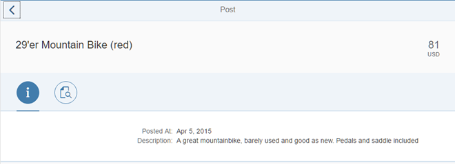

<!-- loio2ca583d6b9c24e4d8f189eada7c4b668 -->

# Step 16: Adding the Date Formatter

Our formatter does its job, but it is not yet used. In this step we will use it.


## Preview

   
  
<a name="loio2ca583d6b9c24e4d8f189eada7c4b668__fig_r1j_pst_mr"/>Date formatter in action

  


## Coding

You can view and download all files in the *Samples* in the Demo Kit at [Testing - Step 16](https://ui5.sap.com/#/entity/sap.m.tutorial.testing/sample/sap.m.tutorial.testing.16).


## webapp/view/Post.view.xml

```xml
…
<IconTabBar id="iconTabBar"
			expanded="{device>/isNoPhone}"
			class="sapUiResponsiveContentPadding">
	<items>
		<IconTabFilter icon="sap-icon://hint" key="info">
			<form:SimpleForm>
				<form:content>
					<Label text="{i18n>postDateLabel}"/>
					<Text text="{
						path: 'Timestamp',
						formatter: '.formatter.date'
					}"/>
					<Label text="{i18n>postDescriptionLabel}"/>
					<Text text="{Description}"/>
				</form:content>
			</form:SimpleForm>
		</IconTabFilter>
		…
	</items>
</IconTabBar>
…
```

On the *Info* tab we bind the date field to a format method `.formatter.date` of the controller of the view. The leading `.` indicates that the function is defined on the controller instance.


## webapp/model/formatter.js

```js
sap.ui.define([ "sap/ui/demo/bulletinboard/model/DateFormatter" ], function (DateFormatter) {
	...
	return {
		...
		numberUnit: function(sValue) {
			...
		},
		date: function(date) {
			return new DateFormatter({now: Date.now}).format(date);
		}

	};
});
```

In the `formatter.js file`, create an instance of the previously implemented `DateFormatter` and provide the necessary dependencies.

Now run the app again to see that the formatter is applied on the post date of the detail page.

> ### Note:  
> The files that create objects with dependencies should be kept simple. They do not have multiple code paths caused by if-else statements or loops. To test these components, just a few simple integration tests, or merely smoke tests, are sufficient. We already know that the `DateFormatter` does the job right for all the different cases.


<a name="loio2ca583d6b9c24e4d8f189eada7c4b668__section_ovt_b2t_qbb"/>

## Summary

You should now be familiar with the major development paradigms and concepts of SAPUI5 and have created a very simple first app. You are now ready to build a proper app based on what you've learned.

**Parent topic:** [Testing](testing-291c912.md "In this tutorial we will test application functionality with the testing tools that are delivered with SAPUI5. At different steps of this tutorial you will write tests using QUnit, OPA5, and the OData V2 mock server. Additionally, you will learn about testing strategies, Test Driven Development (TDD), and much more.")

**Next:** [Step 15: Writing a Short Date Formatter Using TDD](step-15-writing-a-short-date-formatter-using-tdd-bc4114a.md "It's now time to improve the content of the Info tab. We want to see the Posted At date in a formatted way. Based on the age of the post, we either display the time, a textural representation of the day, or the date only.")

