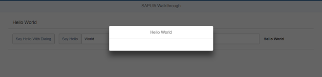

<!-- loio4da72985139b4b83b5f1c1e0c0d2ed5a -->

# Step 16: Dialogs and Fragments

In this step, we will take a closer look at another element which can be used to assemble views: the fragment.

Fragments are light-weight UI parts \(UI subtrees\) which can be reused but do not have any controller. This means, whenever you want to define a certain part of your UI to be reusable across multiple views, or when you want to exchange some parts of a view against one another under certain circumstances \(different user roles, edit mode vs read-only mode\), a fragment is a good candidate, especially where no additional controller logic is required.

A fragment can consist of 1 to n controls. At runtime, fragments placed in a view behave similar to "normal" view content, which means controls inside the fragment will just be included into the view’s DOM when rendered. There are of course controls that are not designed to become part of a view, for example, dialogs.

But even for these controls, fragments can be particularly useful, as you will see in a minute.

We will now add a dialog to our app. Dialogs are special, because they open on top of the regular app content and thus do not belong to a specific view. That means the dialog must be instantiated somewhere in the controller code, but since we want to stick with the declarative approach and create reusable artifacts to be as flexible as possible, and because dialogs cannot be specified as views, we will create an XML fragment containing the dialog. A dialog, after all, can be used in more than one view of your app.


## Preview

  
  
**A dialog opens when the new “Say Hello With Dialog” button is clicked**




## Coding

You can view and download all files at [Walkthrough - Step 16](https://ui5.sap.com/#/entity/sap.m.tutorial.walkthrough/sample/sap.m.tutorial.walkthrough.16).

```xml
<mvc:View
   controllerName="sap.ui.demo.walkthrough.controller.HelloPanel"
   xmlns="sap.m"
   xmlns:mvc="sap.ui.core.mvc">
   <Panel
      headerText="{i18n>helloPanelTitle}"
      class="sapUiResponsiveMargin"
      width="auto" >
      <content>
      <Button
         id="helloDialogButton"
         text="{i18n>openDialogButtonText}"
         press=".onOpenDialog"
         class="sapUiSmallMarginEnd"/>

      <Button
         text="{i18n>showHelloButtonText}"
         press=".onShowHello"
         class="myCustomButton"/>
      <Input
         value="{/recipient/name}"
         valueLiveUpdate="true"
         width="60%"/>
      <FormattedText
         htmlText="Hello {/recipient/name}"
         class="sapUiSmallMargin sapThemeHighlight-asColor myCustomText"/>
      </content>
   </Panel>
</mvc:View>
```

We add a new button to the view to open the dialog. It simply calls an event handler function in the controller of the panel’s content view. We will need the new `id="helloDialogButton"` in [Step 28: Integration Test with OPA](step-28-integration-test-with-opa-9bf4dce.md).

It is a good practice to set a unique ID like `helloWorldButton` to key controls of your app so that can be identified easily. If the attribute \`id\` is not specified, the OpenUI5 runtime generates unique but changing ID like \`\_\_button23\` for the control. Inspect the DOM elements of your app in the browser to see the difference.


## webapp/view/HelloDialog.fragment.xml \(New\)

```xml
<core:FragmentDefinition
   xmlns="sap.m"
   xmlns:core="sap.ui.core" >
   <Dialog
      id="helloDialog"
      title="Hello {/recipient/name}">
   </Dialog>
</core:FragmentDefinition>
```

We add a new XML file to declaratively define our dialog in a fragment. The fragment assets are located in the `core` namespace, so we add an `xml` namespace for it inside the `FragmentDefinition` tag.

The syntax is similar to a view, but since fragments do not have a controller this attribute is missing. Also, the fragment does not have any footprint in the DOM tree of the app, and there is no control instance of the fragment itself \(only the contained controls\). It is simply a container for a set of reuse controls.


## webapp/controller/HelloPanel.controller.js

```js
sap.ui.define([
	"sap/ui/core/mvc/Controller",
	"sap/m/MessageToast",
	"sap/ui/core/Fragment"
], function (Controller, MessageToast, Fragment) {
	"use strict";

	return Controller.extend("sap.ui.demo.walkthrough.controller.HelloPanel", {

		onShowHello : function () {
			…
		},
		onOpenDialog : function () {

			// create dialog lazily
			if (!this.pDialog) {
				this.pDialog = this.loadFragment({
					name: "sap.ui.demo.walkthrough.view.HelloDialog"
				});
			} 
			this.pDialog.then(function(oDialog) {
				oDialog.open();
			});
		}

	});
});
```

If the dialog in the fragment does not exist yet, the fragment is instantiated by calling the `loadFragment` API.

As you can see in the snippet above, we store the loading `Promise` of the dialog fragment on the controller instance. This allows us to handle the opening of the dialog asynchronously on each click of the `helloDialogButton` button.

To reuse the dialog opening and closing functionality in other controllers, you can create a new file `sap.ui.demo.walkthrough.controller.BaseController`, which extends `sap.ui.core.mvc.Controller`, and put all your dialog-related coding into this controller. Now, all the other controllers can extend from `sap.ui.demo.walkthrough.controller.BaseController` instead of `sap.ui.core.mvc.Controller`.


## Conventions

-   Private functions and variables should always start with an underscore.


<a name="loio4da72985139b4b83b5f1c1e0c0d2ed5a__section_d5m_ypr_r2b"/>

## webapp/i18n/i18n.properties

```ini
# App Descriptor
appTitle=Hello World
appDescription=A simple walkthrough app that explains the most important concepts of SAPUI5

# Hello Panel
showHelloButtonText=Say Hello
helloMsg=Hello {0}
homePageTitle=Walkthrough
helloPanelTitle=Hello World
openDialogButtonText=Say Hello With Dialog
```

We add a new text for the open button to the text bundle.

**Related Information**  


[Reusing UI Parts: Fragments](../04_Essentials/reusing-ui-parts-fragments-36a5b13.md "Fragments are light-weight UI parts (UI sub-trees) which can be reused, defined similar to views, but do not have any controller or other behavior code involved.")

[Dialogs and other Popups as Fragments](../04_Essentials/dialogs-and-other-popups-as-fragments-448c641.md "You can use fragments to declaratively define dialogs and other popup controls which are not part of the normal page UI structure.")

[Stable IDs: All You Need to Know](../05_Developing_Apps/stable-ids-all-you-need-to-know-f51dbb7.md "Stable IDs are IDs for controls, elements, or components that you set yourself in the respective id property or attribute as opposed to IDs that are generated by SAPUI5. Stable means that the IDs are concatenated with the application component ID and do not have any auto-generated parts.")

[API Reference: `sap.ui.core.Fragment`](https://ui5.sap.com/#/api/sap.ui.core.Fragment)

