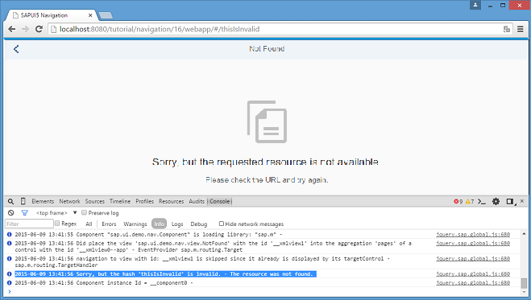

<!-- loioa7932a791adc4a58ae4693400801ea5f -->

# Step 16: Handle Invalid Hashes by Listening to Bypassed Events

So far we have created many useful routes in our app. In the very early steps we have also made sure that a *Not Found* page is displayed in case the app was called with an invalid hash. Now, we proceed further and track invalid hashes to be able to detect and correct any invalid links or add new URL patterns that are often requested but not found. Therefore, we simply listen to the bypassed events


## Preview

   
  
<a name="loioa7932a791adc4a58ae4693400801ea5f__fig_r1j_pst_mr"/>Console output for invalid hashes when listening to bypassed events

  


## Coding

You can view and download all files in the *Samples* in the Demo Kit at [Routing and Navigation - Step 16](https://ui5.sap.com/#/entity/sap.ui.core.tutorial.navigation/sample/sap.ui.core.tutorial.navigation.16).


## webapp/controller/App.controller.js

```js
sap.ui.define([
	"sap/ui/demo/nav/controller/BaseController",
	"sap/base/Log"
], function (BaseController, Log) {
	"use strict";

	return BaseController.extend("sap.ui.demo.nav.controller.App", {

		onInit: function () {
			// This is ONLY for being used within the tutorial.
			// The default log level of the current running environment may be higher than INFO,
			// in order to see the debug info in the console, the log level needs to be explicitly
			// set to INFO here.
			// But for application development, the log level doesn't need to be set again in the code.
			Log.setLevel(Log.Level.INFO);

			var oRouter = this.getRouter();

			oRouter.attachBypassed(function (oEvent) {
				var sHash = oEvent.getParameter("hash");
				// do something here, i.e. send logging data to the backend for analysis
				// telling what resource the user tried to access...
				Log.info("Sorry, but the hash '" + sHash + "' is invalid.", "The resource was not found.");
			});
		}

	});

});
```

All we need to do is listen to the bypassed event on the router. If the bypassed event is triggered, we simply get the current hash and log a message. In an actual app this is probably the right place to add some application analysis features, i.e. sending analytical logs to the back end for later evaluation and processing. This could be used to improve the app, for example, to find out why the user called the app with an invalid hash.

> ### Note:  
> We have chosen to place this piece of code into the `App` controller because this is a global feature of the app. However, you could also place it anywhere else, for example in the `NotFound` controller file or in a helper module related to analysis.

Now try to access `webapp/index.html#/thisIsInvalid` while you have your browser console open. As you can see, there is a message that issues a faulty hash. Furthermore, our `NotFound` page is displayed.

**Parent topic:** [Navigation and Routing](navigation-and-routing-1b6dcd3.md "SAPUI5 comes with a powerful routing API that helps you control the state of your application efficiently. This tutorial will illustrate all major features and APIs related to navigation and routing in SAPUI5 apps by creating a simple and easy to understand mobile app. It represents a set of best practices for applying the navigation and routing features of SAPUI5 to your applications.")

**Next:** [Step 15: Reuse an Existing Route](step-15-reuse-an-existing-route-877d57e.md "The Employees table displays employee data. However, the resumes of the employees are not accessible from this view yet. We could create a new route and a new view to visualize the resume again, but we could also simply reuse an existing route to cross-link the resume of a certain employee. In this step, we will add a feature that allows users to directly navigate to the resume of a certain employee. We will reuse the Resume page that we have created in an earlier step. This example illustrates that there can be multiple navigation paths that direct to the same page.")

**Previous:** [Step 17: Listen to Matched Events of Any Route](step-17-listen-to-matched-events-of-any-route-4a063b8.md "In the previous step, we have listened for bypassed events to detect possible technical issues with our app. In this step, we want to improve the analysis use case even more by listening to any matched event of the route. We could use this information to measure how the app is used and how frequently the pages are called. Many Web analytic tools track page hits this way. The collected information can be used, for example to improve our app and its usability.")

**Related Information**  


[API Reference: `sap.m.routing.Router`](https://ui5.sap.com/#/api/sap.m.routing.Router)

