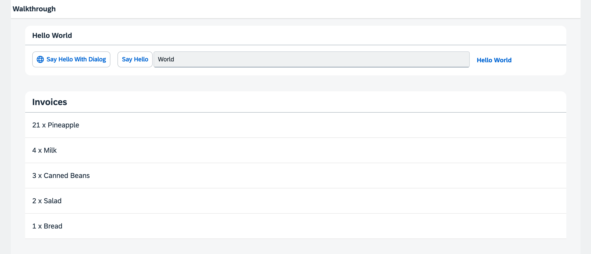

<!-- loiobf71375454654b44af01379a3c3a6273 -->

# Step 19: Aggregation Binding

Now that we have established a good structure for our app, it's time to add some more functionality. We start exploring more features of data binding by adding some invoice data in JSON format that we display in a list below the panel.


## Preview

  
  
**A list of invoices is displayed below the panel**




<a name="loiobf71375454654b44af01379a3c3a6273__section_zfj_ljk_syb"/>

## Coding

You can view and download all files at [Walkthrough - Step 19](https://ui5.sap.com/#/entity/sap.m.tutorial.walkthrough/sample/sap.m.tutorial.walkthrough.19).


<a name="loiobf71375454654b44af01379a3c3a6273__section_agj_ljk_syb"/>

## webapp/Invoices.json \(New\)

```
{
    "Invoices": [
        {
            "ProductName": "Pineapple",
            "Quantity": 21,
            "ExtendedPrice": 87.2,
            "ShipperName": "Fun Inc.",
            "ShippedDate": "2015-04-01T00:00:00",
            "Status": "A"
        },
        {
            "ProductName": "Milk",
            "Quantity": 4,
            "ExtendedPrice": 10,
            "ShipperName": "ACME",
            "ShippedDate": "2015-02-18T00:00:00",
            "Status": "B"
        },
        {
            "ProductName": "Canned Beans",
            "Quantity": 3,
            "ExtendedPrice": 6.85,
            "ShipperName": "ACME",
            "ShippedDate": "2015-03-02T00:00:00",
            "Status": "B"
        },
        {
            "ProductName": "Salad",
            "Quantity": 2,
            "ExtendedPrice": 8.8,
            "ShipperName": "ACME",
            "ShippedDate": "2015-04-12T00:00:00",
            "Status": "C"
        },
        {
            "ProductName": "Bread",
            "Quantity": 1,
            "ExtendedPrice": 2.71,
            "ShipperName": "Fun Inc.",
            "ShippedDate": "2015-01-27T00:00:00",
            "Status": "A"
        }
    ]
}
```

The `Invoices.json` file simply contains five invoices in a JSON format that we can use to bind controls against them in the app. JSON is a very lightweight format for storing data and can be directly used as a data source for SAPUI5 applications.


## webapp/manifest.json

```
{
  ...
  "sap.ui5": {
    ...
    "models": {
      "i18n": {
        "type": "sap.ui.model.resource.ResourceModel",
        "settings": {
          "bundleName": "ui5.walkthrough.i18n.i18n",
          "supportedLocales": [
            ""
          ],
          "fallbackLocale": ""
        }
      },
      "invoice": {
        "type": "sap.ui.model.json.JSONModel",
        "uri": "Invoices.json"
      }
    }
  }
  ...
}
```

We add a new model `invoice` to the `sap.ui5` section of the descriptor. This time we want a JSONModel, so we set the type to `sap.ui.model.json.JSONModel`. The `uri` key is the path to our data relative to the component. With this little configuration our component will automatically instantiate a new `JSONModel` which loads the invoice data from the `Invoices.json` file. Finally, the instantiated `JSONModel` is put onto the component as a named model invoice. The named model is then visible throughout our app.


## webapp/view/App.view.xml

```xml
<mvc:View
	controllerName="ui5.walkthrough.controller.App"
	xmlns="sap.m"
	xmlns:mvc="sap.ui.core.mvc"
	displayBlock="true">
    <Shell>
        <App class="myAppDemoWT">
            <pages>
                <Page title="{i18n>homePageTitle}">
                    <content>
                        <Panel
                            headerText="{i18n>helloPanelTitle}"
                            class="sapUiResponsiveMargin"
                            width="auto">
                            <content>
                                <mvc:XMLView
                                    viewName="ui5.walkthrough.view.HelloPanel"/>
                                <mvc:XMLView
                                    viewName="ui5.walkthrough.view.InvoiceList"/>
                            </content>
                        </Panel>
                    </content>
                </Page>
            </pages>
        </App>
    </Shell>
</mvc:View>
```

In the app view we add a second view to display our invoices below the panel.


## webapp/view/InvoiceList.view.xml \(New\)

```xml
<mvc:View
   xmlns="sap.m"
   xmlns:mvc="sap.ui.core.mvc">
   <List
      headerText="{i18n>invoiceListTitle}"
      class="sapUiResponsiveMargin"
      width="auto"
      items="{invoice>/Invoices}" >
      <items>
         <ObjectListItem
            title="{invoice>Quantity} x {invoice>ProductName}"/>
      </items>
   </List>
</mvc:View>
```

The new view is displaying a list control with a custom header text. The item aggregation of the list is bound to the root path `Invoices` of the JSON data. And since we defined a named model, we have to prefix each binding definition with the identifier `invoice`.

In the `items` aggregation, we define the template for the list that will be automatically repeated for each invoice of our test data. More precisely, we use an `sap/m/ObjectListItem` to create a control for each aggregated child of the `items` aggregation. The `title` property of the list item is bound to properties of a single invoice. This is achieved by defining a relative path \(without `/` in the beginning\). This works because we have bound the `items` aggregation via `items={invoice>/Invoices}` to the invoices.


## webapp/i18n/i18n.properties

```ini
# App Descriptor
appTitle=Hello World
appDescription=A simple walkthrough app that explains the most important concepts of SAPUI5

# Hello Panel
showHelloButtonText=Say Hello
helloMsg=Hello {0}
homePageTitle=Walkthrough
helloPanelTitle=Hello World
openDialogButtonText=Say Hello With Dialog
dialogCloseButtonText=Ok

# Invoice List
invoiceListTitle=Invoices
```

In the text bundle the title of the list is added.

**Related Information**  


[Lists](../10_More_About_Controls/lists-1da1581.md "Lists have properties and events and they contain list items that inherit from sap.m.ListItemBase, which provides navigation, selection and event features. The list item type determines the way the list item interacts by providing additional features.")

[API Reference: `sap.m.List`](https://ui5.sap.com/#/api/sap.m.List)

[Samples: `sap.m.List` ](https://ui5.sap.com/#/entity/sap.m.List)

[List Binding \(Aggregation Binding\)](../04_Essentials/list-binding-aggregation-binding-91f0577.md "List binding (or aggregation binding) is used to automatically create child controls according to model data.")

