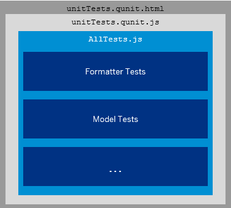

<!-- loiob81736e0fcb246efb3b0cf0ca422f8fd -->

# Step 2: A First Unit Test

In this step we will analyze the unit testing infrastructure and write a first unit test.

The product team requested a feature to highlight the price with colors depending on the amount. This can be done using the standard semantic colors that are defined for states like *Success*, *Warning*, or *Error*.

The price values can be mapped to semantic states as follows:

-   price < 50: Status is green \(*Success*\)

-   price \>= 50 and price < 250: Status is normal \(*None*\)

-   price \>= 250 and price < 2000: Status is orange \(*Warning*\)

-   price \>= 2000: Status is red \(*Error*\)


As we use Test Driven Development \(TDD\) we define the test case first, before we actually implement the feature. So we will now start by implementing a test for the *Price State* feature. Naturally the test will fail until the feature is implemented in the next step.

> ### Note:  
> Test Driven Development \(TDD\) is a software development model that relies on a very short development cycle. When using TDD a developer first writes a failing automatic test case to describe the behavior of a new feature or functionality. As soon as the test fails \(due to the still missing implementation\) the role of the developer switches to the implementation. The code is added to make the test run successful and then the cycle starts over again.
> 
> There might also be iterations where just the implementation or testing code is refactored to make it more elegant. TDD reduces complexity while maintaining high test coverage of the application coding at the same time.


## Preview

   
  
**The unit test will initially fail as the implementation is not provided yet**

  


## Unit Test Setup

All unit tests are located in the `webapp/test/unit` folder and can be started manually by calling the `unitTests.qunit.html` file in the same folder or the entry page. This HTML page is a QUnit runner that calls all unit tests of the app and displays the test results in a readable format.

> ### Note:  
> Some testrunners like Karma do not require an HTML page to invoke the tests but work with configuration files instead. They can directly invoke the `AllTests.js` file and log the test results in their own format. Therefore we make sure that the `AllTests.js` file does not contain any UI output and just calls the various test cases of the app.

   
  
**Unit test infrastructure in the application**

  

Let’s take a closer look at the `unitTests.qunit.html` file. The application root is stored in the `webapp` folder two levels above. In the `bootstrap` tag of the HTML page we define two namespaces to refer to the app and the unit tests. The namespace of the unit tests points to the current folder as all test artifacts are located below the current folder:

-   `sap.ui.demo.bulletinboard: "../../"`

-   `test.unit: "./"`


The namespace abstraction allows us to refer to all application and testing parts without having to use the full path. Furthermore, all unit tests are put in a similar folder structure and get the same name as the artifact that is tested. For example, the tests for the file `webapp/model/formatter.js` are located in the `webapp/test/unit/model/formatters.js` folder. For more details on the unit test setup please have a look at the coding of the prototype.


<a name="loiob81736e0fcb246efb3b0cf0ca422f8fd__section_uw3_pzh_p1b"/>

## Coding

You can view and download all files in the *Samples* in the Demo Kit at [Testing Apps - Step 2](https://ui5.sap.com/#/entity/sap.m.tutorial.testing/sample/sap.m.tutorial.testing.02).


## webapp/model/formatter.js

```js
sap.ui.define([
	"sap/m/Text"
], function (Text) {
	"use strict";
	return {
		numberUnit: function (sValue) {
			…
		},
		priceState: function () {
		}

	};
});
```

First we think about the feature that we want to implement. We want to introduce a new state for the price, and its value should depend on certain price ranges. SAPUI5 controls typically have semantic states like *Success*, *Warning*, or *Error*. We will need this formatter function to convert the numeric price value from the model to a state value for the control. But without caring too much about the actual implementation of this formatter we just add an empty function `priceState` to the formatter file for now and focus on the unit tests first.


## webapp/test/unit/model/formatter.js

```js
sap.ui.define([
	"./model/formatter"
], function (formatter) {
	"use strict";

	QUnit.module("Number unit");
		…
	QUnit.module("Price State");

	function priceStateTestCase(oOptions) {
		// Act
		var sState = formatter.priceState(oOptions.price);

		// Assert
		oOptions.assert.strictEqual(sState, oOptions.expected, "The price state was correct");
	}

	QUnit.test("Should format the products with a price lower than 50 to Success", function (assert) {
		priceStateTestCase.call(this, {
			assert: assert,
			price: 42,
			expected: "Success"
		});
	});

	QUnit.test("Should format the products with a price of 50 to Normal", function (assert) {
		priceStateTestCase.call(this, {
			assert: assert,
			price: 50,
			expected: "None"
		});
	});

	QUnit.test("Should format the products with a price between 50 and 250 to Normal", function (assert) {
		priceStateTestCase.call(this, {
			assert: assert,
			price: 112,
			expected: "None"
		});
	});

	QUnit.test("Should format the products with a price between 250 and 2000 to Warning", function (assert) {
		priceStateTestCase.call(this, {
			assert: assert,
			price: 798,
			expected: "Warning"
		});
	});

	QUnit.test("Should format the products with a price higher than 2000 to Error", function (assert) {
		priceStateTestCase.call(this, {
			assert: assert,
			price: 2001,
			expected: "Error"
		});
	});
});

```

Now we write tests that call the function we have just defined and check for the correct result when passing in various arguments.

By writing these tests, we actually implement the following specification in our tests that was defined by the product team.

-   price < 50: Status is green \(*Success*\)

-   price \>= 50 and price < 250: Status is normal \(*None*\)

-   price \>= 250 and price < 2000: Status is orange \(*Warning*\)

-   price \>= 2000: Status is red \(*Error*\)


Whenever we run the tests, we will implicitly check that the feature is still working as it was designed. To keep it simple, we should only write a minimum set of tests that cover the most important cases, but also including edge cases like the value 50 or unexpected values.

Let’s have a look at the implementation of the unit tests now: We add our unit tests to the `webapp/test/unit/model/formatter.js` file. The path below the app and the test folder is similar so it can easily associate the test with the tested functionality. There are already formatter functions for the number unit conversion defined in the code - you can have a quick look before we add our own tests.

We add a new QUnit module for our price state tests after the number unit conversion tests. We could write a test checking the result of the formatter for each of these cases but we do not want to repeat ourselves \(“DRY”\) – neither in the tests nor in the application coding – so we create a reuse function called `priceStateTestCase`. In this function, we call the formatter with the arguments provided as `oOptions` and make a `strictEqual` assertion for the expected parameter.

> ### Note:  
> There must be at least one assertion per QUnit test. If the actual value matches the expected value then the test is successful. However, if there are more assertions in a test case and a subsequent assertion fails, the whole test fails with the error message of the failed assertion.
> 
> There are also other types of assertions, for example the `ok` assertion that does not check the type. For more details, have a look at the official QUnit documentation.

The assert object – a special object injected by QUnit – is passed on as a reference to the function. QUnit is loaded once for the whole unit testing part of the app.

> ### Note:  
> The main page for calling the unit tests is `webapp/test/unit/unitTests.qunit.html`. In this file we load the QUnit runtime and an `AllTests.js` file that loads and directly executes all files with unit tests. The other content of this file is just HTML for displaying the QUnit test result page.

And now for the actual test cases: Whenever we want to start a new test we call `QUnit.test` with a test description and a callback function containing the test logic as an argument. The callback is invoked with a special assert object that is maintained by QUnit. We can simply call assertions as we saw above.

Inside each test we simply call our reuse function with different parameters for the price and the expected state that reflect our specification above. With five tests we can check the most important cases for our price state converter. There are four tests for the four different states and one edge case test with the value `50`, that makes sure that the correct state is chosen.

That’s it, you just wrote your first unit test. When you call the `webapp/test/unit/unitTests.qunit.html` file in your browser, you can see that the first module for the number unit formatter is still green but our price state tests are red and failing. The error message tells us that the result of the empty formatter function is not as expected.

TDD methodology tells us to do the implementation as soon as the test fails and to come back to testing as soon as the tests are successful again. You run the unit tests after each code change, and you're done when the test does not fail anymore. We now switch to the implementation part and define the details of the formatter function in the next step.


## Conventions

-   Write unit tests for testing the logical correctness of your features


**Related Information**  


[Unit Testing with QUnit](../04_Essentials/unit-testing-with-qunit-09d145c.md "QUnit is a powerful, easy-to-use JavaScript unit testing framework. It is used by the jQuery, jQuery UI and jQuery Mobile projects and is capable of testing any generic JavaScript code. It supports asynchronous tests out-of-the-box.")

[QUnit Home Page](https://qunitjs.com/)

