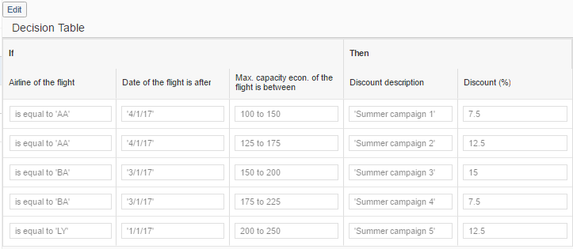

<!-- loio33ef2b0efda148afaa3270a08c3f5d9b -->

# Step 2: Associating the Expression Language for Decision Tables

Expression languages provide the required services for rule authoring, rule visualization, and rule content validation. The services provided by the expression language object include expression validations, expression parsing, auto-complete suggestions, retrieval of expression metadata and tokens, and performing runtime services such as fetching data objects, outputs, and so on.

The vocabulary OData model and the binding context path for the specific vocabulary are mandatory input for the expression language.

The expression language objects are an association of the `RuleBuilder` object, and it can be associated with multiple `RuleBuilder` objects.


<a name="loio33ef2b0efda148afaa3270a08c3f5d9b__section_f5q_rp3_rz"/>

## Preview

   
  
<a name="loio33ef2b0efda148afaa3270a08c3f5d9b__fig_jmj_j2p_rz"/>Decision Table with Guided Input

  


<a name="loio33ef2b0efda148afaa3270a08c3f5d9b__section_mjx_fn3_rz"/>

## Coding

You can view and download all files at [Rule Builder - Guided Decision Table](https://ui5.sap.com/#/entity/sap.rules.ui.RuleBuilder/sample/sap.rules.ui.sample.GuidedDecisionTable). This is applicable only for rule expression language.


Before you begin, customize the `Page.controller.js` as per your requirements.

-   Set the expression language object:

    For rule expression language 1.0:

    ```
    oExpressionLanguage = new sap.rules.ui.services.ExpressionLanguage();
    oRuleBuilder.setExpressionLanguage(oExpressionLanguage);
    
    ```

    For DMN SFEEL\(Expression language 2.0\):

    ```
    oAstExpressionLanguage = new sap.rules.ui.services.AstExpressionLanguage();
    oRuleBuilder.setAstExpressionLanguage(oAstExpressionLanguage);
    
    ```

-   Ensure that you have set the data before setting the vocabulary model for the expression language as shown:

    ```
    oExpressionLanguage.setData(data);
    oExpressionLanguage.setModel(that.oVocabularyModel);
    
    ```


**Page.controller.js**

```js
 
sap.ui.define([
	'jquery.sap.global',
	'sap/ui/core/mvc/Controller',
	'sap/ui/model/odata/v2/ODataModel',
	'sap/rules/ui/services/ExpressionLanguage',   //For DMN SFEEL language, use 'AstExpressionLanguage'.
	'sap/ui/core/util/MockServer',
	'sap/m/MessageToast'
], function (jQuery, Controller, ODataModel, ExpressionLanguage, MockServer, MessageToast) {    //For DMN SFEEL language, use 'AstExpressionLanguage' instead of 'ExpressionLanguage'.
	"use strict";

	return Controller.extend("sap.rules.ui.sample.GuidedDecisionTable.Page", {

		onInit: function () {

			sap.ui.getCore().applyTheme("sap_belize");

			// apply compact density for desktop, the cozy design otherwise
			this.getView().addStyleClass(sap.ui.Device.system.desktop ? "sapUiSizeCompact" : "sapUiSizeCozy");

			var mPath = sap.ui.require.toUrl("sap/rules/ui/sample/GuidedDecisionTable") + "/";
			
			// Initialize Expression Language services
			this.oVocabularyMockServer = new MockServer({rootUri: "/sap/opu/odata/SAP/vocabulary_srv/"});
			this.oVocabularyMockServer.simulate(
				mPath + "localService/vocabulary/metadata.xml",
				{'sMockdataBaseUrl': mPath + "localService/vocabulary/mockdata/"}
			);
			this.oVocabularyMockServer.start();
			this.oVocabularyModel = new ODataModel("/sap/opu/odata/SAP/vocabulary_srv/");
			this.oExpressionLanguage = new ExpressionLanguage();               //For DMN SFEEL, use 'new AstExpressionLanguage();'.
			this.oExpressionLanguage.setModel(this.oVocabularyModel);
			this.oExpressionLanguage.setBindingContextPath("/Vocabularies('FA163E38C6481EE785F409DCAD583D43')");

			// Initialize the Rule Builder
			this.oRuleMockServer = new MockServer({rootUri: "/sap/opu/odata/SAP/RULE_SRV/"});
			this.oRuleMockServer.simulate(
				mPath + "localService/rule/metadata.xml",
				{'sMockdataBaseUrl': mPath + "localService/rule/mockdata/"}
			);

			var aRequests = this.loadRequests(mPath);
			this.oRuleMockServer.setRequests(aRequests);
			this.oRuleMockServer.start();
			this.oRuleModel = new ODataModel({
				serviceUrl: "/sap/opu/odata/SAP/RULE_SRV/",
				defaultBindingMode: sap.ui.model.BindingMode.TwoWay
			});

			var oRuleBuilder = this.byId("ruleBuilder");
			oRuleBuilder.setModel(this.oRuleModel);
			oRuleBuilder.setExpressionLanguage(this.oExpressionLanguage);
			oRuleBuilder.setBindingContextPath("/Rules(Id='FA163E38C6481EE785F409DCAD583D43',Version='000000000000000001')");
		},

		handleEditButton: function () {
			var oEditButton = this.byId("editButton");
			var oRuleBuilder = this.byId("ruleBuilder");
			var bEdit = (oEditButton.getText() === "Edit");
			oRuleBuilder.setEditable(bEdit);
			oEditButton.setText(bEdit ? "Display" : "Edit");
		},

		onAfterRendering: function () {

			// Line actions are not supported in this demo
			var oRuleBuilder = this.byId("ruleBuilder");
			var oDecisionTable = oRuleBuilder.getAggregation("_rule");
			var oToolbar = oDecisionTable.getAggregation("_toolbar");
			var arrContent = oToolbar.getContent();
			for (var i = 0; i < arrContent.length; i++) {
				if (arrContent[i].getMetadata().getName() === "sap.m.Button") {
					arrContent[i].detachPress(arrContent[i].mEventRegistry.press[0].fFunction, arrContent[i].mEventRegistry.press[0].oListner);
					arrContent[i].attachPress(function (oEvent) {
							var msg = 'Line action pressed';
							MessageToast.show(msg);
						}
					);
				} else if (arrContent[i].getMetadata().getName() === "sap.m.MenuButton") {
					var oMenu = arrContent[i].getMenu();
					oMenu.detachItemSelected(oMenu.mEventRegistry.itemSelected[1].fFunction, oMenu.mEventRegistry.itemSelected[1].oListner);
					oMenu.attachItemSelected(function (oEvent) {
							var msg = 'Line action pressed';
							MessageToast.show(msg);
						}
					);
				}
			}

		},

		loadRequests: function (mPath) {

			// The mock server does not support 1 to 1 navigation.
			// Hence we provide the responses directly by adding custom requests to the MockServer
			var oRresponses = jQuery.sap.sjax({
				type: "GET",
				url: mPath + "localService/rule/responses.json",
				dataType: "json"
				}	
			).data;
			
			var aRequests = this.oRuleMockServer.getRequests();
			var sMethod = "GET";
			var sPath = /Rules\(Id='FA163E38C6481EE785F409DCAD583D43',Version='000001'\)\/DecisionTable\/DecisionTableRows\/\$count/;
			var fnResponse1 = function (xhr) {
				xhr.respond(200, {
					"Content-Type": "text/plain;charset=utf-8"
				}, "5");
			};
			aRequests.push({method: sMethod, path: sPath, response: fnResponse1});
			
			sPath = /Rules\(Id='FA163E38C6481EE785F409DCAD583D43',Version='000001'\)\/DecisionTable\/DecisionTableRows\?\$skip=0&\$top=\d+&\$orderby=Sequence%20asc&\$expand=Cells/;
			var response_1 = this.response_1;
			var fnResponse2 = function (xhr) {
				xhr.respondJSON(200, {
					"Content-Type": "application/json;charset=utf-8"
				}, oRresponses.response_1);
			};
			aRequests.push({method: sMethod, path: sPath, response: fnResponse2});

			sPath = /Rules\(Id='FA163E38C6481EE785F409DCAD583D43',Version='000001'\)\/DecisionTable\/DecisionTableColumns\/\$count/;
			var fnResponse3 = function (xhr) {
				xhr.respond(200, {
					"Content-Type": "text/plain;charset=utf-8"
				}, "5");
			}
			aRequests.push({method: sMethod, path: sPath, response: fnResponse3});

			sPath = /Rules\(Id='FA163E38C6481EE785F409DCAD583D43',Version='000001'\)\/DecisionTable\/DecisionTableColumns\?\$skip=0&\$top=\d+&\$expand=Condition%2cResult/;
			var response_2 = this.response_2;
			var fnResponse4 = function (xhr) {
				xhr.respondJSON(200, {
					"Content-Type": "application/json;charset=utf-8"
				}, oRresponses.response_2);
			}
			aRequests.push({method: sMethod, path: sPath, response: fnResponse4});
 
			return aRequests;
		}
	});
});
```

This code adds an expression language object to the view controller, and connects it to the `RuleBuilder` as an association. For the expression language service, this code sets the model and then does all the necessary data binding internally \(unlike other SAPUI5 controls where the developer defines the data binding\). The data for the expression language is loaded via the vocabulary OData service.

The following are the code modifications that you can make to include additional functionalities:

-   For reading specific vocabulary content like data objects, attributes, value help, rules or vocabulary rules, use the following code:

    ```
    this.oVocabularyModel.read(sVocabularyPath, {
                    urlParameters: {
                        "$expand": "DataObjects/Associations,DataObjects/Attributes,ValueSources,Rules"
                   },
    
    ```

-   To set the vocabulary context shown in autosuggestion, use the following code:

    ```
    oExpressionLanguage.setBindingContextPath("/Vocabularies(\'" + <vocabulary context> + "\')");
    ```

    > ### Note:  
    > Vocabulary context is `ProjectId` by default and all the data objects of the given project are listed in autosuggestion. The possible contexts include `RuleserviceId`, `RuleId` and `ProjectId`.


The code also sets a binding context path on `RuleBuilder` to the specific rule you are currently working on.

Now, when running the application, the decision table will be rendered filled with rule data from the mock server.

> ### Note:  
> If you are using a back-end system with the relevant implemented OData services, use the following code:
> 
> ```js
> sap.ui.define([
> 	'sap/ui/core/mvc/Controller',
> 	'sap/ui/model/odata/v2/ODataModel',
> 	'sap/rules/ui/services/ExpressionLanguage'         //For DMN SFEEL language, use 'sap/rules/ui/services/AstExpressionLanguage'.
> ], function ( Controller, ODataModel, ExpressionLanguage) {   //For DMN SFEEL language, use 'AstExpressionLanguage' instead of 'ExpressionLanguage'.
> 	"use strict";
> 
> 	return Controller.extend("mySample.RuleBuilder.Page", {
> 
> 		onInit: function () {
> 
> 			// apply compact density for desktop, the cozy design otherwise
> 			this.getView().addStyleClass(sap.ui.Device.system.desktop ? "sapUiSizeCompact" : "sapUiSizeCozy");
> 			
> 			// Initialize Expression Language services
> 			this.oVocabularyModel = new ODataModel("/vocabulary_srv/");
> 			this.oExpressionLanguage = new ExpressionLanguage();       //For DMN SFEEL, use 'new AstExpressionLanguage()'.
> 			this.oExpressionLanguage.setModel(this.oVocabularyModel);
> 			this.oExpressionLanguage.setBindingContextPath("/Vocabularies('<your rule ID>')");
> 
> 			// Initialize the Rule Builder
> 			this.oRuleModel = new ODataModel({
> 				serviceUrl: "/sap/opu/odata/SAP/RULE_SRV/",
> 				defaultBindingMode: sap.ui.model.BindingMode.TwoWay
> 			});
> 
> 			var oRuleBuilder = this.byId("ruleBuilder");
> 			oRuleBuilder.setModel(this.oRuleModel);
> 			oRuleBuilder.setExpressionLanguage(this.oExpressionLanguage);
> 			oRuleBuilder.setBindingContextPath("/Rules(Id='<your rule ID>',Version='000001')");
> 		},
> 
> 		handleEditButton: function () {
> 			var oEditButton = this.byId("editButton");
> 			var oRuleBuilder = this.byId("ruleBuilder");
> 			var bEdit = (oEditButton.getText() === "Edit");
> 			oRuleBuilder.setEditable(bEdit);
> 			oEditButton.setText(bEdit ? "Display" : "Edit");
> 		}
> 	});
> });
> ```

**Parent topic:** [Decision Table](decision-table-c0184a0.md "Create a business logic by defining the conditions in decision table, which is associated with the expression language.")

**Next:** [Step 1: Creating an Initial Rule Control](step-1-creating-an-initial-rule-control-e58a936.md "")

**Previous:** [Step 3: Changing the Decision Table Configuration](step-3-changing-the-decision-table-configuration-4394320.md "")

