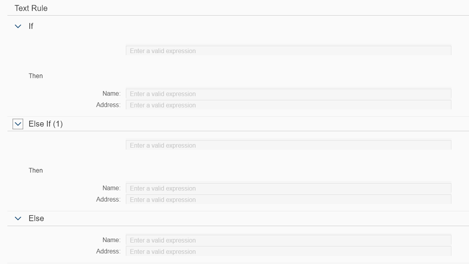

<!-- loio34d774fe7a3e4cd5b0fe6ad26d9fe693 -->

# Step 2: Associating the Expression Language for Text Rules


<a name="loio34d774fe7a3e4cd5b0fe6ad26d9fe693__section_f5q_rp3_rz"/>

## Preview




<a name="loio34d774fe7a3e4cd5b0fe6ad26d9fe693__section_mjx_fn3_rz"/>

## Coding

You can view and download all files at [Rule Builder - Text Rule](https://ui5.sap.com/#/entity/sap.rules.ui.RuleBuilder/sample/sap.rules.ui.sample.TextRule).


<a name="loio34d774fe7a3e4cd5b0fe6ad26d9fe693__section_fmw_sp3_rz"/>

## Page.controller.js

This code adds an expression language object to the view controller, and connects it to the `RuleBuilder`. For the expression language object, this code sets the model and then does all the necessary data binding internally \(unlike other SAPUI5 controls where the developer defines the data binding\). The data for expression language object is loaded via the vocabulary OData service.

Before you begin, customize the `Page.controller.js` as per your requirements.

-   Set the expression language object:

    For rule expression language 1.0:

    ```
    oExpressionLanguage = new sap.rules.ui.services.ExpressionLanguage();
    oRuleBuilder.setExpressionLanguage(oExpressionLanguage);
    
    ```

    For DMN SFEEL\(Expression language 2.0\):

    ```
    oAstExpressionLanguage = new sap.rules.ui.services.AstExpressionLanguage();
    oRuleBuilder.setAstExpressionLanguage(oAstExpressionLanguage);
    
    ```

-   Ensure that you have set the data before setting the vocabulary model for the expression language as shown:

    ```
    oExpressionLanguage.setData(data);
    oExpressionLanguage.setModel(that.oVocabularyModel);
    
    ```


> ### Note:  
> Text rule will not load if the batch mode is disabled. Set `setUseBatch` to `true` in the OData model used to enable batch mode.

The code also sets a binding context path on `RuleBuilder` to the specific rule you are currently working on.


```js
 sap.ui.define([
    'jquery.sap.global',
    'sap/ui/core/mvc/Controller',
    'sap/ui/model/odata/v2/ODataModel',
    'sap/rules/ui/services/ExpressionLanguage',     //For DMN SFEEL, use 'sap/rules/ui/services/AstExpressionLanguage'.
    'sap/ui/core/util/MockServer',
    'sap/m/MessageToast'
], function (jQuery, Controller, ODataModel, ExpressionLanguage, MockServer, MessageToast) {   //For DMN SFEEL, use 'AstExpressionLanguage' instead of 'ExpressionLanguage'.
    "use strict";

    return Controller.extend("sap.rules.ui.sample.TextRule.Page", {

        /**
         * This sample uses the sap.ui.core.uti.MockServer. The RuleBuilder control is meant to be used
         * with the Vocabulary OData service and the Rules OData service.
         * Hence, when using th eproper OData services the mockServer code should be removed.
         */
        onInit: function () {

            sap.ui.getCore().applyTheme("sap_horizon");

            // apply compact density for desktop, the cozy design otherwise
            this.getView().addStyleClass(sap.ui.Device.system.desktop ? "sapUiSizeCompact" : "sapUiSizeCozy");

            var mPath = sap.ui.require.toUrl("sap/rules/ui/sample/TextRule") + "/";

            // Initialiaze Expression Language services
            this.oVocabularyMockServer = new MockServer({rootUri: "/rule-service/vocabulary_srv/"});
            this.oVocabularyMockServer.simulate(
                mPath + "localService/vocabulary/mockdata/metadata.xml",
                {'sMockdataBaseUrl': mPath + "localService/vocabulary/mockdata/"}
            );
            this.oVocabularyMockServer.start();
            this.oVocabularyModel = new ODataModel("/rule-service/vocabulary_srv/");
            this.oExpressionLanguage = new ExpressionLanguage();         //For DMN SFEEL, use 'new AstExpressionLanguage();'.
            this.oExpressionLanguage.setModel(this.oVocabularyModel);
            this.oExpressionLanguage.setBindingContextPath("/Vocabularies('<project-id>')");

            // Initialiaze the Rule Builder
           

            this.oRuleMockServer = new MockServer({rootUri: "/rule-service/rule_srv/"});
            this.oRuleMockServer.simulate(
                mPath + "localService/rule/mockdata/metadata.xml",
                {'sMockdataBaseUrl': mPath + "localService/rule/mockdata/"}
            );
            var aRequests = this.loadRequests(mPath);
            this.oRuleMockServer.setRequests(aRequests);


            this.oRuleMockServer.start();
            this.oRuleModel = new ODataModel({
                serviceUrl: "/rule-service/rule_srv/",
                defaultBindingMode: sap.ui.model.BindingMode.TwoWay
            });

            var oRuleBuilder = this.byId("ruleBuilder");
            oRuleBuilder.setModel(this.oRuleModel);
            oRuleBuilder.setExpressionLanguage(this.oExpressionLanguage);
            oRuleBuilder.setBindingContextPath("/Projects(Id='<project-id>',Version='<project-version>')/Rules(Id='<rule-id>',Version='<rule-version>')");
        },

        handleEditButton: function () {
            var oEditButton = this.byId("editButton");
            var oRuleBuilder = this.byId("ruleBuilder");
            var bEdit = (oEditButton.getText() === "Edit");
            oRuleBuilder.setEditable(bEdit);
            oEditButton.setText(bEdit ? "Display" : "Edit");
        },

        onAfterRendering: function () {

            /**
             * Line actions are not supported in this demo as they require a functioning Rules oData service
             * This function overwites the line actions event handlers.
             * Please do not use this code when using proper OData services.
             */
            var oRuleBuilder = this.byId("ruleBuilder");
            var oDecisionTable = oRuleBuilder.getAggregation("_rule");


        },
        loadRequests: function (mPath) {
            // The mock server does not support 1 to 1 navigation.
            // Hence we provide the responses directly by adding custom requests to the MockServer
            var oRresponses = jQuery.sap.sjax({
                type: "GET",
                url: mPath + "localService/rule/mockdata/responses.json",
                dataType: "json"
            }).data;
	        var aRequests = this.oRuleMockServer.getRequests();
	        var sMethod = "GET";
	        var sPath = /Projects\(Id='<project-id>',Version='<project-version>'\)\/Rules\(Id='<rule-id>',Version='<rule-version>'\)\/TextRule\/TextRuleConditions\/\$count/;
	        var fnResponse1 = function (xhr) {
	            xhr.respond(200, {
	                "Content-Type": "text/plain;charset=utf-8"
	            }, "3");
	        };
	        aRequests.push({method: sMethod, path: sPath, response: fnResponse1});
	
	        sPath = /Projects\(Id='<project-id>',Version='<project-version>'\)\/Rules\(Id='<rule-id>',Version='<rule-version>'\)\?\$expand=TextRule/;
	        var fnResponse2 = function (xhr) {
	            xhr.respondJSON(200, {
	                "Content-Type": "application/json;charset=utf-8"
	            }, oRresponses.response_7);
	        };
	        aRequests.push({method: sMethod, path: sPath, response: fnResponse2});
	        
	        var sPath = /Projects\(Id='<project-id>',Version='<project-version>'\)\/Rules\(Id='<rule-id>',Version='<rule-version>'\)\/TextRule\/TextRuleResults\/\$count/;
	        var fnResponse3 = function (xhr) {
	            xhr.respond(200, {
	                "Content-Type": "text/plain;charset=utf-8"
	            }, "2");
	        };
	        aRequests.push({method: sMethod, path: sPath, response: fnResponse3});
	
	        sPath = /Projects\(Id='<project-id>',Version='<project-version>'\)\/Rules\(Id='<rule-id>',Version='<rule-version>'\)\/TextRule\/TextRuleResults/;
	        var fnResponse4 = function (xhr) {
	            xhr.respondJSON(200, {
	                "Content-Type": "application/json;charset=utf-8"
	            }, oRresponses.response_3);
	        };
	        aRequests.push({method: sMethod, path: sPath, response: fnResponse4});
	
	        /Projects\(Id='<project-id>',Version='<project-version>'\)\/Rules\(Id='<rule-id>',Version='<rule-version>'\)\/TextRule\/TextRuleConditions\?\$expand=TextRuleResultExpressions/;
	        var fnResponse5 = function (xhr) {
	            xhr.respondJSON(200, {
	                "Content-Type": "application/json;charset=utf-8"
	            }, oRresponses.response_2);
	        };
	        aRequests.push({method: sMethod, path: sPath, response: fnResponse5});
	        
	        sPath = /Projects\(Id='<project-id>',Version='<project-version>'\)\/Rules\(Id='<rule-id>',Version='<rule-version>'\)\/TextRule\/TextRuleConditions\(RuleId='<rule-id>',RuleVersion='<rule-version>',Id='1'\)\/TextRuleResultExpressions\$count/;
	        var fnResponse6 = function (xhr) {
	            xhr.respond(200, {
	                "Content-Type": "text/plain;charset=utf-8"
	            }, "2");
	        };
	        aRequests.push({method: sMethod, path: sPath, response: fnResponse6});
	        
	        sPath = /Projects\(Id='<project-id>',Version='<project-version>'\)\/Rules\(Id='<rule-id>',Version='<rule-version>'\)\/TextRule\/TextRuleConditions\(RuleId='<rule-id>',RuleVersion='<rule-version>',Id='1'\)\/TextRuleResultExpressions\?\$skip=0&\$top=100/;
	        var fnResponse7 = function (xhr) {
	             xhr.respondJSON(200, {
	                "Content-Type": "application/json;charset=utf-8"
	            }, oRresponses.response_8);
	        };
	        aRequests.push({method: sMethod, path: sPath, response: fnResponse7});
	        
	        sPath = /Projects\(Id='<project-id>',Version='<project-version>'\)\/Rules\(Id='<rule-id>',Version='<rule-version>'\)\/TextRule\/TextRuleConditions\(RuleId='<rule-id>',RuleVersion='<rule-version>',Id='2'\)\/TextRuleResultExpressions\$count/;
	        var fnResponse8 = function (xhr) {
	            xhr.respond(200, {
	                "Content-Type": "text/plain;charset=utf-8"
	            }, "2");
	        };
	        aRequests.push({method: sMethod, path: sPath, response: fnResponse8});
	        
	        sPath = /Projects\(Id='<project-id>',Version='<project-version>'\)\/Rules\(Id='<rule-id>',Version='<rule-version>'\)\/TextRule\/TextRuleConditions\(RuleId='<rule-id>',RuleVersion='<rule-version>',Id='2'\)\/TextRuleResultExpressions\?\$skip=0&\$top=100/;
	        var fnResponse9 = function (xhr) {
	             xhr.respondJSON(200, {
	                "Content-Type": "application/json;charset=utf-8"
	            }, oRresponses.response_9);
	        };
	        aRequests.push({method: sMethod, path: sPath, response: fnResponse9});
	
	        return aRequests;


        }


    });
});
```

The following are the code modifications that you can make to include additional functionalities:

-   For reading specific vocabulary content like data objects, attributes, value help, rules or vocabulary rules, use the following code:

    ```
    this.oVocabularyModel.read(sVocabularyPath, {
                    urlParameters: {
                        "$expand": "DataObjects/Associations,DataObjects/Attributes,ValueSources,Rules"
                   },
    
    ```

-   To set the vocabulary context shown in autosuggestion, use the following code:

    ```
    oExpressionLanguage.setBindingContextPath("/Vocabularies(\'" + <vocabulary context> + "\')");
    ```

    > ### Note:  
    > Vocabulary context is `ProjectId` by default and all the data objects of the given project are listed in autosuggestion. The possible contexts include `RuleserviceId`, `RuleId` and `ProjectId`.


