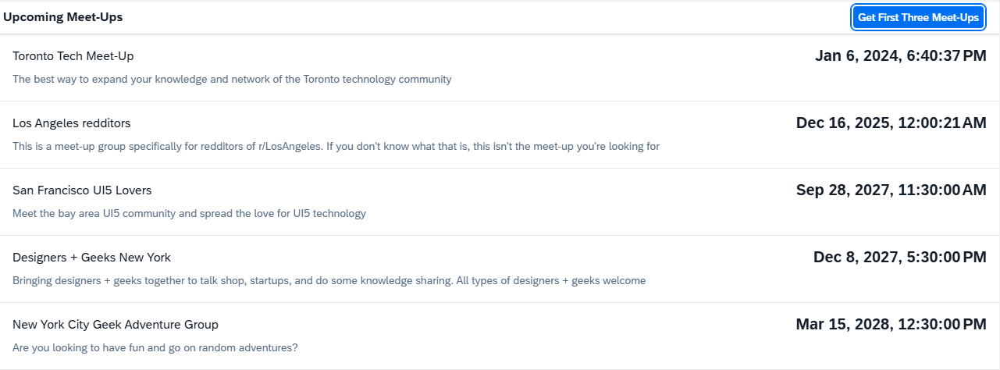

<!-- loio50897decc9504b2a875fb41d89fd254a -->

# Step 2: Creating a Mock Server to Simulate Data

In this step, we use the OData V2 mock server to add data to our app without dependency to any remote server or system.


## Preview

   
  
<a name="loio50897decc9504b2a875fb41d89fd254a__fig_qwx_h2q_st"/>The app now contains data

  


## Coding

You can view and download all files in the Demo Kit at [Mock Server - Step 2](https://ui5.sap.com/#/entity/sap.ui.core.tutorial.mockserver/sample/sap.ui.core.tutorial.mockserver.02).


## webapp/test/mockServer.html

```html
<!DOCTYPE HTML>
<html>
<head>
	<meta charset="utf-8">
	<meta name="viewport" content="width=device-width, initial-scale=1.0">
	<title>Mock Server Tutorial</title>
	<script id="sap-ui-bootstrap"
		src="resources/sap-ui-core.js"
		data-sap-ui-theme="sap_belize"
		data-sap-ui-resourceroots='{
			"sap.ui.demo.MockServer": "../"
		}'
		data-sap-ui-oninit="module:sap/ui/demo/MockServer/test/initMockServer"
		data-sap-ui-compatVersion="edge"
		data-sap-ui-async="true">
	</script>
</head>
<body class="sapUiBody">
	<div data-sap-ui-component data-name="sap.ui.demo.MockServer" data-id="container" data-settings='{"id" : "MockServer"}'></div>
</body>
</html>

```

We use this file to run our app in test mode with mock data. The new artifact `initMockServer` performs the required set up steps before the application component is instantiated. By doing so, we can catch all requests that would go to the real service and process it locally with our mock server when the app is launched with the `webapp/test/mockServer.html`.

> ### Note:  
> A productive application does not contain the mock server code and thus connects to the real service instead. The HTML page above is defined only for local testing and to be called in automated tests. The application coding itself is unchanged and does not know the difference between the real and the mocked back-end service.
> 
> The mock server does not need to be called from anywhere else in our code so we use `sap.ui.require` to load dependencies asynchronously without defining a global namespace.


<a name="loio50897decc9504b2a875fb41d89fd254a__section_e1t_y11_hhb"/>

## webapp/test/initMockServer.js

```js
sap.ui.define([
	"sap/ui/demo/MockServer/localService/mockserver"
], function (mockserver) {
	"use strict";

	// initialize the mock server
	mockserver.init();

	// initialize the embedded component on the HTML page
	sap.ui.require(["sap/ui/core/ComponentSupport"]);
});
```

We load a dependency to a file called `mockserver.js` that is located in the `webapp/localService` folder. This file contains our local mock server. It is immediately called with the `init` method before we initialize the application component.


## webapp/localService/metadata.xml

```xml
<?xml version="1.0" encoding="utf-8" standalone="yes"?>
<edmx:Edmx Version="1.0"
    xmlns:edmx="http://schemas.microsoft.com/ado/2007/06/edmx">
    <edmx:DataServices
        xmlns:m="http://schemas.microsoft.com/ado/2007/08/dataservices/metadata" m:DataServiceVersion="1.0">
        <Schema Namespace="NerdMeetup.Models"
            xmlns:d="http://schemas.microsoft.com/ado/2007/08/dataservices"
            xmlns:m="http://schemas.microsoft.com/ado/2007/08/dataservices/metadata"
            xmlns="http://schemas.microsoft.com/ado/2006/04/edm">
            <EntityType Name="Meetup">
                <Key>
                    <PropertyRef Name="MeetupID" />
                </Key>
                <Property Name="MeetupID" Type="Edm.Int32" Nullable="false" />
                <Property Name="Title" Type="Edm.String" Nullable="true" />
                <Property Name="EventDate" Type="Edm.DateTime" Nullable="false" />
                <Property Name="Description" Type="Edm.String" Nullable="true" />
                <Property Name="HostedBy" Type="Edm.String" Nullable="true" />
                <Property Name="ContactPhone" Type="Edm.String" Nullable="true" />
                <Property Name="Address" Type="Edm.String" Nullable="true" />
                <Property Name="Country" Type="Edm.String" Nullable="true" />
                <Property Name="Latitude" Type="Edm.Double" Nullable="false" />
                <Property Name="Longitude" Type="Edm.Double" Nullable="false" />
                <Property Name="HostedById" Type="Edm.String" Nullable="true" />
                <Property Name="Location" Type="NerdMeetup.Models.LocationDetail" Nullable="false" />
            </EntityType>
            <ComplexType Name="LocationDetail" />
            <EntityContainer Name="NerdMeetups" m:IsDefaultEntityContainer="true">
                <EntitySet Name="Meetups" EntityType="NerdMeetup.Models.Meetup" />
                <FunctionImport Name="FindUpcomingMeetups" EntitySet="Meetups" ReturnType="Collection(NerdMeetup.Models.Meetup)" m:HttpMethod="GET" />
            </EntityContainer>
        </Schema>
    </edmx:DataServices>
</edmx:Edmx>
```

The `metadata` file contains information about the service interface and does not need to be written manually. It defines a `Meetup` entity, a `Meetups` entity set and a function import definition.


## webapp/localService/mockdata/Meetups.json \(New\)

```json
[{
	"MeetupID": 1,
	"Title": "Toronto Tech Meet-Up",
	"EventDate": "/Date(1593810000000)/",
	"Description": "The best way to expand your knowledge and network of the Toronto technology community"
},
{
	"MeetupID": 2,
	"Title": "Los Angeles redditors",
	"EventDate": "/Date(1572779994000)/",
	"Description": "This is a meet-up group specifically for redditors of r/LosAngeles. If you don't know what that is, this isn't the meet-up you're looking for"
}, {
	"MeetupID": 3,
	"Title": "San Francisco UI5 Lovers",
	"EventDate": "/Date(1642122807784)/",
	"Description": "Meet the bay area UI5 community and spread the love for UI5 technology"
}, {
	"MeetupID": 4,
	"Title": "Designers + Geeks New York",
	"EventDate": "/Date(1575544794000)/",
	"Description": "Bringing designers + geeks together to talk shop, startups, and do some knowledge sharing. All types of designers + geeks welcome"
}, {
	"MeetupID": 5,
	"Title": "New York City Geek Adventure Group",
	"EventDate": "/Date(1539339594000)/",
	"Description": "Are you looking to have fun and go on random adventures?"
}]

```

The `Meetups.json` file is automatically read by the mock server later in this step. It represents a flat array of `Meetup` items.


## webapp/localService/mockserver.js \(New\)

```js
sap.ui.define([
	"sap/ui/core/util/MockServer",
	"sap/base/Log"
], function(MockServer, Log) {
	"use strict";

	return {
		/**
		 * Initializes the mock server.
		 * You can configure the delay with the URL parameter "serverDelay".
		 * The local mock data in this folder is returned instead of the real data for testing.
		 * @public
		 */
		init: function() {
			// create
			var oMockServer = new MockServer({
				rootUri: "/"
			});

			// simulate against the metadata and mock data
			oMockServer.simulate("../localService/metadata.xml", {
				sMockdataBaseUrl: "../localService/mockdata",
				bGenerateMissingMockData: true
			});

			// start
			oMockServer.start();

			Log.info("Running the app with mock data");
		}

	};

});
```

Now we can write the code to initialize the OData V2 mock server that will simulate the requests instead of the real server. We load the `MockServer` module as a dependency and create a helper object that defines an `init` method to start the server. This method is called before the Component initialization in the `mockServer.html` file above. The `init` method creates a `MockServer` instance with the same URL as the real service. The URL in configuration parameter `rootURI` is now served by our test server instead of the real service.

Next, we set two global configuration settings for all `MockServer` instances that tell the server to respond automatically and introduce a delay of one second to imitate a typical server response time.

In order to simulate a manual back-end call we can simply call the `simulate` method on the `MockServer` instance with the path to our newly created`metadata.xml` file. This will read the test data from our local file system and set up the URL patterns that will mimic the real service. The first parameter is the path to the service `metadata.xml` document. The second parameter is an object with the following properties:

-   `sMockdataBaseUrl`: path where to look for mock data files in JSON format

-   `bGenerateMissingMockData`: Boolean property to tell the `MockServer` to use auto-generated mock data in case no JSON files are found.


We call the function `start` on the mock server instance. From this point on, each request matching the URL pattern `rootURI` will be processed by the `MockServer`.

Finally, we add a message toast to indicate for the user that the app runs with mock data.

This approach is perfect for local and automated testing, even without any network connection. Your development does not depend on the availability of a remote server, i.e. to run your tests independently from the back-end service. You can control the mocked data so the requests will return reliable and predictable results.

If the real service connection cannot be established, for example, when there is no network connection, you can always fall back to the local test page and run the app with mock data.

Just run the app now again with the `mockServer.html` file.. The list should now be populated with meet-ups from our mock data. You can also choose the button and see data.

**Related Information**  


[Mock Server](../04_Essentials/mock-server-69d3cbd.md "A mock server mimics one or more back-end services. It is used to simplify integration testing and to decouple UI development from service development. By using a mock server you can develop and test the UI even if the service in the back end is incomplete or unstable.")

[API Reference: `sap.ui.core.util.MockServer`](https://ui5.sap.com/#/api/sap.ui.core.util.MockServer)

