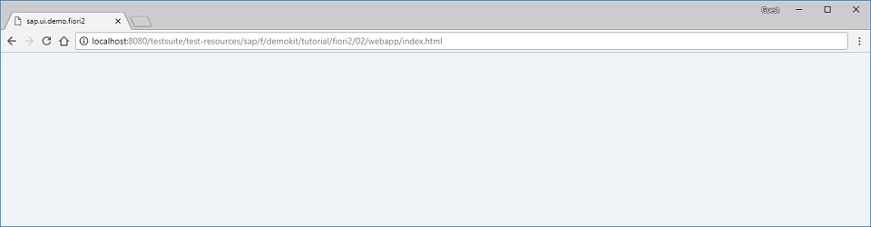

<!-- loiobf38e4de70084477b9e104bf6f6d7737 -->

# Step 2: Creating an Empty Flexible Column Layout

In this step, we add an instance of the `sap.f.FlexibleColumnLayout` control in the main view of the app.


<a name="loiobf38e4de70084477b9e104bf6f6d7737__section_ed2_4dd_lbb"/>

## Preview

  
  
**An empty instance of the sap.f.FlexibleColumnLayout control**




<a name="loiobf38e4de70084477b9e104bf6f6d7737__section_yzh_v3j_l4b"/>

## Coding

You can view and download all files at [Flexible Column Layout App - Step 2](https://ui5.sap.com/#/sample/sap.f.tutorial.fcl.02/preview).


<a name="loiobf38e4de70084477b9e104bf6f6d7737__section_cyn_x3j_l4b"/>

## webapp/manifest.json \[MODIFY\]

```json
{
	"_version": "1.38.0",
	"sap.app": {
		"id": "sap.ui.demo.fcl",
		"type": "application",
		"applicationVersion": {
			"version": "1.0.0"
		}
	},
	"sap.ui5": {
		"rootView": {
			"viewName": "sap.ui.demo.fcl.view.App",
			"type": "XML",
			"async": true,
			"id": "fcl"
		},
		"dependencies": {
			"minUI5Version": "1.98.0",
			"libs": {
				"sap.f": {},
				"sap.ui.core": {}
				}
		},
		"config": {
			"fullWidth": true
		}
	}
}
```

First, we add the `sap.f` library as a dependency in the `manifest.json` file.


<a name="loiobf38e4de70084477b9e104bf6f6d7737__section_w1v_z3j_l4b"/>

## webapp/view/App.view.xml \[NEW\]

```xml
<mvc:View
	displayBlock="true"
	height="100%"
	xmlns="sap.f"
	xmlns:mvc="sap.ui.core.mvc">
		<FlexibleColumnLayout id="flexibleColumnLayout" backgroundDesign="Solid"></FlexibleColumnLayout>
</mvc:View>
```

We create a new **`App.view.xml`** that contains an instance of the `sap.f.FlexibleColumnLayout` control. Keep in mind that there is no content yet and the app appears as an empty page.


<a name="loiobf38e4de70084477b9e104bf6f6d7737__section_fd2_4dd_lbb"/>

## webapp/manifest.json \[MODIFY\]

```json
{
	"_version": "1.38.0",
	"sap.app": {
		"id": "sap.ui.demo.fcl",
		"type": "application",
		"applicationVersion": {
			"version": "1.0.0"
		}
	},
	"sap.ui5": {
		"rootView": {
			"viewName": "sap.ui.demo.fcl.view.App",
			"type": "XML",
			"async": false,
			"id": "fcl"
		},
		"dependencies": {
			"minUI5Version": "1.98.0",
			"libs": {
				"sap.f": {},
				"sap.ui.core": {}
			}
		},
		"config": {
			"fullWidth": true
		}
	}
}
```

We set the `rootView` to point to the created `App.view.xml`.

