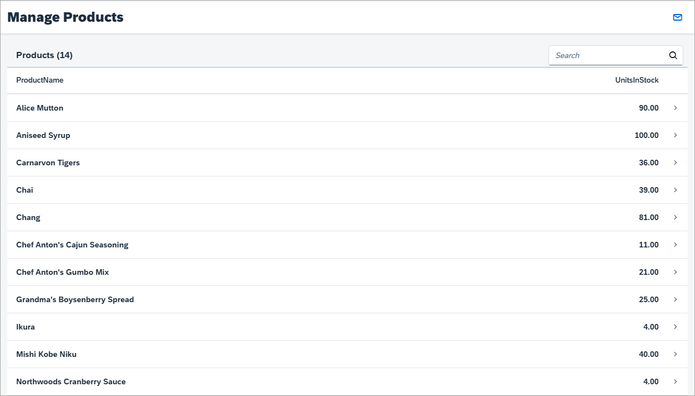
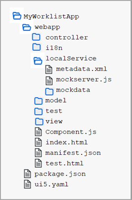

<!-- loio311890311f7148adbfbf248a6980df1c -->

# Step 2: Custom Mock Data

In this step, we want to change the mock data of the initial app.


## Preview

   
  
**The product list of the initial app with custom mock data**

  

   
  
**Folder structure for this step including custom mock data**

  

The service metadata only contains a description of the service entities. The mock server that is part of the app will auto-generate random mock data based on the data types defined in the metadata file. To have a more realistic development environment we will now add additional sample data.

The `webapp/localService/metadata.xml` file used by the mock server describes our OData service. The service only has two OData entities, and the data for these two entities is located in the folder `webapp/localService/mockdata`:

-   Products

    A product has typical properties like `ProductName` and `UnitsInStock` as well as a navigation property to a supplier entity referenced by a `SupplierID`. Of course, the entity has an ID property `ProductID`. The corresponding `EntitySet` is `Products`. The actual test data containing several products is located in the `webapp/localService/mockdata/Products.json` file.

-   Suppliers

    Later in this tutorial, we will display some information about the supplier of a product. The properties are `CompanyName`, `Address`, `City`, `PostalCode`, `Country`, and so on; all of them contain textual information of type `Edm.String`. The entity has an ID property `SupplierID` and the corresponding `EntitySet` is `Suppliers`. The supplier data for products is located in the file `webapp/localService/mockdata/Suppliers.json`.


## Coding

You can view and download all files in the *Samples* in the Demo Kit at [Worklist App - Step 2](https://ui5.sap.com/#/entity/sap.m.tutorial.worklist/sample/sap.m.tutorial.worklist.02).


### webapp/localService/mockdata/Products.json \[NEW\]

```js
[
  {
    "ProductID": 1,
    "ProductName": "Chai",
    "UnitsInStock": 39,
    "UnitsOnOrder": 10,
    "UnitPrice": 8,
    "SupplierID": 1,
    "Discontinued": false,
    "Supplier": {
      "__deferred": {
        "uri": "/destinations/northwind/V2/Northwind/Northwind.svc/Products(1)/Supplier"
      }
    }
  },
  {
    "ProductID": 2,
    "ProductName": "Chang",
    "UnitsInStock": 81,
    "UnitsOnOrder": 7,
    "UnitPrice": 6,
    "SupplierID": 1,
    "Discontinued": true,
    "Supplier": {
      "__deferred": {
        "uri": "/destinations/northwind/V2/Northwind/Northwind.svc/Products(2)/Supplier"
      }
    }
  },
  {
    "ProductID": 3,
    "ProductName": "Aniseed Syrup",
    "UnitsInStock": 100,
    "UnitsOnOrder": 6,
    "UnitPrice": 3,
    "SupplierID": 3,
    "Discontinued": false,
    "Supplier": {
      "__deferred": {
        "uri": "/destinations/northwind/V2/Northwind/Northwind.svc/Products(3)/Supplier"
      }
    }
  },
  {
    "ProductID": 4,
    "ProductName": "Schwarzwälder Kirschtorte",
    "UnitsInStock": 2,
    "UnitsOnOrder": 3,
    "UnitPrice": 19,
    "SupplierID": 3,
    "Discontinued": false,
    "Supplier": {
      "__deferred": {
        "uri": "/destinations/northwind/V2/Northwind/Northwind.svc/Products(4)/Supplier"
      }
    }
  },
  {
    "ProductID": 5,
    "ProductName": "Chef Anton's Cajun Seasoning",
    "UnitsInStock": 11,
    "UnitsOnOrder": 9,
    "UnitPrice": 108,
    "SupplierID": 3,
    "Discontinued": false,
    "Supplier": {
      "__deferred": {
        "uri": "/destinations/northwind/V2/Northwind/Northwind.svc/Products(5)/Supplier"
      }
    }
  },
  {
    "ProductID": 6,
    "ProductName": "Chef Anton's Gumbo Mix",
    "UnitsInStock": 21,
    "UnitsOnOrder": 12,
    "UnitPrice": 18,
    "SupplierID": 4,
    "Discontinued": false,
    "Supplier": {
      "__deferred": {
        "uri": "/destinations/northwind/V2/Northwind/Northwind.svc/Products(6)/Supplier"
      }
    }
  },
  {
    "ProductID": 7,
    "ProductName": "Grandma's Boysenberry Spread",
    "UnitsInStock": 25,
    "UnitsOnOrder": 25,
    "UnitPrice": 18,
    "SupplierID": 5,
    "Discontinued": false,
    "Supplier": {
      "__deferred": {
        "uri": "/destinations/northwind/V2/Northwind/Northwind.svc/Products(7)/Supplier"
      }
    }
  },
  {
    "ProductID": 8,
    "ProductName": "Uncle Bob's Organic Dried Pears",
    "UnitsInStock": 29,
    "UnitsOnOrder": 7,
    "UnitPrice": 35,
    "SupplierID": 6,
    "Discontinued": false,
    "Supplier": {
      "__deferred": {
        "uri": "/destinations/northwind/V2/Northwind/Northwind.svc/Products(8)/Supplier"
      }
    }
  },
  {
    "ProductID": 9,
    "ProductName": "Northwoods Cranberry Sauce",
    "UnitsInStock": 4,
    "UnitsOnOrder": 32,
    "UnitPrice": 35,
    "SupplierID": 6,
    "Discontinued": false,
    "Supplier": {
      "__deferred": {
        "uri": "/destinations/northwind/V2/Northwind/Northwind.svc/Products(9)/Supplier"
      }
    }
  },
  {
    "ProductID": 10,
    "ProductName": "Mishi Kobe Niku",
    "UnitsInStock": 40,
    "UnitsOnOrder": 5,
    "UnitPrice": 130,
    "SupplierID": 5,
    "Discontinued": false,
    "Supplier": {
      "__deferred": {
        "uri": "/destinations/northwind/V2/Northwind/Northwind.svc/Products(10)/Supplier"
      }
    }
  },
  {
    "ProductID": 11,
    "ProductName": "Ikura",
    "UnitsInStock": 4,
    "UnitsOnOrder": 10,
    "UnitPrice": 13,
    "SupplierID": 4,
    "Discontinued": false,
    "Supplier": {
      "__deferred": {
        "uri": "/destinations/northwind/V2/Northwind/Northwind.svc/Products(11)/Supplier"
      }
    }
  },
  {
    "ProductID": 13,
    "ProductName": "Carnarvon Tigers",
    "UnitsInStock": 36,
    "UnitsOnOrder": 40,
    "UnitPrice": 56,
    "SupplierID": 3,
    "Discontinued": false,
    "Supplier": {
      "__deferred": {
        "uri": "/destinations/northwind/V2/Northwind/Northwind.svc/Products(13)/Supplier"
      }
    }
  },
  {
    "ProductID": 14,
    "ProductName": "Teatime Chocolate Biscuits",
    "UnitsInStock": 21,
    "UnitsOnOrder": 40,
    "UnitPrice": 7,
    "SupplierID": 2,
    "Discontinued": false,
    "Supplier": {
      "__deferred": {
        "uri": "/destinations/northwind/V2/Northwind/Northwind.svc/Products(14)/Supplier"
      }
    }
  },
  {
    "ProductID": 15,
    "ProductName": "Alice Mutton",
    "UnitsInStock": 90,
    "UnitsOnOrder": 20,
    "UnitPrice": 75,
    "SupplierID": 2,
    "Discontinued": true,
    "Supplier": {
      "__deferred": {
        "uri": "/destinations/northwind/V2/Northwind/Northwind.svc/Products(15)/Supplier"
      }
    }
  }
]
```

First create a new `mockdata` folder inside `webapp/localService`. Create a `Products.json` file, and copy and paste the code.


### webapp/localService/mockdata/Suppliers.json \[NEW\]

```js
[
  {
    "SupplierID": 1,
    "CompanyName": "New Orleans Cajun Delights",
    "ContactName": "Shelley Burke",
    "ContactTitle": "Order Administrator",
    "Address": "P.O. Box 78934",
    "City": "New Orleans",
    "Region": "LA",
    "PostalCode": "70117",
    "Country": "USA"
  },
  {
    "SupplierID": 2,
    "CompanyName": "Exotic Liquids",
    "ContactName": "Charlotte Cooper",
    "ContactTitle": "Purchasing Manager",
    "Address": "49 Gilbert St.",
    "City": "London",
    "Region": "UK",
    "PostalCode": "EC1 4SD",
    "Country": "UK"
  },
  {
    "SupplierID": 3,
    "CompanyName": "Grandma Kelly's Homestead",
    "ContactName": "Regina Murphy",
    "ContactTitle": "Sales Representative",
    "Address": "707 Oxford Rd.",
    "City": "Ann Arbor",
    "Region": "MI",
    "PostalCode": "48104",
    "Country": "USA"
  },
  {
    "SupplierID": 4,
    "CompanyName": "Forêts d'érables",
    "ContactName": "Chantal Goulet",
    "ContactTitle": "Accounting Manager",
    "Address": "148 rue Chasseur",
    "City": "Ste-Hyacinthe",
    "Region": "Québec",
    "PostalCode": "J2S 7S8",
    "Country": "Canada"
  },
  {
    "SupplierID": 5,
    "CompanyName": "Plutzer Lebensmittelgroßmärkte AG",
    "ContactName": "Martin Bein",
    "ContactTitle": "International Marketing Mgr.",
    "Address": "Bogenallee 51",
    "City": "Frankfurt",
    "Region": "DE",
    "PostalCode": "60439",
    "Country": "Germany"
  },
  {
    "SupplierID": 6,
    "CompanyName": "Lyngbysild",
    "ContactName": "Niels Petersen",
    "ContactTitle": "Sales Manager",
    "Address": "Lyngbysild Fiskebakken 10",
    "City": "Lyngby",
    "Region": "NL",
    "PostalCode": "2800",
    "Country": "Denmark"
  },
  {
    "SupplierID": 7,
    "CompanyName": "Formaggi Fortini s.r.l.",
    "ContactName": "Elio Rossi",
    "ContactTitle": "Sales Representative",
    "Address": "Viale Dante, 75",
    "City": "Ravenna",
    "Region": "IL",
    "PostalCode": "48100",
    "Country": "Italy"
  }
]

```

Create a `Suppliers.json` file, and copy and paste the code.

You can now run the app again and see the mock data in your app.

> ### Note:  
> In order to get realistic mock data you can call a real OData service directly in your browser to receive the real data of a given `Entity` or `EntitySet`. Make sure that you call the service with the system option `$format=json`, that is `http://services.odata.org/V2/Northwind/Northwind.svc/Products?$format=json`. This will return the data in JSON format, which is the format required for our mock data. This data is put into a local file in your application’s `webapp/localService/mockdata` folder. The file name is expected to be the name of the corresponding `EntitySet` ends with `.json`, for example `Products.json`. The obtained data from the OData service can serve as a first set of mock data, which you can change to your needs if necessary.

