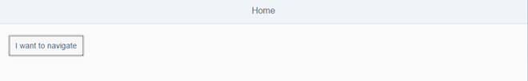
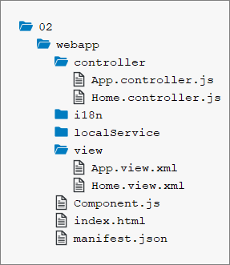

<!-- loiocf3c57c89ef0491793d1ce327ab4f9b2 -->

# Step 2: Enable Routing

In this step we will modify the app and introduce routing. Instead of having the home page of the app hard coded we will configure a router to wire multiple views together when our app is called. The routing configuration controls the application flow when the user triggers a navigation action or opens a link to the application directly.


## Preview

  
  
**Views are wired together using the router**




## Coding

You can view and download all files in the *Samples* in the Demo Kit at [Routing and Navigation - Step 2](https://ui5.sap.com/#/entity/sap.ui.core.tutorial.navigation/sample/sap.ui.core.tutorial.navigation.02).

  
  
**Folder structure for this step**




## webapp/manifest.json

```js
{
   "_version": "1.12.0",
   "sap.app": {
      ...
   },
   "sap.ui": {
      ...
   },
   "sap.ui5": {

      "rootView": {
          "viewName": "sap.ui.demo.nav.view.App",
          "type": "XML",
          "async": true,
          "id": "app"
      },
      "dependencies": {
         ...
      },
      "models": {
         ...
      },
      "routing": {
         "config": {
            "routerClass": "sap.m.routing.Router",
            "type": "View",
            "viewType": "XML",
            "path": "sap.ui.demo.nav.view",
            "controlId": "app",
            "controlAggregation": "pages",
            "transition": "slide",
            "async": true
         },
         "routes": [{
            "pattern": "",
            "name": "appHome",
            "target": "home"
         }],
         "targets": {
            "home": {
               "id": "home",
               "name": "Home",
               "level" : 1
            }
         }
      }
   }
}

```

Single-page applications based on SAPUI5 can use a so-called “router” to dispatch hash-based URLs to one or more views of the app. Therefore, the router needs to know how to address and show the views. In SAPUI5, we can simply add a `routing` section to our existing `sap.ui5` section in the descriptor file to configure the router. There are three properties that can be used to configure the routing of your application:

-   `config`

    This section contains the global router configuration and default values that apply for all routes and targets. The property `routerClass` is special as it determines the router implementation. The default value is `sap.ui.core.routing.Router`. Here, we set the `routerClass` to `sap.m.routing.Router`, because we implement an app based on `sap.m`. All other properties in `config` are given to the router instance. For example, we define where our views are located in the app. To load and display views automatically, we also specify the `controlId` of the control that is used to display the pages and the aggregation \(`controlAggregation`\) that will be filled when a new page is displayed. We will create only XMLviews in this tutorial, so we can set the `viewType` property to `XML`. All our views will be available in the `view` folder of the namespace `sap.ui.demo.nav`, so we can set the `path` to `sap.ui.demo.nav.view`. The `transition` allows us to set a default value for how the transition should happen; you can choose between `slide` \(default\), `flip`, `fade`, and `show`. All parameters of the config section can be overruled in the individual route and target definitions if needed.

    > ### Note:  
    > The possible values for `routerClass` are `sap.ui.core.routing.Router`, `sap.m.routing.Router`, or any other subclasses of `sap.ui.core.routing.Router`. Compared to `sap.ui.core.routing.Router` the `sap.m.routing.Router` is optimized for mobile apps and adds the properties `level`, `transition` and `transitionParameters` which can be specified for each route or target created by the `sap.m.routing.Router`. The `transitionParameters` can also be used for custom transitions. Please check the *API Reference* for more information.

-   `routes`

    Each route defines a name, a pattern, and one or more targets to navigate to when the route has been hit. The pattern is basically the hash part of the URL that matches the route. The sequence of the routes is important because only the first matched route is used by the router. In our case, we have an empty pattern to match the empty hash. The `name` property allows you to choose a unique route name that helps you to navigate a specific route or to determine the matched route in one of the matched handlers \(we'll explain that in a later step\). The target property references one or more targets from the section below that will be displayed when the route has been matched.

-   `targets`

    A target defines either a **view** that is displayed or a **component** that can be loaded and placed through its routing. In order to distinguish between these two target types, it is required to define the `type` property and set it either to `View` or `Component`. In this sample, we will focus on view targets and define the `type` property as `View`. A target is associated with one or more routes, or it can be displayed manually from within the app. Whenever a target is displayed, the corresponding view is loaded and added to the aggregation configured with the `controlAggregation` option of the control. This option is configured using `controlId`. Each target has a unique key \(`home`\). The `name` defines which view shall be loaded. In our little example, the absolute view path to be loaded for our `home` target is determined by the default `"path": "sap.ui.demo.nav.view"` and `"name": "Home"`. This leads to `"sap.ui.demo.nav.view.Home"`. The `level` property is especially relevant for `flip` and `slide` transitions. It helps the router to determine the direction of the transition from one page to another. \(This will also be explained later.\) A target can be assigned to a route, but it's not necessary. Targets can be displayed directly in the app without hitting a route.

    This basic routing configuration was easy enough. However, you can’t see it in action until you have initialized the router.


> ### Note:  
> As of SAPUI5 version 1.30, we recommend that you define the routing in the `manifest.json` descriptor file using routes and targets. In older versions of SAPUI5, the routing configuration had to be done directly in the metadata section of the component, and with different syntax.


## webapp/Component.js

```js
sap.ui.define([
    "sap/ui/core/UIComponent"
], function (UIComponent) {
    "use strict";

    return UIComponent.extend("sap.ui.demo.nav.Component", {

        metadata: {
            manifest: "json"
        },

        init: function () {
            // call the init function of the parent
            UIComponent.prototype.init.apply(this, arguments);

            // create the views based on the url/hash
            this.getRouter().initialize();
        }
    });
});
```

We override the `init` function and call the parent’s `init` function first. We get a reference to the router and call `initialize()`on it. The router is instantiated automatically with the configuration loaded in the descriptor. The routing events and our configuration in the descriptor are now automatically enabled in the app. Running the app at this point would lead to an error, because the home view is not implemented yet.


## webapp/view/App.view.xml

```xml
<mvc:View
	controllerName="sap.ui.demo.nav.controller.App"
	xmlns="sap.m"
	xmlns:mvc="sap.ui.core.mvc"
	displayBlock="true">
	<Shell>
		<App id="app"/>
	</Shell>
</mvc:View>

```

In the `App` view, we remove the content of `App` control. The pages will be added dynamically the way we have configured it in the descriptor. The view configured with the property `rootView` is automatically instantiated when the app is called initially.


## webapp/view/Home.view.xml \(New\)

```xml
<mvc:View
   controllerName="sap.ui.demo.nav.controller.Home"
   xmlns="sap.m"
   xmlns:mvc="sap.ui.core.mvc">
   <Page title="{i18n>homePageTitle}" class="sapUiResponsiveContentPadding">
      <content>
         <Button text="{i18n>iWantToNavigate}" class="sapUiTinyMarginEnd"/>
      </content>
   </Page>
</mvc:View>
```

Create a file `Home.view.xml` in the `webapp/view` folder. The home view only contains a page control that displays a button. For illustration, we bind the title of the page to the `i18n>homePageTitle`, you can use data binding just the way you are used to it.


## webapp/controller/Home.controller.js \(New\)

```js
sap.ui.define([
   "sap/ui/core/mvc/Controller"
], function (Controller) {
   "use strict";

   return Controller.extend("sap.ui.demo.nav.controller.Home", {

   });

});
```

Create a file `Home.controller.js` in the `webapp/controller` folder. The controller for the home view does not contain any custom logic in this step, but we will add some features to it soon. Finally, run the app by calling the `webapp/index.html` file. This will be the entry point for our app in all the next steps. As you can see, the app is initially displaying the home view that we configured as the default pattern in the routing configuration. We have now successfully enabled routing in the app.

> ### Note:  
> We think of routing as a set of features that dispatch hash-based URLs to an app's views and manage the views' states.
> 
> Based on the routing configuration, you define the navigation between pages and pass parameters to the target views.


## Conventions

-   Configure the router in the `manifest.json` descriptor file

-   Initialize the router exactly once

-   Initialize the router in the component


**Related Information**  


[Routing and Navigation](../04_Essentials/routing-and-navigation-3d18f20.md "SAPUI5 offers hash-based navigation, which allows you to build single-page apps where the navigation is done by changing the hash. In this way the browser does not have to reload the page; instead there is a callback to which the app and especially the affected view can react. A hash string is parsed and matched against patterns which will then inform the handlers.")

[API Reference: `sap.ui.core.routing`](https://ui5.sap.com/#/api/sap.ui.core.routing)

[API Reference: `sap.ui.core.routing.Route`](https://ui5.sap.com/#/api/sap.ui.core.routing.Route)

[API Reference: `sap.ui.core.routing.Route`: Constructor Detail](https://ui5.sap.com/#/api/sap.ui.core.routing.Route/constructor)

[API Reference: `sap.m.routing.Router`](https://ui5.sap.com/#/api/sap.m.routing.Router)

