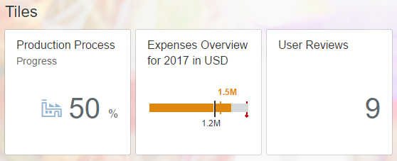

<!-- loio3981331cbc074ec398ae735e7b449cce -->

# Step 2: KPI Tile and Chart Tile on the Start Page

In this step, we will create our start page with the KPI Tile `(GenericTile` with `NumericContent)` and Chart Tile `(GenericTile` with `MicroChart)`.


<a name="loio3981331cbc074ec398ae735e7b449cce__section_jtg_1sp_f1b"/>

## Preview

When you have completed this step, your start page will include the following tiles:




<a name="loio3981331cbc074ec398ae735e7b449cce__section_pjv_mw2_j1b"/>

## GenericTile with NumericContent

Let's start by creating the first `GenericTile` that shows the progress of the production process as percentage data \(compared to all production steps\). By selecting the **Production Process** tile, the user can navigate to another view to see the complete production process. We will implement this navigation in step 5.

You can view and download this step in the Demo Kit at [Ice Cream Machine - Step 2 - KPI Tile and Chart Tile in Start Page](https://ui5.sap.com/#/entity/sap.suite.ui.commons.tutorial.icecream/sample/sap.suite.ui.commons.tutorial.icecream.02).


### Startpage.view.xml

```xml
<mvc:View
    controllerName="sap.suite.ui.commons.demokit.tutorial.icecream.02.controller.Startpage"
    xmlns:mvc="sap.ui.core.mvc"
    xmlns="sap.m"
    xmlns:layout="sap.ui.layout">
    <Page title="{i18n>title}">
        <layout:VerticalLayout class="sapUiResponsiveMargin">
            <Title
                titleStyle="H2"
                text="{i18n>startpageTilesGroupTitle}"
                class="sapUiTinyMarginBegin" />
            <layout:HorizontalLayout allowWrapping="true">
                <GenericTile
                    class="sapUiTinyMarginBegin sapUiTinyMarginTop"
                    header="{i18n>startpagePFTileTitle}"
                    subheader="{i18n>startpagePFTileSubTitle}">
                    <tileContent>
                        <TileContent>
                            <content>
                                <NumericContent
                                    scale="%"
                                    value="{
                                        path: 'process>/Nodes',
                                        formatter: '.getProgress'
                                    }"
                                    icon="sap-icon://factory" />
                            </content>
                        </TileContent>
                    </tileContent>
                </GenericTile>
            </layout:HorizontalLayout>
        </layout:VerticalLayout>
    </Page>
</mvc:View>
```

First, we are going to add a `GenericTile` with the *header* and *subheader* properties in order to display the header and subheader . In the `TileContent` aggregation, the `TileContent` is added with a `NumericContent`. This lets you display a scale or unit with the *scale* property. The *value* property of the `NumericContent` displays the percentage value of the production progress by using a custom formatter. In our case, it is *.getProgress*. You can use any icon from the [SAPUI5 Icon Explorer](https://ui5.sap.com/test-resources/sap/m/demokit/iconExplorer/webapp/index.html) as the *icon* property.

We will create another `GenericTile` with `NumericContent` in a similar way, which will navigate to another view. You can see customer reviews there. The number of reviews is displayed in this `GenericTile`. Navigation to the reviews view is implemented in step 5.


### Startpage.view.xml

```xml
mvc:View
     controllerName="sap.suite.ui.commons.demokit.tutorial.icecream.02.controller.Startpage"
     xmlns:mvc="sap.ui.core.mvc"
     xmlns="sap.m"
     xmlns:layout="sap.ui.layout">
     <Page title="{i18n>title}">
         <layout:VerticalLayout class="sapUiResponsiveMargin">
             <Title
                 titleStyle="H2"
                 text="{i18n>startpageTilesGroupTitle}"
                 class="sapUiTinyMarginBegin" />
             <layout:HorizontalLayout allowWrapping="true">
                ...
                <GenericTile
                     class="sapUiTinyMarginBegin sapUiTinyMarginTop"
                     header="{i18n>startpageUserReviewsTileTitle}">
                     <tileContent>
                         <TileContent>
                             <content>
                                 <NumericContent
                                     value="{
                                         path: 'reviews>/UserReviews',
                                         formatter: '.getEntityCount'
                                     }"
                                         indicator="None"
                                         valueColor="Neutral" />
                             </content>
                         </TileContent>
                     </tileContent>
                 </GenericTile>
             </layout:HorizontalLayout>
         </layout:VerticalLayout>
     </Page>
 </mvc:View>
```

In the `NumericContent`, we only want to display the number of user reviews. Since we don't want to show indicators, we set the *indicator* property to **None**. We are choosing **Neutral** as a value for the *valueColor* property to display a neutral semantic color.


### Startpage.controller.js

```js
sap.ui.define([
    "sap/ui/core/mvc/Controller"
], function(Controller) {
    "use strict";
    return Controller.extend("sap.suite.ui.commons.demokit.tutorial.icecream.02.controller.Startpage", {
        ...
        getProgress: function(aNodes) {
                   if (!aNodes || aNodes.length === 0) {
                      return 0;
                   }
                   var iSum = 0;
                   for (var i = 0; i < aNodes.length; i++) {
                       iSum += aNodes[i].state === "Positive";
                   }
                   var fPercent = (iSum / aNodes.length) * 100;
                   return fPercent.toFixed(0);
                },
                getEntityCount: function(entities) {
                   return entities && entities.length || 0;
                }
    });
});
```

The *getProgress* function is the formatter function that belongs to the value binding of the `NumericContent` in the first `GenericTile`. It is used to return the ratio of positive process steps as compared to the complete number of process steps.

To get the number of user reviews in another `GenericTile`, we will add a new formatter called *.getEntityCount*. This formatter returns the number of entities found in the **reviews** JSON model.


<a name="loio3981331cbc074ec398ae735e7b449cce__section_mpm_qbt_l1b"/>

## GenericTile with BulletMicroChart


In the second tile on the start page, you can find an overview of the project expenses. We will use the `BulletMicroChart` control for this overview.


### Startpage.view.xml

```xml
mvc:View
    controllerName="sap.suite.ui.commons.demokit.tutorial.icecream.02.controller.Startpage"
    xmlns:mvc="sap.ui.core.mvc"
    xmlns="sap.m"
    xmlns:layout="sap.ui.layout"
    xmlns:microchart="sap.suite.ui.microchart">
    <Page title="{i18n>title}">
        <layout:VerticalLayout class="sapUiResponsiveMargin">
            <Title
                titleStyle="H2"
                text="{i18n>startpageTilesGroupTitle}"
                class="sapUiTinyMarginBegin" />
            <layout:HorizontalLayout allowWrapping="true">
                                ...
               <GenericTile
                     class="sapUiTinyMarginBegin sapUiTinyMarginTop"
                     header="{
                         parts: [
                             'i18n>startpageCCTileTitle',
                             'business>/year',
                             'business>/currency'
                         ],
                         formatter: '.formatMessage'
                     }">
                     <tileContent>
                         <TileContent>
                             <content>
                                 <microchart:BulletMicroChart
                                     size="Responsive"
                                     targetValue="{business>/plannedExpenses}"
                                     targetValueLabel="{
                                        path: 'business>/plannedExpenses',
                                        formatter: '.formatNumber'
                                    }"
                                     actualValueLabel="{
                                        path: 'business>/expenses',
                                        formatter: '.formatNumber'
                                    }"
                                     minValue="0">
                                     <microchart:actual>
                                         <microchart:BulletMicroChartData
                                             value="{business>/expenses}"
                                             color="Critical" />
                                     </microchart:actual>
                                     <microchart:thresholds>
                                         <microchart:BulletMicroChartData
                                             value="{business>/expensesCritical}"
                                             color="Critical" />
                                         <microchart:BulletMicroChartData
                                             value="{business>/budget}"
                                             color="Error" />
                                     </microchart:thresholds>
                                 </microchart:BulletMicroChart>
                             </content>
                         </TileContent>
                     </tileContent>
                 </GenericTile> 
            </layout:HorizontalLayout>
        </VBox>
    </Page>
</mvc:View>
```

We are adding a new `GenericTile`. Here, we are setting only the *header* property of the tile because we don't need a subheader. We want to display only the Expenses overview. The `BulletMicroChart` is in the *TileContent*. Do not forget to add a namespace for the `sap.suite.ui.microchart` library in the *\*.view.xml*.

We want to show our business data in the `BulletMicroChart`. To do so, we are adding the `BulletMicroChartData` element to the **actual** aggregation of the chart control. This data element has two properties:

1.  The *value* property that is bound to a property in the data model

2.  The *color* property that is set to **Critical** to show when the expenses are about to exceed the limit. This property shows the amount of money already spent on this project.


Similarly, we can add **thresholds** to the chart to show when our expenses become **critical** but still manageable. For expenses that are too high for the company, the **Error** color applies. This time, the *value* properties are directly bound to the properties in the data model. No formatting is needed as the values are used only by the chart and are not displayed directly.

Finally, we will add a *targetValue* to our chart to display an indicator that shows the planned spending.


### Startpage.controller.js

```js
sap.ui.define([
    "sap/ui/core/mvc/Controller",
    "sap/ui/core/format/NumberFormat",
    "sap/base/strings/formatMessage"
], function(Controller, NumberFormat) {
    "use strict";

    return Controller.extend("sap.suite.ui.commons.demokit.tutorial.icecream.02.controller.Startpage", {
        ...
        formatNumber: function(value) {
            var oFloatFormatter = NumberFormat.getFloatInstance({
                style: "short",
                decimals: 1
            });
            return oFloatFormatter.format(value);
        }
    });
});

```

Since the production of our ice cream has already cost us a lot of money and the monetary values are very high, we need to provide custom data labels in order to have a neat chart design. The custom data labels can be added via the *actualValueLabel* and *targetValueLabel* properties that are set on the `BulletMicroChart`. In both instances, we use data binding with a custom formatter function from the *Startpage.controller.js* file to format the values using a standard SAPUI5 number formatter.

