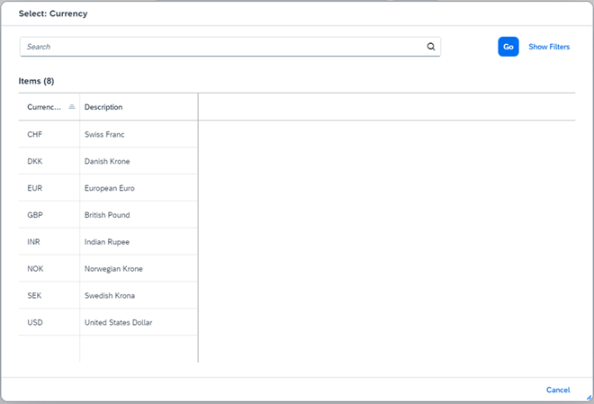

<!-- loio3361e270c62c46c9893eaefb2966d62e -->

# Step 2: Smart Field with Value Help

You can use the `SmartField` control in combination with the `ValueHelpDialog` control that allow you to carry out a complex search in order to identify the value you are looking for.

We would like to stress the importance of this feature with a dedicated example, even though you might argue that this is just another feature of the `SmartField` control. In the following example, we see a value help for a currency code. By providing a value help, the user can find the correct currency by firing a query with complex input parameters. Surely, you can imagine that there are more complex examples in which specifying the correct value is almost impossible without performing a query. For example, when providing a customer ID, you would want to find this based on the last name of the customer.

We would like to emphasize here that the response to the query input \(whether it is the response to the query input for the main table, as we will see later, or whether it is related to the value help, as we will see here\) heavily depends on the server handling the request. In our case, the `MockServer` is not a full-fledged implementation that handles all OData requests as the user might expect. Therefore, please bear in mind that the examples are intended for a tutorial and not a real application.


## Preview

  
  
**Smart Field with Value Help**


There is a small icon right next to the currency code. After pressing this icon you see a dialog \(the `ValueHelpDialog` control\) on which a query can be executed.

  
  
**Value Help**




## Coding

You can view and download all files in the *Samples* in the Demo Kit at [Smart Controls - Step 2 - Smart Field with Value Help](https://ui5.sap.com/#/entity/sap.ui.comp.tutorial.smartControls/sample/sap.ui.comp.tutorial.smartControls.02).


## SmartFieldWithValueHelp.view.xml

```xml
<mvc:View
	controllerName="sap.ui.demo.smartControls.SmartFieldWithValueHelp"
	xmlns="sap.m"
	xmlns:mvc="sap.ui.core.mvc"
	xmlns:smartForm="sap.ui.comp.smartform"
	xmlns:sap.ui.layout="sap.ui.layout"
	xmlns:smartField="sap.ui.comp.smartfield">
	<smartForm:SmartForm editable="true">
		<smartForm:layout>
			<smartForm:ColumnLayout 
				emptyCellsLarge="4"
				labelCellsLarge="4"
				columnsM="1"
				columnsL="1"
				columnsXL="1"/>
		</smartForm:layout>
		<smartForm:Group>
			<smartForm:GroupElement>
				<smartField:SmartField value="{Price}" id="idPrice"/>
			</smartForm:GroupElement>
		</smartForm:Group>
	</smartForm:SmartForm>
</mvc:View>
```

For the view definition, we see that there is no difference to the previous example. This is an important fact since this exemplifies the underlying idea of what we mean by “smart”: Depending on the metadata, the control automatically adjusts its behavior.


## SmartField.controller.js

```js
sap.ui.define([
	"sap/ui/core/mvc/Controller"
], function(Controller) {
	"use strict";

	return Controller.extend("sap.ui.demo.smartControls.SmartFieldWithValueHelp", {
		onInit: function() {
			this.getView().bindElement("/Products('4711')");
		}
	});

});
```

Again, this file is in essence identical with the controller in step 1.


## metadata.xml

```xml
<?xml version="1.0" encoding="utf-8"?>
<edmx:Edmx Version="1.0"
	xmlns:edmx="http://schemas.microsoft.com/ado/2007/06/edmx"
	xmlns:m="http://schemas.microsoft.com/ado/2007/08/dataservices/metadata"
	xmlns:sap="http://www.sap.com/Protocols/SAPData">
	<edmx:DataServices m:DataServiceVersion="2.0">
		<Schema Namespace="com.sap.wt02" 
			sap:schema-version="1" xmlns="http://schemas.microsoft.com/ado/2008/09/edm">
			<EntityType Name="Product">
				<Key>
					<PropertyRef Name="ProductId" />
				</Key>
				<Property Name="ProductId" Type="Edm.String" />
				<Property Name="Price" Type="Edm.String" 
					sap:unit="CurrencyCode" MaxLength="3" sap:label="Price"
					sap:updatable="true" />
				<Property Name="CurrencyCode" Type="Edm.String" 
					MaxLength="3" sap:label="Currency" sap:semantics="currency-code"
					sap:updatable="true" />
			</EntityType>
			<EntityType Name="Currency">
				<Key>
					<PropertyRef Name="CURR" />
				</Key>
				<Property Name="CURR" Type="Edm.String" MaxLength="4"
					sap:display-format="UpperCase" sap:text="DESCR" sap:label="Currency Code"
					sap:filterable="false" />
				<Property Name="DESCR" Type="Edm.String" MaxLength="25"
					sap:label="Description" />
			</EntityType>
			<EntityContainer m:IsDefaultEntityContainer="true"
				sap:supported-formats="atom json">
				<EntitySet Name="Products" EntityType="com.sap.wt02.Product" />
				<EntitySet Name="Currency" EntityType="com.sap.wt02.Currency" />
			</EntityContainer>
			<Annotations Target="com.sap.wt02.Product/CurrencyCode"
				xmlns="http://docs.oasis-open.org/odata/ns/edm">
				<Annotation Term="com.sap.vocabularies.Common.v1.ValueList">
					<Record>
						<PropertyValue Property="Label" String="Currency" />
						<PropertyValue Property="CollectionPath" String="Currency" />
						<PropertyValue Property="SearchSupported" Bool="true" />
						<PropertyValue Property="Parameters">
							<Collection>
								<Record Type="com.sap.vocabularies.Common.v1.ValueListParameterOut">
									<PropertyValue Property="LocalDataProperty"
										PropertyPath="CurrencyCode" />
									<PropertyValue Property="ValueListProperty"
										String="CURR" />
								</Record>
								<Record
									Type="com.sap.vocabularies.Common.v1.ValueListParameterDisplayOnly">
									<PropertyValue Property="ValueListProperty"
										String="DESCR" />
								</Record>
							</Collection>
						</PropertyValue>
					</Record>
				</Annotation>
			</Annotations>
		</Schema>
	</edmx:DataServices>
</edmx:Edmx>						
```

As stated above, the metadata file is the place in which the difference to step 1 can be found - we have highlighted the changes. We will dig deeper into this file now.

First we inspect the added entity type:

```xml
<EntityType Name="Currency" sap:content-version="1">
<Key>
		<PropertyRef Name="CURR" />
	</Key>
	<Property Name="CURR" Type="Edm.String" MaxLength="4" 
sap:display-format="UpperCase" sap:text="DESCR" 
sap:label="Currency Code" sap:filterable="false"/>
	<Property Name="DESCR" Type="Edm.String" MaxLength="25"	 sap:label="Description"/>
</EntityType>
```

We notice that we have set `sap:filterable="false"` for the `CURR` property. We do this, since we would otherwise also have a currency code search field in the dialog that we wish to avoid \(default of `sap:filterable` is true\).

Now let us look at the `ValueList` annotation:

```xml
<Annotations Target="com.sap.wt02.Product/CurrencyCode"
				xmlns="http://docs.oasis-open.org/odata/ns/edm">
<Annotation Term="com.sap.vocabularies.Common.v1.ValueList">
	<Record>
		<PropertyValue Property="Label" String="Currency"/>
		<PropertyValue Property="CollectionPath" String="Currency"/>
		<PropertyValue Property="SearchSupported" Bool="true"/>
		<PropertyValue Property="Parameters">
			<Collection>
<Record Type="com.sap.vocabularies.Common.v1.ValueListParameterOut">
					<PropertyValue Property="LocalDataProperty" PropertyPath="CurrencyCode" />
					<PropertyValue Property="ValueListProperty" String="CURR" />
				</Record>
				<Record Type="com.sap.vocabularies.Common.v1.ValueListParameterDisplayOnly">
					<PropertyValue Property="ValueListProperty" String="DESCR" />
				</Record>
			</Collection>
		</PropertyValue>
	</Record>
</Annotation>
</Annotations>
```

With the metadata `Target="com.sap.wt02.Product/CurrencyCode"`, we define that the `CurrencyCode` of the `EntityType` `Product` will have a `ValueList` \(or `ValueHelp`\) associated to it. We set the property `SearchSupported` to true in order to get a general search field. This is the field in the dialog that has the *Search* shadow text.

```xml
<Record Type="com.sap.vocabularies.Common.v1.ValueListParameterOut">
					<PropertyValue Property="LocalDataProperty" PropertyPath="CurrencyCode" />
					<PropertyValue Property="ValueListProperty" String="CURR" />
				</Record>
```

This specification defines that the value help will export the value of the `CURR` field to the `CurrencyCode` field using `ValueListParameterOut`. This export happens, for example, by selecting an entry in the list of currency values.

Lastly, as for the `ValueList` annotation, we specify with the following specification that the `DESCR` field is shown in the table \(but only for display purposes in the sense that no interaction with the content of this field is possible\):

```xml
<Record Type="com.sap.vocabularies.Common.v1.ValueListParameterDisplayOnly">
					<PropertyValue Property="ValueListProperty" String="DESCR" />
</Record>
```


## Products.json

```js
[{
	"ProductId": "4711",
	"Price": 856.49,
	"CurrencyCode": "EUR"
}]
```

Since the product we show initially is the same as in step 1, there is no change to the `Products.json` file.


## Currency.json

```js
[{
	"CURR": "EUR",
	"DESCR": "European Euro"
},
{
	"CURR": "USD",
	"DESCR": "United States Dollar"
},
{
	"CURR": "GBP",
	"DESCR": "British Pound"
},
{
	"CURR": "DKK",
	"DESCR": "Danish Krone"
},
{
	"CURR": "INR",
	"DESCR": "Indian Rupee"
},
{
	"CURR": "NOK",
	"DESCR": "Norwegian Krone"
},
{
	"CURR": "SEK",
	"DESCR": "Swedish Krona"
},
{
	"CURR": "CHF",
	"DESCR": "Swiss Franc"
}]
```

In the newly added `Currency.json` file, we include the values needed for the currency entities.

**Related Information**  


[Smart Field](../10_More_About_Controls/smart-field-4864403.md "The sap.ui.comp.smartfield.SmartField control offers a wrapper for other controls using OData metadata to determine which control has to be instantiated and makes it possible to add input-enabled fields to an application.")

