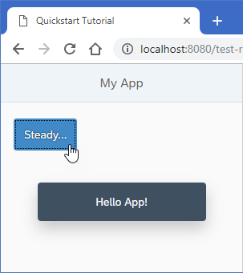

<!-- loio128214a9b2754b15aec5e365780b03fd -->

# Step 2: Steady...

Now we extend our minimalist HTML page to a basic app with a view and a controller.


<a name="loio128214a9b2754b15aec5e365780b03fd__section_dxj_gxh_1gb"/>

## Preview

   
  
<a name="loio128214a9b2754b15aec5e365780b03fd__fig_lx3_hxh_1gb"/>The browser shows a *Steady* button in an app

  


<a name="loio128214a9b2754b15aec5e365780b03fd__section_rcp_yxh_1gb"/>

## Coding

You can view and download all files at [Quick Start - Step 2](https://ui5.sap.com/#/sample/sap.m.tutorial.quickstart.02/preview).


## webapp/index.js

```js
sap.ui.define([
	"sap/ui/core/mvc/XMLView"
], function (XMLView) {
	"use strict";

	XMLView.create({viewName: "Quickstart.App"}).then(function (oView) {
		oView.placeAt("content");
	});
});
```

Now we replace most of the code in this file: We remove the inline button from the previous step, and introduce a proper XML view to separate the presentation from the controller logic. We prefix the view name `Quickstart.App` with our newly defined namespace. The view is loaded asynchronously.

Similar to the step before, the view is placed in the element with the `content` ID after it has finished loading.


<a name="loio128214a9b2754b15aec5e365780b03fd__section_zgg_rl3_1gb"/>

## webapp/App.view.xml \(New\)

```xml
<mvc:View
	controllerName="Quickstart.App"
	displayBlock="true"
	xmlns="sap.m"
	xmlns:mvc="sap.ui.core.mvc">
	<App>
		<Page title="My App">
			<Button
				text="Steady..."
				press=".onPress"
				type="Emphasized"
				class="sapUiSmallMargin"/>
		</Page>
	</App>
</mvc:View>
```

The presentation logic is now defined declaratively in an XML view.

UI controls are located in libraries that we define in the `View` tag. In our case, we use the bread-and-butter controls from `sap.m`.

The new controls in the view are an `App` and a `Page`. They define a Web app with a header bar and a title.

The button from the previous examples now also defines a `type` and a `class` attribute. This improves the layout of our button and makes it stand out more.

We outsource the controller logic to an app controller. The `.onPress` event now references a function in the controller.


<a name="loio128214a9b2754b15aec5e365780b03fd__section_rc3_gm3_1gb"/>

## webapp/App.controller.js \(New\)

```js
sap.ui.define([
	"sap/ui/core/mvc/Controller",
	"sap/m/MessageToast"
], function (Controller, MessageToast) {
	"use strict";

	return Controller.extend("Quickstart.App", {
		onPress : function () {
			MessageToast.show("Hello App!");
		}
	});

});
```

In our controller, we load the `Controller` base class and extend it to define the behavior of our app. We also add the event handler for our button.

The `MessageToast` is also loaded as a dependency. When the button is pressed, we now display a "Hello App" message.

Now reload your `index.html` file. You can see a title bar and a blue button that reacts to your input. Congratulations, you have created our very first app.

**Parent topic:** [Quick Start](quick-start-592f36f.md "Unleash your SAPUI5 skills with this simple three-step tutorial. We start with a simple &quot;Hello World&quot; example, and convert it to a minimalist two-page app.")

**Next:** [Step 1: Ready...](step-1-ready-851bde4.md "Let's get you ready for your journey! We bootstrap SAPUI5 in an HTML page and implement a simple &quot;Hello World&quot; example.")

**Previous:** [Step 3: Go!](step-3-go-073d107.md "Finally, we add a second page to our app showcasing some of the key SAPUI5 concepts.")

**Related Information**  


[XML View](../04_Essentials/xml-view-91f2928.md "The XML view type is defined in an XML file. The file name either ends with .view.xml or as an XML string. The file name and the folder structure together specify the name of the view that equals the SAPUI5 module name.")

[Controller](../04_Essentials/controller-121b8e6.md "A controller contains methods that define how models and views interact.")

