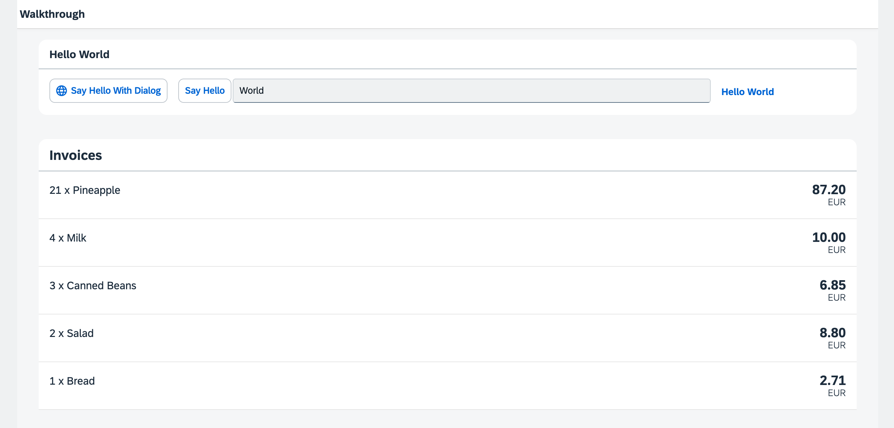

<!-- loiodfe04650afc046e0802abb1a1a90d2d9 -->

# Step 20: Data Types

The list of invoices is already looking nice, but what is an invoice without a price assigned? Typically prices are stored in a technical format and with a '`.`' delimiter in the data model. For example, our invoice for pineapples has the calculated price `87.2` without a currency. We are going to use the SAPUI5 data types to format the price properly, with a locale-dependent decimal separator and two digits after the separator.


## Preview

  
  
**The list of invoices with prices and number units**




<a name="loiodfe04650afc046e0802abb1a1a90d2d9__section_wqj_flk_syb"/>

## Coding

You can view and download all files at [Walkthrough - Step 20](https://ui5.sap.com/#/entity/sap.m.tutorial.walkthrough/sample/sap.m.tutorial.walkthrough.20).


<a name="loiodfe04650afc046e0802abb1a1a90d2d9__section_xqj_flk_syb"/>

## webapp/view/InvoiceList.view.xml

```xml
<mvc:View
    controllerName="ui5.walkthrough.controller.InvoiceList"
    xmlns="sap.m"
    xmlns:core="sap.ui.core"
    xmlns:mvc="sap.ui.core.mvc">
    <List
        headerText="{i18n>invoiceListTitle}"
        class="sapUiResponsiveMargin"
        width="auto"
        items="{invoice>/Invoices}">
        <items>
            <ObjectListItem
                core:require="{
                    Currency: 'sap/ui/model/type/Currency'
                }"
                title="{invoice>Quantity} x {invoice>ProductName}"
                number="{
                    parts: [
                        'invoice>ExtendedPrice',
                        'view>/currency'
                    ],
                    type: 'Currency',
                    formatOptions: {
                        showMeasure: false
                    }
                }"
                numberUnit="{view>/currency}"/>
        </items>
    </List>
</mvc:View>
```

We add a price to our invoices list in the view by adding the `number` and `numberUnit` attributes to the `ObjectListItem` control. To apply the currency data type, we use the `require` attribute with the namespace URI `sap.ui.core`, for which the `core` prefix is already defined in our XML view. This allows us to write the attribute as `core:require`. We then add the currency data type module to the list of required modules and assign it the alias `Currency`, making it available for use within the view. Finally, we set the `type` attribute of the binding syntax to the alias `Currency`.

As you can see above, we are using a special binding syntax for the `number` property of the `ObjectListItem`. This binding syntax makes use of so-called "Calculated Fields", which allows the binding of multiple properties from different models to a single property of a control. The properties bound from different models are called "parts". In the example above, the property of the control is `number` and the bound properties \("parts"\) retrieved from two different models are `invoice>ExtendedPrice` and `view>/currency`.

We want to display the price in Euro, and typically the currency is part of our data model on the back end. In our case this is not the case, so we need to define it directly in the app. We therefore add a controller for the invoice list, and use the `currency` property as the second part of our binding syntax. The `Currency` type will handle the formatting of the price for us, based on the currency code. In our case, the price is displayed with 2 decimals.

Additionally, we set the formatting option `showMeasure` to `false`. This hides the currency code in the property `number`, because it is passed on to the `ObjectListItem` control as a separate property `numberUnit`.


## webapp/controller/InvoiceList.controller.js \(New\)

```js
sap.ui.define([
	"sap/ui/core/mvc/Controller",
	"sap/ui/model/json/JSONModel"
], (Controller, JSONModel) => {
	"use strict";

	return Controller.extend("ui5.walkthrough.controller.InvoiceList", {
		onInit() {
			const oViewModel = new JSONModel({
				currency: "EUR"
			});
			this.getView().setModel(oViewModel, "view");
		}
	});
});
```

To be able to access the currency code that is not part of our data model, we define a view model in the controller of the invoice list. It is a simple JSON model with just one key `currency` and the value `EUR`. This can be bound to the formatter of the number field. View models can hold any configuration options assigned to a control to bind properties such as the visibility.


## Conventions

-   Use data types instead of custom formatters whenever possible.


**Related Information**  


[Composite Binding](../04_Essentials/composite-binding-a2fe8e7.md "Calculated fields enable the binding of multiple properties in different models to a single property of a control.")

[Formatting, Parsing, and Validating Data](../04_Essentials/formatting-parsing-and-validating-data-07e4b92.md "Data that is presented on the UI often has to be converted so that is human readable and fits to the locale of the user. On the other hand, data entered by the user has to be parsed and validated to be understood by the data source. For this purpose, you use formatters and data types.")

[Require Modules in XML View and Fragment](../04_Essentials/require-modules-in-xml-view-and-fragment-b11d853.md "Modules can be required in XML views and fragments and assigned to aliases which can be used as variables in properties, event handlers, and bindings.")

[API Reference: `sap.ui.model.type`](https://ui5.sap.com/#/api/sap.ui.model.type)

[API Reference: `sap.ui.model.type.Currency`](https://ui5.sap.com/#/api/sap.ui.model.type.Currency)

[Samples: `sap.ui.model.type.Currency` ](https://ui5.sap.com/#/entity/sap.ui.model.type.Currency)

