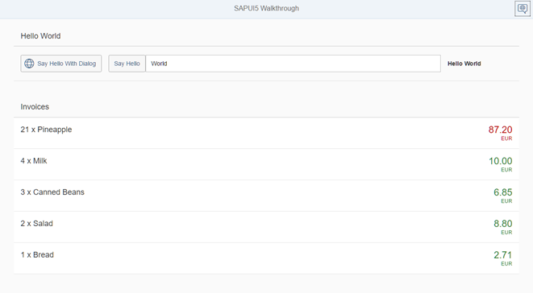

<!-- loioc98d57347ba444c6945f596584d2db45 -->

# Step 21: Expression Binding

Sometimes the predefined types of SAPUI5 are not flexible enough and you want to do a simple calculation or formatting in the view - that is where expressions are really helpful. We use them to format our price according to the current number in the data model.


## Preview

   
  
<a name="loioc98d57347ba444c6945f596584d2db45__fig_r1j_pst_mr"/>The price is now formatted according to its number

  


## Coding

You can view and download all files at [Walkthrough - Step 21](https://ui5.sap.com/#/entity/sap.m.tutorial.walkthrough/sample/sap.m.tutorial.walkthrough.21).

```xml
<mvc:View
controllerName="sap.ui.demo.walkthrough.controller.InvoiceList"
xmlns="sap.m"
   xmlns:mvc="sap.ui.core.mvc">
   <List
      headerText="{i18n>invoiceListTitle}"
      class="sapUiResponsiveMargin"
      width="auto"
      items="{invoice>/Invoices}" >
      <items>
         <ObjectListItem
            title="{invoice>Quantity} x {invoice>ProductName}"
            number="{
		parts: [{path: 'invoice>ExtendedPrice'}, {path: 'view>/currency'}],
		type: 'sap.ui.model.type.Currency',
		formatOptions: {
			showMeasure: false
		}
		}"
		numberUnit="{view>/currency}"
        	numberState="{= ${invoice>ExtendedPrice} > 50 ? 'Error' : 'Success' }"/>
      </items>
   </List>
</mvc:View>
```

We add the property `numberState` in our declarative view and introduce a new binding syntax that starts with `=` inside the brackets. This symbol is used to initiate a new binding syntax, it's called an expression and can do simple calculation logic like the ternary operator shown here.

The condition of the operator is a value from our data model. A model binding inside an expression binding has to be escaped with the `$` sign as you can see in the code. We set the state to `'Error'`\(the number will appear in red\) if the price is higher than 50 and to `‘Success’` \(the number will appear in green\) otherwise.

Expressions are limited to a particular set of operations that help formatting the data such as Math expression, comparisons, and such. You can lookup the possible operations in the documentation.


## Conventions

-   Only use expression binding for trivial calculations.


**Parent topic:** [Walkthrough](walkthrough-3da5f4b.md "In this tutorial we will introduce you to all major development paradigms of SAPUI5.")

**Next:** [Step 20: Data Types](step-20-data-types-dfe0465.md "The list of invoices is already looking nice, but what is an invoice without a price assigned? Typically prices are stored in a technical format and with a '.' delimiter in the data model. For example, our invoice for pineapples has the calculated price 87.2 without a currency. We are going to use the SAPUI5 data types to format the price properly, with a locale-dependent decimal separator and two digits after the separator.")

**Previous:** [Step 22: Custom Formatters](step-22-custom-formatters-0f8626e.md "If we want to do a more complex logic for formatting properties of our data model, we can also write a custom formatting function. We will now add a localized status with a custom formatter, because the status in our data model is in a rather technical format.")

**Related Information**  


[Expression Binding](../04_Essentials/expression-binding-daf6852.md "Expression binding is an enhancement of the SAPUI5 binding syntax, which allows for providing expressions instead of custom formatter functions.")

