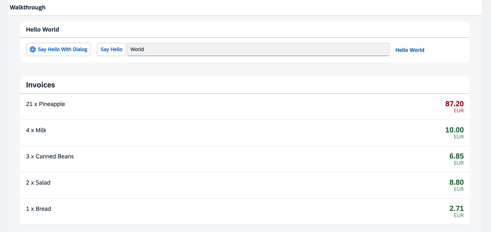

<!-- loioc98d57347ba444c6945f596584d2db45 -->

# Step 21: Expression Binding

Sometimes the predefined types of SAPUI5 are not flexible enough and you want to do a simple calculation or formatting in the view - that is where expressions are really helpful. We use them to format our price according to the current number in the data model.


## Preview

  
  
**The price is now formatted according to its number**




<a name="loioc98d57347ba444c6945f596584d2db45__section_uzp_rmk_syb"/>

## Coding

You can view and download all files at [Walkthrough - Step 21](https://ui5.sap.com/#/entity/sap.m.tutorial.walkthrough/sample/sap.m.tutorial.walkthrough.21).


<a name="loioc98d57347ba444c6945f596584d2db45__section_vzp_rmk_syb"/>

## webapp/view/InvoiceList.view.xml

```xml
<mvc:View
    controllerName="ui5.walkthrough.controller.InvoiceList"
    xmlns="sap.m"
    xmlns:core="sap.ui.core"
    xmlns:mvc="sap.ui.core.mvc">
    <List
        headerText="{i18n>invoiceListTitle}"
        class="sapUiResponsiveMargin"
        width="auto"
        items="{invoice>/Invoices}">
        <items>
            <ObjectListItem
                core:require="{
                    Currency: 'sap/ui/model/type/Currency'
                }"
                title="{invoice>Quantity} x {invoice>ProductName}"
                number="{
                    parts: [
                        'invoice>ExtendedPrice',
                        'view>/currency'
                    ],
                    type: 'Currency',
                    formatOptions: {
                        showMeasure: false
                    }
                }"
                numberUnit="{view>/currency}"
                numberState="{= ${invoice>ExtendedPrice} > 50 ? 'Error' : 'Success' }"/>
        </items>
    </List>
</mvc:View>
```

We add the property `numberState` in our declarative view and introduce a new binding syntax that starts with `=` inside the brackets. This symbol is used to initiate a new binding syntax, it's called an expression and can do simple calculation logic like the ternary operator shown here.

The condition of the operator is a value from our data model. A model binding inside an expression binding has to be escaped with the `$` sign as you can see in the code. We set the state to "Error" \(the number will appear in red\) if the price is higher than 50 and to "Success" \(the number will appear in green\) otherwise.

Expressions are limited to a particular set of operations that help formatting the data such as Math expression, comparisons, and such. You can look up the possible operations in the [documentation](../04_Essentials/expression-binding-daf6852.md).


## Conventions

-   Only use expression binding for trivial calculations.


**Related Information**  


[Expression Binding](../04_Essentials/expression-binding-daf6852.md "Expression binding is an enhancement of the SAPUI5 binding syntax, which allows for providing expressions instead of custom formatter functions.")

