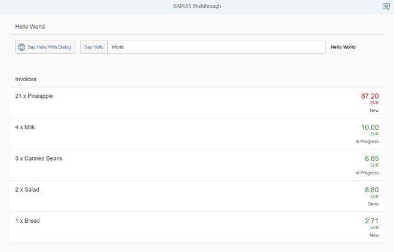

<!-- loio0f8626ed7b7542ffaa44601828db20de -->

# Step 22: Custom Formatters

If we want to do a more complex logic for formatting properties of our data model, we can also write a custom formatting function. We will now add a localized status with a custom formatter, because the status in our data model is in a rather technical format.


## Preview

   
  
**A status is now displayed with a custom formatter**

  


## Coding

You can view and download all files at [Walkthrough - Step 22](https://ui5.sap.com/#/entity/sap.m.tutorial.walkthrough/sample/sap.m.tutorial.walkthrough.22).

```js
sap.ui.define([], function () {
	"use strict";
	return {
		statusText: function (sStatus) {
			var resourceBundle = this.getOwnerComponent().getModel("i18n").getResourceBundle();
			switch (sStatus) {
				case "A":
					return resourceBundle.getText("invoiceStatusA");
				case "B":
					return resourceBundle.getText("invoiceStatusB");
				case "C":
					return resourceBundle.getText("invoiceStatusC");
				default:
					return sStatus;
			}
		}
	};
});
```

We create a new folder `model` in our app project. The new `formatter` file is placed in the model folder of the app, because formatters are working on data properties and format them for display on the UI. So far we did not have any model-related artifacts, except for the `Invoices.json` file, we will now add the folder `webapp/model` to our app. This time we do not extend from any base object but just return a JavaScript object with our `formatter` functions inside the `sap.ui.define` call.

Function `statusText` gets the technical status from the data model as input parameter and returns a human-readable text that is read from the `resourceBundle` file.

> ### Note:  
> In the above example, `this` refers to the controller instance as soon as the formatter gets called. We access the data model via the component using `this.getOwnerComponent().getModel()` instead of using `this.getView().getModel()`. The latter call might return `undefined`, because the view might not have been attached to the component yet, and thus the view can't inherit a model from the component.

**Additional Information:**

-    [API Reference: `sap.ui.core.mvc.Controller#getOwnerComponent`](https://ui5.sap.com/#/api/sap.ui.core.mvc.Controller/methods/getOwnerComponent). 
-    [API Reference: `sap.ui.core.mvc.Controller#onInit`](https://ui5.sap.com/#/api/sap.ui.core.mvc.Controller/methods/onInit). 


## webapp/controller/InvoiceList.controller.js

```js
sap.ui.define([
	"sap/ui/core/mvc/Controller",
	"sap/ui/model/json/JSONModel",
	"../model/formatter"
], function (Controller, JSONModel, formatter) {
	"use strict";
	return Controller.extend("sap.ui.demo.walkthrough.controller.InvoiceList", {
		formatter: formatter,
		onInit : function () {
			var oViewModel = new JSONModel({
				currency: "EUR"
			});
			this.getView().setModel(oViewModel, "view");
		}
	});
});
```

To load our formatter functions, we have to add it to the `InvoiceList.controller.js`. In this controller, we first add a dependency to our custom `formatter` module. The controller simply stores the loaded formatter functions in the local property `formatter` to be able to access them in the view.


## webapp/view/InvoiceList.view.xml

```xml
<mvc:View
	controllerName="sap.ui.demo.walkthrough.controller.InvoiceList"
	xmlns="sap.m"
	xmlns:mvc="sap.ui.core.mvc">
	<List
			headerText="{i18n>invoiceListTitle}"
		class="sapUiResponsiveMargin"
		width="auto"
		items="{invoice>/Invoices}">
		<items>
			<ObjectListItem
				title="{invoice>Quantity} x {invoice>ProductName}"
				number="{
					parts: [{path: 'invoice>ExtendedPrice'}, {path: 'view>/currency'}],
					type: 'sap.ui.model.type.Currency',
					formatOptions: {
						showMeasure: false
					}
				}"
				numberUnit="{view>/currency}"
				numberState="{=	${invoice>ExtendedPrice} > 50 ? 'Error' : 'Success' }">
				<firstStatus>
					<ObjectStatus text="{
						path: 'invoice>Status',
						formatter: '.formatter.statusText'
					}"/>
				</firstStatus>
			</ObjectListItem>
		</items>
	</List>
</mvc:View>
```

We add a status using the `firstStatus` aggregation to our `ObjectListItem` that will display the status of our invoice. The custom formatter function is specified with the reserved property `formatter` of the binding syntax. A `"."` in front of the formatter name means that the function is looked up in the controller of the current view. There we defined a property `formatter` that holds our formatter functions, so we can access it by `.formatter.statusText`.


## webapp/i18n/i18n.properties

```ini
# App Descriptor
appTitle=Hello World
appDescription=A simple walkthrough app that explains the most important concepts of SAPUI5

# Hello Panel
showHelloButtonText=Say Hello
helloMsg=Hello {0}
homePageTitle=Walkthrough
helloPanelTitle=Hello World
openDialogButtonText=Say Hello With Dialog
dialogCloseButtonText=Ok

# Invoice List
invoiceListTitle=Invoices
invoiceStatusA=New
invoiceStatusB=In Progress
invoiceStatusC=Done
```

We add three new entries to the resource bundle that reflect our translated status texts. These texts are now displayed below the `number` attribute of the `ObjectListItem` dependent on the status of the invoice.

**Related Information**  


[Formatting, Parsing, and Validating Data](../04_Essentials/formatting-parsing-and-validating-data-07e4b92.md "Data that is presented on the UI often has to be converted so that is human readable and fits to the locale of the user. On the other hand, data entered by the user has to be parsed and validated to be understood by the data source. For this purpose, you use formatters and data types.")

