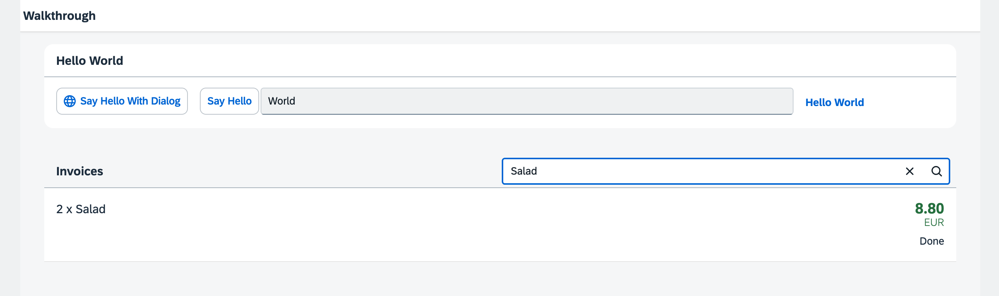

<!-- loio5295470d7eee46c1898ee46c1b9ad763 -->

# Step 23: Filtering

In this step, we add a search field for our product list and define a filter that represents the search term. When searching, the list is automatically updated to show only the items that match the search term.


## Preview

  
  
**A search field is displayed above the list**




<a name="loio5295470d7eee46c1898ee46c1b9ad763__section_qx5_wch_ycb"/>

## Coding

You can view and download all files at [Walkthrough - Step 23](https://ui5.sap.com/#/entity/sap.m.tutorial.walkthrough/sample/sap.m.tutorial.walkthrough.23).


<a name="loio5295470d7eee46c1898ee46c1b9ad763__section_rx5_wch_ycb"/>

## webapp/view/InvoiceList.view.xml

```xml
<mvc:View
   controllerName="ui5.walkthrough.controller.InvoiceList"
   xmlns="sap.m"
   xmlns:core="sap.ui.core"
   xmlns:mvc="sap.ui.core.mvc">
   <List
      id="invoiceList"
      class="sapUiResponsiveMargin"
      width="auto"
      items="{invoice>/Invoices}" >
      <headerToolbar>
         <Toolbar>
            <Title text="{i18n>invoiceListTitle}"/>
            <ToolbarSpacer/>
            <SearchField 
               width="50%" 
               search=".onFilterInvoices"/>
         </Toolbar>
      </headerToolbar>
      ...
</mvc:View>
```

The view is extended by a search control that we add to the list of invoices. We also need to specify an ID `invoiceList` for the list control to be able to identify the list from the event handler function `onFilterInvoices` that we add to the search field. In addition, the search field is part of the list header and therefore, each change on the list binding will trigger a rerendering of the whole list, including the search field.

The `headerToolbar` aggregation replaces the simple `title` property that we used before for our list header. A toolbar control is way more flexible and can be adjusted as you like. We are now displaying the title on the left side with a `sap.m.Title` control, a spacer, and the `sap.m.SearchField` on the right.


## webapp/controller/InvoiceList.controller.js

```js
sap.ui.define([
	"sap/ui/core/mvc/Controller",
	"sap/ui/model/json/JSONModel",
	"sap/ui/model/Filter",
	"sap/ui/model/FilterOperator"
], (Controller, JSONModel, Filter, FilterOperator) => {
	"use strict";

	return Controller.extend("ui5.walkthrough.controller.InvoiceList", {
		onInit() {
			const oViewModel = new JSONModel({
				currency: "EUR"
			});
			this.getView().setModel(oViewModel, "view");
		},

		onFilterInvoices(oEvent) {
			// build filter array
			const aFilter = [];
			const sQuery = oEvent.getParameter("query");
			if (sQuery) {
				aFilter.push(new Filter("ProductName", FilterOperator.Contains, sQuery));
			}

			// filter binding
			const oList = this.byId("invoiceList");
			const oBinding = oList.getBinding("items");
			oBinding.filter(aFilter);
		}
	});
});
```

We load two new dependencies for the filtering. The filter object will hold our configuration for the filter action and the `FilterOperator` is a helper type that we need in order to specify the filter.

In the `onFilterInvoices` function we construct a filter object from the search string that the user has typed in the search field. Event handlers always receive an event argument that can be used to access the parameters that the event provides. In our case the search field defines a parameter `query` that we access by calling `getParameter("query")` on the `oEvent` parameter.

If the query is not empty, we add a new filter object to the still empty array of filters. However, if the query is empty, we filter the binding with an empty array. This makes sure that we see all list elements again. We could also add more filters to the array, if we wanted to search more than one data field. In our example, we just search in the `ProductName` path and specify a filter operator that will search for the given query string.

The list is accessed with the ID that we have specified in the view, because the control is automatically prefixed by the view ID, we need to ask the view for the control with the helper function `byId`. On the list control we access the binding of the aggregation `items` to filter it with our newly constructed filter object. This will automatically filter the list by our search string so that only the matching items are shown when the search is triggered. The filter operator `FilterOperator.Contains` is **not** case-sensitive.

**Related Information**  


[API Reference: `sap.ui.model.Filter`](https://ui5.sap.com/#/api/sap.ui.model.Filter)

[API Reference: `sap.ui.model.FilterOperator`](https://ui5.sap.com/#/api/sap.ui.model.FilterOperator)

[API Reference: `sap.m.SearchField`](https://ui5.sap.com/#/api/sap.m.SearchField)

